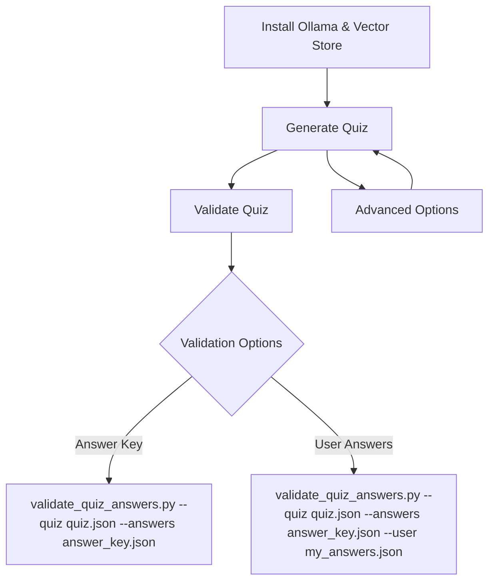

# Quiz Generation Workflow

## Flow Diagram & Summary

This workflow guides you through setting up your local AI quiz system, generating quizzes, and validating answers. The process is fully offline-first, using Ollama and local vector stores, with OpenAI as an optional path.



---

## 1. Install Ollama & Vector Store

**Ollama Installation**
```bash
brew install ollama
ollama pull mistral
```
**Check Ollama Status**
```bash
./scripts/bin/run_venv.sh scripts/rag/check_ollama.py check
```
**Start/Stop Ollama Service**
```bash
./scripts/bin/run_venv.sh scripts/rag/check_ollama.py start
./scripts/bin/run_venv.sh scripts/rag/check_ollama.py stop
```

**Vector Store Build (Local Embeddings)**
```bash
./scripts/bin/run_venv.sh scripts/rag/vector_store_build.py --local --force
```
**Vector Store Build (OpenAI Embeddings)**
```bash
OPENAI_API_KEY=sk-... ./scripts/bin/run_venv.sh scripts/rag/vector_store_build.py --force
```

---

## 2. Generate the Quiz

**Primary (Offline, Ollama)**
```bash
./scripts/bin/run_venv.sh scripts/quiz/master.py prepare --ollama --ollama-model mistral --count 5 --fresh --auto-build --local-embeddings
```
**Experimental (OpenAI)**
```bash
./scripts/bin/run_venv.sh scripts/quiz/master.py prepare --ai --model gpt-4o-mini --count 12 --fresh --auto-build
```
**Deterministic (Template)**
```bash
./scripts/bin/run_venv.sh scripts/quiz/master.py prepare --template --count 8 --auto-build --local-embeddings
```

**Advanced Options**
- Limit corpus: `--sources <pattern>`
- Change model: `--ollama-model <name>`
- Skip text export: `--no-text`
- Improve novelty: `--fresh`
- Filter by tags/H1: `--restrict-sources`, `--include-tags`, `--include-h1`

---

## 3. Validate the Quiz

**Validate with Answer Key**
```bash
./scripts/bin/run_venv.sh scripts/quiz/validate_quiz_answers.py --quiz quiz.json --answers answer_key.json
```
**Validate with User Answers**
```bash
./scripts/bin/run_venv.sh scripts/quiz/validate_quiz_answers.py --quiz quiz.json --answers answer_key.json --user my_answers.json
```

**Manual Marking Workflow**
1. Export plain text:  
  `./scripts/bin/run_venv.sh scripts/quiz/export_quiz_text.py`
2. Mark answers in `quiz.txt`
3. Parse answers:  
  `./scripts/bin/run_venv.sh scripts/quiz/master.py parse --in quiz.txt --out my_answers.json --force`
4. Validate as above.

## Files Produced
- `quiz.json` – list of question objects (no answers)
- `answer_key.json` – mapping question id -> { answer, explanation }
- `quiz.txt` – markable plain text template (optional, created by prepare script unless --no-text)

## Providers & Status
| Provider | Flag | Max Questions | Status | Notes |
|----------|------|---------------|--------|-------|
| Ollama   | `--ollama` | 5 | Primary | Offline / fast iteration / zero API cost |
| Template | `--template` | 100+ practical | Primary (fallback) | Deterministic; uses markdown structure only |
| OpenAI   | `--ai`     | 20 | Experimental | Requires `OPENAI_API_KEY`; less exercised in daily flow |

> Accuracy Note (Ollama): Local models may occasionally produce mismatches (e.g. answer letter not conceptually matching best option, weak explanations, or subtly duplicated stems). Validate logically. If a question looks off: (1) re-run with `--fresh`, (2) adjust sources, or (3) manually correct. The validator checks structure, not semantic truth. OpenAI path can yield different style but is **optional/experimental**.

## Offline-First Philosophy
The system prioritizes *repeatable, air‑gapped study*. Core guarantees:
1. Works with only local markdown + Ollama + HuggingFace embeddings.
2. Never requires an internet call unless you opt into OpenAI.
3. Vector store auto-build (`--auto-build`) keeps friction low.
4. Template mode provides a deterministic fallback for quick smoke tests or when models are unavailable.

## Ollama Setup & Validation
> Install: https://ollama.com
```bash
ollama pull mistral
./scripts/bin/run_venv.sh scripts/rag/check_ollama.py check
```
> Manage via tasks (Install / Start / Stop / Check) or CLI (`brew services start ollama`).


## Customizing
- Limit corpus scope: `--sources system-design/designs/video-streaming/*.md`
- Change models: `--ollama-model llama3` or `--model gpt-4o-mini`
- Skip text export: add `--no-text` to `master.py prepare`.
- Improve novelty: add `--fresh` to reduce repetition (stores normalized prior questions in `.quiz_history.json`; increases temperature slightly and retries once if overlap detected).
- Improve local answer accuracy: after generation run `generate_quiz.py` directly with `--verify` (adds a self-check pass per question; slower, Ollama only) or integrate later into master script.
- Disable randomness of component focus: pass `--sources ...` or add `--no-random-component` when directly invoking `generate_quiz.py` (the master script uses default random component selection automatically when sources unchanged).
- Deterministic generation: use `--template` (with optional `--seed <n>` via direct `generate_quiz.py`) for hallucination-free baseline sourced from markdown key-value lines and headings.
  *Updated:* With always-on RAG this legacy randomness is largely superseded. Prefer new filtering flags (`--restrict-sources`, `--include-tags`, `--include-h1`).

## Retrieval-Augmented Generation (Always On)
The quiz pipeline now automatically retrieves context from a Chroma vector store before LLM prompting (unless you explicitly disable it when calling `generate_quiz.py` directly with `--no-rag`).

### Preflight Validation (master.py prepare)
Before generating questions the master script will:
1. Check vector store health (load & test a similarity search).
2. Auto-build the store if missing and `--auto-build` is provided.
3. Validate provider connectivity:
  - OpenAI: API key presence + simple model list probe.
  - Ollama: binary present, daemon reachable, model pulled (auto-pulls if absent).

If any required service is down, the run aborts early (no partial files created).

### Vector Store Build (Manual / CI)
Local embeddings (HuggingFace):
```bash
./scripts/bin/run_venv.sh scripts/rag/vector_store_build.py --local --force
```
OpenAI embeddings:
```bash
OPENAI_API_KEY=sk-... ./scripts/bin/run_venv.sh scripts/rag/vector_store_build.py --force
```
Common tuning flags: `--persist .chroma` (default), `--chunk-size 900`, `--chunk-overlap 120`, `--glob`, `--exclude`.

### New Master Flags
| Flag | Purpose |
|------|---------|
| `--persist DIR` | Vector store directory (default .chroma) |
| `--auto-build` | Build store if missing before generation |
| `--local-embeddings` | Expect local HF embeddings (must match how store was built) |
| `--rag-k N` | Top-k chunks per retrieval query (passed through) |
| `--rag-queries q1 q2 ...` | Override default internal retrieval queries |

### Retrieval Behavior
Queries: A default curated list (caching, load balancing, queues, replication, gateway, etc.) is truncated based on requested question count. Each query retrieves `--rag-k` chunks. Duplicates are de-duplicated via raw snippet text hashing. All unique chunks are concatenated into one synthetic context document fed to the model provider.

### Citation Markers (Grounding)
When RAG runs, each retrieved chunk is assigned a citation label like `C1`, `C2`, ...

Structure of the generated synthetic context (`RAG_CONTEXT.md`):
1. A header directory listing: `C#: <source path> :: <section heading>`
2. Separator line `---`
3. Bodies: Each block starts with `[C#] (source: <path>, heading: <heading>)` followed by the snippet text.

Model Prompting Expectation:
- The LLM is instructed (inline) to ground every question in one or more cited sections and avoid unsupported invention.
- You can manually inspect which sections influenced a quiz by opening `RAG_CONTEXT.md` (if you run `generate_quiz.py` directly) or by re‑running with the same parameters.

Planned Extensions (not yet implemented):
- Optional inclusion of citation references in each output question object.
- Filtering retrieval by tag or section heading.
- Deduplicating semantically similar citations beyond raw snippet text hashing.

### Source & Tag / H1 Filtering (Direct generate_quiz.py)
Constrain retrieval without rebuilding the store:

| Flag | Purpose | Match Logic |
|------|---------|-------------|
| `--restrict-sources PAT...` | Only chunks whose `source` path matches ANY provided pattern | Substring OR glob (`*`, `?`) on relative path |
| `--include-tags TAG...` | Require at least one of these tag tokens | Tags originate from dirs + file stem + optional H1 slug |
| `--include-h1 H1...` | Require first H1 slug match | Slugified (non-alphanumerics -> `-`), partial contains allowed |

Behavior:
1. Over-fetch (`k * 3`) when filters active; prune failing chunks.
2. Queries yielding zero passing chunks are skipped; others still contribute.
3. Applied filters listed in `RAG_CONTEXT.md` header.

Examples:
```bash
# System design designs only
./scripts/bin/run_venv.sh scripts/quiz/generate_quiz.py --ollama --rag-local --restrict-sources system-design/designs --count 5

# Chunks tagged caching OR redis
./scripts/bin/run_venv.sh scripts/quiz/generate_quiz.py --ollama --rag-local --include-tags caching redis --count 5

# H1 slug contains rate-limiting
./scripts/bin/run_venv.sh scripts/quiz/generate_quiz.py --ollama --rag-local --include-h1 rate-limiting --count 10

# Combine all filters
./scripts/bin/run_venv.sh scripts/quiz/generate_quiz.py --ollama --rag-local \
  --restrict-sources system-design/designs \
  --include-tags caching consistency \
  --include-h1 rate-limiting --count 10
```

Notes:
- Filters are also available via `master.py prepare` (pass them after provider flags). Previously they were only for direct `generate_quiz.py` calls.
- Tags & H1 slugs are lowercase internally; supply lowercase.
- OR within a category, AND across categories.
- Exclusion flags (`--exclude-tags`, etc.) not implemented yet.

Master pass-through example:
```bash
./scripts/bin/run_venv.sh scripts/quiz/master.py prepare --ollama \
  --count 5 --local-embeddings --auto-build \
  --restrict-sources system-design/designs \
  --include-tags caching consistency \
  --include-h1 rate-limiting
```

### Recommended Settings
- Keep `--rag-k` between 3–5.
- Rebuild the store (`--auto-build` or manual) after adding substantive markdown.
- Prefer local embeddings for consistent offline workflow (`--local-embeddings`).
- Use OpenAI embeddings only if you explicitly need broader semantic recall (experimental path).

### Disabling RAG (Debug Only)
If you need to benchmark raw behavior, call `generate_quiz.py` directly with `--no-rag` (the master script always uses RAG).

### Maintenance Tips
- Delete & rebuild (`--force`) after large doc reorganizations.
- Monitor store size; extremely large stores may slow retrieval—consider pruning outdated notes.

## Troubleshooting
| Symptom | Cause | Resolution |
|---------|-------|------------|
| Vector store missing | Not built yet | Add `--auto-build` or run build script manually |
| Vector store health check failed | Embedding mismatch / corrupt dir | Rebuild with matching flags (`--local` vs OpenAI) |
| Ollama request error | Daemon not running | `./scripts/bin/run_venv.sh scripts/rag/check_ollama.py start` or launch app |
| 0 questions returned | Model output malformed | Re-run; ensure model supports instruction following |
| Validation failed: count mismatch | Model produced fewer items | Re-run; sometimes temperature / truncation issues |
| OPENAI_API_KEY error | Env var missing | Only needed for experimental OpenAI path; `export OPENAI_API_KEY=sk-...` |
| Question seems wrong / answer dubious (Ollama) | Model hallucination | Re-run with `--fresh`; switch provider; manual edit |

## Example Snippet
```json
[
  {
    "id": "Q1",
    "question": "Which component handles rate limiting?",
    "options": ["API Gateway", "Object Store", "CDN Edge", "Log Indexer"],
    "topic": "Rate Limiter System Design",
    "difficulty": "medium"
  }
]
```

#### *Placeholder Heading (Fill Me)*
> Return to main README: [README.md](./README.md)
