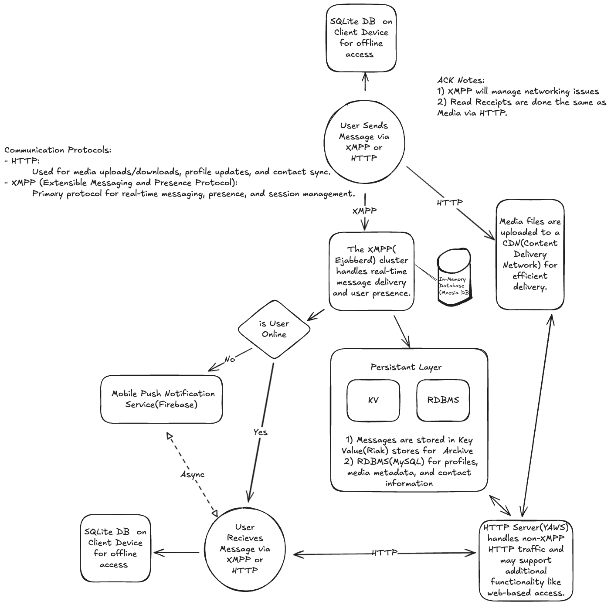
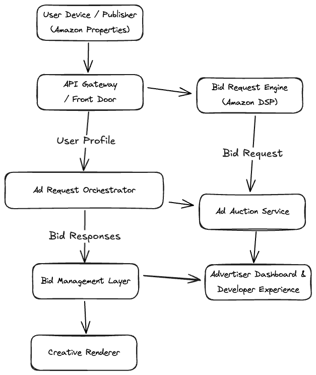

# Excalidraw Diagrams

This repository contains system design diagrams created with Excalidraw.

Each diagram is saved as a `.excalidraw.png` file — meaning:
- You can **preview** it directly on GitHub
- You can **edit** it later in [Excalidraw](https://excalidraw.com) by opening the file

---

## Diagrams

### 📄 Facebook News Feed

- [Editable PNG](facebook-newsfeed/FacebookNewsFeed.excalidraw.png)
- [Design Notes](facebook-newsfeed/design.md)

---

### 📄 Messaging System Architecture

- [Editable PNG](facebook-messaging/FacebookMessaging.excalidraw.png)
- [Design Notes](facebook-messaging/design.md)

---

### 📄 Notification System

- [Editable PNG](notification-system/NotificationSystem.excalidraw.png)
- [Design Notes](notification-system/design.md)

---

### 📄 Amazon Ads

- [Editable PNG](amazon-ads/amazon_ads_system_design.excalidraw.png)
- [Design Notes](amazon-ads/design.md)