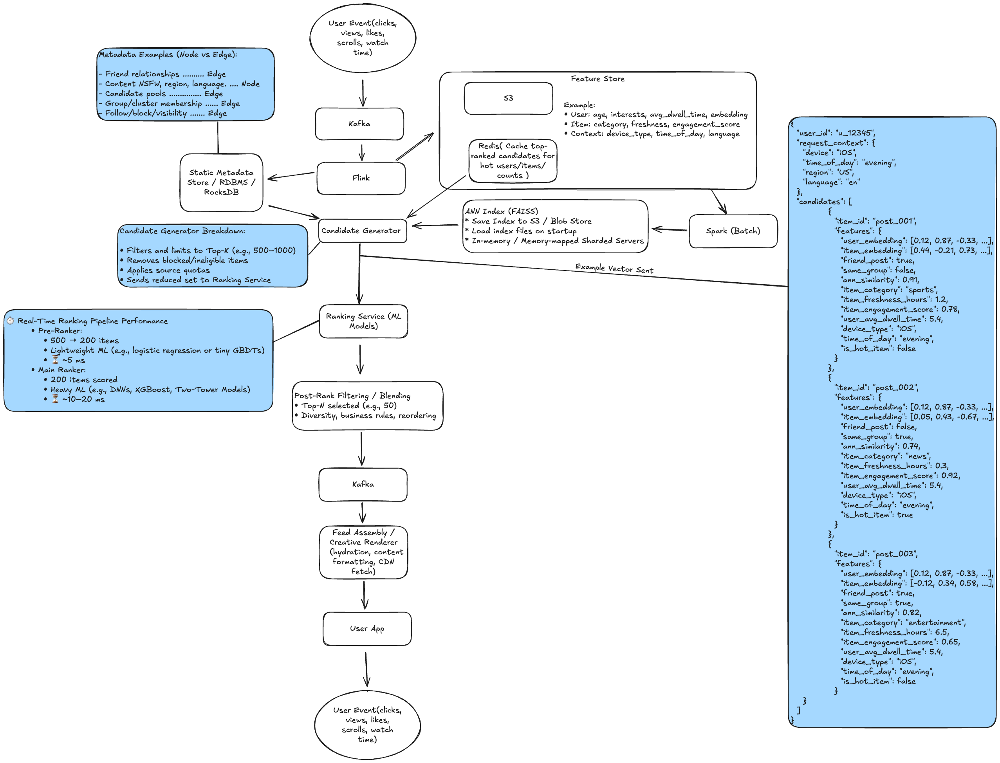
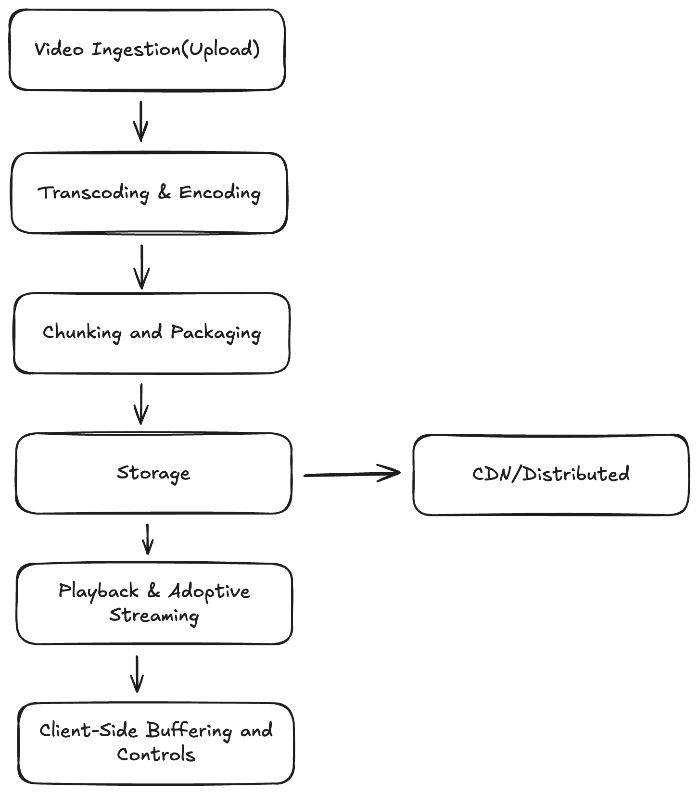
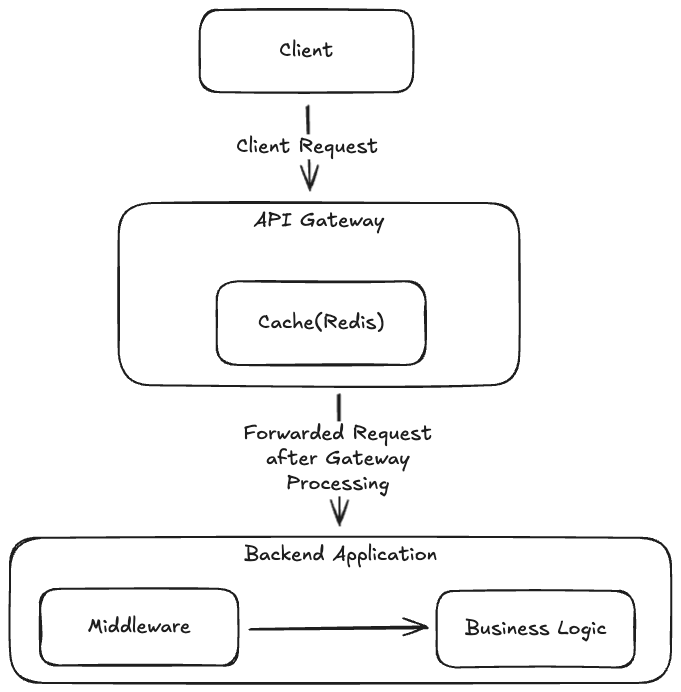

# Interview Prep Repository

This repository contains system design diagrams, technical notes, and devops scenario answers for large-scale engineering interviews.

---

## 📦 System Design

A collection of system design diagrams and detailed design notes:

- **[Amazon Ads](system-design/amazon-ads/design.md)**  
  
- **[Facebook Cold Storage](system-design/facebook-cold-storage/design.md)**  
  
- **[Facebook News Feed](system-design/facebook-newsfeed/design.md)**  
  
- **[Messaging System](system-design/facebook-messaging/design.md)**  
  
- **[Notification System](system-design/notification-system/design.md)**  
  
- **[Messaging Queue (Kafka)](system-design/messaging-queue/design.md)**  
  
- **[ML Recommendation System](system-design/ml-recommendation-system/design.md)**  
  
- **[Video Streaming System](system-design/video-streaming/design.md)**  
  
- **[Rate Limiter](system-design/rate-limiter/design.md)**  
  
- **[Weather App](system-design/weather-app/design.md)**  
  

## 📖 System Design Reference: Approach & Key Questions

For a structured approach to system design interviews, see the [System Design Approach and Key Questions](system-design/system-design-approach.md) document. Quick links to each step:

- [Clarify Requirements](system-design/system-design-approach.md#1-clarify-requirements)
- [Define Constraints & Assumptions](system-design/system-design-approach.md#2-define-constraints--assumptions)
- [High-Level Architecture](system-design/system-design-approach.md#3-high-level-architecture)
- [Data Modeling & Storage](system-design/system-design-approach.md#4-data-modeling--storage)
- [Scalability & Reliability](system-design/system-design-approach.md#5-scalability--reliability)
- [Consistency & Availability](system-design/system-design-approach.md#6-consistency--availability)
- [Performance Optimization](system-design/system-design-approach.md#7-performance-optimization)
- [Security & Privacy](system-design/system-design-approach.md#8-security--privacy)
- [Monitoring & Maintenance](system-design/system-design-approach.md#9-monitoring--maintenance)
- [User Experience](system-design/system-design-approach.md#10-user-experience)
- [Evolution & Extensibility](system-design/system-design-approach.md#11-evolution--extensibility)

**Common Trade-offs in System Design:**
- [Easy-to-Build APIs vs. Long-Term APIs](system-design/system-design-approach.md#1-easy-to-build-apis-vs-long-term-apis)
- [UI Complexity vs. Server Complexity](system-design/system-design-approach.md#2-ui-complexity-vs-server-complexity)
- [Performance vs. Scalability](system-design/system-design-approach.md#3-performance-vs-scalability)
- [Latency vs. Throughput](system-design/system-design-approach.md#4-latency-vs-throughput)
- [CAP Theorem](system-design/system-design-approach.md#5-cap-theorem)
- [PACELC Theorem](system-design/system-design-approach.md#6-pacelc-theorem)

For sample interview questions, see the same document.

---

## 📝 How to Edit Diagrams

All diagrams are `.excalidraw.png` files. To edit:
1. Download the PNG
2. Open [Excalidraw](https://excalidraw.com)
3. Use "Open" to import and edit
4. Save and commit the updated PNG

---

## 🛠️ DevOps & Scenario Questions

A set of scenario-based devops and operational questions, each with detailed technical answers:

- **[Incident Management](devops/incident-management/senario.md)**
- **[Cross-Region Replication](devops/cross-region-replication/senario.md)**
- **[Global Feed for Emerging Markets](devops/global-feed-emerging-markets/senario.md)**
- **[Instagram with Fewer DB Servers](devops/instagram-fewer-db-servers/senario.md)**
- **[Microservices Monitoring & Autoscale](devops/microservices-monitoring-autoscale/senario.md)**
- **[Adopting Unproven Technology](devops/adopting-unproven-tech/senario.md)**
- **[Small Team, Fast Delivery](devops/small-team-fast-delivery/senario.md)**
- **[Rebuild Facebook with Limited Resources](devops/facebook-limited-resources/senario.md)**
- **[Less Common Questions](devops/less-common-questions/questions.md)**

    - [Design a system with capped storage](devops/less-common-questions/questions.md#design-a-system-with-capped-storage)
    - [Scale the Like button](devops/less-common-questions/questions.md#scale-the-like-button)
    - [Distributed cache](devops/less-common-questions/questions.md#distributed-cache)
    - [Groups for poor connectivity](devops/less-common-questions/questions.md#groups-for-poor-connectivity)
    - [Archive all Facebook posts](devops/less-common-questions/questions.md#archive-all-facebook-posts)
    - [SLA-based job queue](devops/less-common-questions/questions.md#sla-based-job-queue)
    - [Self-healing service](devops/less-common-questions/questions.md#self-healing-service)

---

## 👔 Manager Behavioral Questions

A collection of common engineering manager behavioral interview questions. Full sample answers are available in the private submodule: [private-interviewprep/manager-behavioral-questions.md](private-interviewprep/manager-behavioral-questions.md)

### 🧠 Leadership & People Management
- [How do you support career growth for your engineers?](private-interviewprep/manager-behavioral-questions.md#how-do-you-support-career-growth-for-your-engineers)
- [Tell me about a time you had to handle a low-performing team member.](private-interviewprep/manager-behavioral-questions.md#tell-me-about-a-time-you-had-to-handle-a-low-performing-team-member)
- [How do you build team culture and trust?](private-interviewprep/manager-behavioral-questions.md#how-do-you-build-team-culture-and-trust)
- [How do you manage conflict within a team?](private-interviewprep/manager-behavioral-questions.md#how-do-you-manage-conflict-within-a-team)
- [What’s your philosophy on performance reviews?](private-interviewprep/manager-behavioral-questions.md#whats-your-philosophy-on-performance-reviews)

### 📈 Execution & Delivery
- [Tell me about a time you led a project from inception to launch.](private-interviewprep/manager-behavioral-questions.md#tell-me-about-a-time-you-led-a-project-from-inception-to-launch)
- [How do you manage scope, timelines, and stakeholder expectations?](private-interviewprep/manager-behavioral-questions.md#how-do-you-manage-scope-timelines-and-stakeholder-expectations)
- [How do you prioritize technical debt vs. feature work?](private-interviewprep/manager-behavioral-questions.md#how-do-you-prioritize-technical-debt-vs-feature-work)
- [Describe how you handle missed deadlines or roadblocks.](private-interviewprep/manager-behavioral-questions.md#describe-how-you-handle-missed-deadlines-or-roadblocks)
- [How do you collaborate with product managers, designers, or other cross-functional partners?](private-interviewprep/manager-behavioral-questions.md#how-do-you-collaborate-with-product-managers-designers-or-other-cross-functional-partners)

### 🛠️ Technical Depth & Judgment
- [How do you stay technically engaged without micromanaging?](private-interviewprep/manager-behavioral-questions.md#how-do-you-stay-technically-engaged-without-micromanaging)
- [How do you evaluate technical proposals or architecture reviews?](private-interviewprep/manager-behavioral-questions.md#how-do-you-evaluate-technical-proposals-or-architecture-reviews)
- [Tell me about a hard technical tradeoff your team made.](private-interviewprep/manager-behavioral-questions.md#tell-me-about-a-hard-technical-tradeoff-your-team-made)
- [How do you assess engineering quality and velocity?](private-interviewprep/manager-behavioral-questions.md#how-do-you-assess-engineering-quality-and-velocity)
- [Have you ever disagreed with an engineer’s technical approach? What did you do?](private-interviewprep/manager-behavioral-questions.md#have-you-ever-disagreed-with-an-engineers-technical-approach-what-did-you-do)

### 🌟 Strategy & Vision
- [What’s your approach to aligning your team’s work with company goals?](private-interviewprep/manager-behavioral-questions.md#whats-your-approach-to-aligning-your-teams-work-with-company-goals)
- [Describe a time you influenced organizational change.](private-interviewprep/manager-behavioral-questions.md#describe-a-time-you-influenced-organizational-change)
- [What metrics do you use to evaluate team health and success?](private-interviewprep/manager-behavioral-questions.md#what-metrics-do-you-use-to-evaluate-team-health-and-success)
- [How do you contribute to the technical roadmap?](private-interviewprep/manager-behavioral-questions.md#how-do-you-contribute-to-the-technical-roadmap)

### 🧪 Behavioral & Situational
- [Describe a time you made a mistake as a manager. How did you handle it?](private-interviewprep/manager-behavioral-questions.md#describe-a-time-you-made-a-mistake-as-a-manager-how-did-you-handle-it)
- [Tell me about a time you had to manage up (influence leadership).](private-interviewprep/manager-behavioral-questions.md#tell-me-about-a-time-you-had-to-manage-up-influence-leadership)
- [How do you onboard new engineers?](private-interviewprep/manager-behavioral-questions.md#how-do-you-onboard-new-engineers)
- [Have you ever had to manage a remote or distributed team?](private-interviewprep/manager-behavioral-questions.md#have-you-ever-had-to-manage-a-remote-or-distributed-team)
- [What’s the hardest decision you’ve had to make as a manager?](private-interviewprep/manager-behavioral-questions.md#whats-the-hardest-decision-youve-had-to-make-as-a-manager)

---

