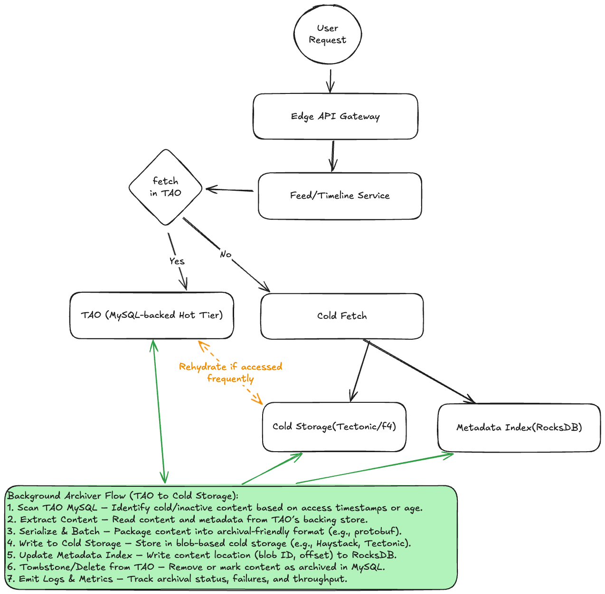
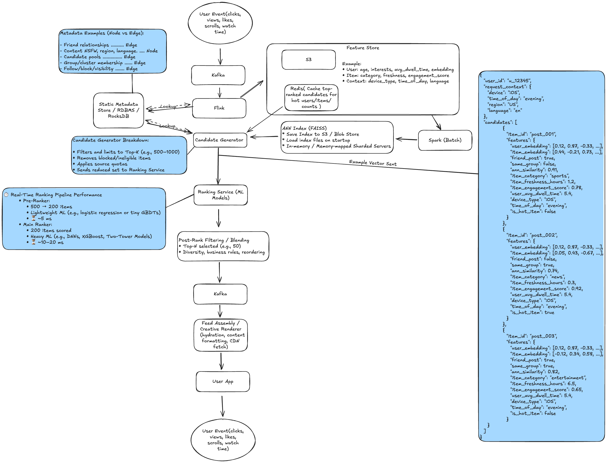

# Interview Prep Repository

This repository contains system design diagrams, technical notes, and devops scenario answers for large-scale engineering interviews.

---

## 📑 Index

- [System Design](#-system-design)
    - [Approach & Key Questions](#-system-design-reference-approach--key-questions)
- [DevOps & Scenario Questions](#-devops--scenario-questions)
- [Manager Behavioral Questions (External Repo)](#-manager-behavioral-questions)

---

## 📦 System Design

A collection of system design diagrams and detailed design notes:

- **[Amazon Ads](system-design/designs/amazon-ads/amazon-ads-system-design.md)**  
  
- **[Facebook Cold Storage](system-design/designs/facebook-cold-storage/facebook-cold-storage-design.md)**  
  
- **[Facebook News Feed](system-design/designs/facebook-newsfeed/facebook-newsfeed-design.md)**  
  
- **[Messaging System](system-design/designs/facebook-messaging/facebook-messaging-design.md)**  
  
- **[Notification System](system-design/designs/notification-system/notification-system-design.md)**  
  
- **[Messaging Queue (Kafka)](system-design/designs/messaging-queue/messaging-queue-design.md)**  
  
- **[ML Recommendation System](system-design/designs/ml-recommendation-system/ml-recommendation-system-design.md)**  
  
- **[Video Streaming System](system-design/designs/video-streaming/video-streaming-design.md)**  
  
- **[Rate Limiter](system-design/designs/rate-limiter/rate-limiter-design.md)**  
  
- **[Weather App](system-design/designs/weather-app/weather-app-design.md)**  
  

### 📖 Approach & Key Questions

For a structured approach to system design interviews, see the [System Design Approach and Key Questions](system-design/system-design-approach.md) document. Quick links to each step:

- [Step 1: Requirements Clarification](system-design/system-design-approach.md#step-1-requirements-clarification)
- [Step 2: Capacity Planning and Scale Estimation](system-design/system-design-approach.md#step-2-capacity-planning-and-scale-estimation)
- [Step 3: API and Interface Design](system-design/system-design-approach.md#step-3-api-and-interface-design)
- [Step 4: Data Architecture and Modeling](system-design/system-design-approach.md#step-4-data-architecture-and-modeling)
- [Step 5: System Architecture Overview](system-design/system-design-approach.md#step-5-system-architecture-overview)
- [Step 6: Deep Dive Design Analysis](system-design/system-design-approach.md#step-6-deep-dive-design-analysis)
- [Step 7: Risk Assessment and Mitigation](system-design/system-design-approach.md#step-7-risk-assessment-and-mitigation)

#### *Essential System Design Components & Trade-offs*
- [Data Storage & Management](system-design/system-design-approach.md#data-storage--management)
- [Performance & Scalability](system-design/system-design-approach.md#performance--scalability)
- [Network Infrastructure & Traffic Management](system-design/system-design-approach.md#network-infrastructure--traffic-management)
- [API Design & Communication Patterns](system-design/system-design-approach.md#api-design--communication-patterns)
- [Architecture Patterns & State Management](system-design/system-design-approach.md#architecture-patterns--state-management)
- [Data Processing Patterns](system-design/system-design-approach.md#data-processing-patterns)

For sample interview questions, see the same document.

---

*How to Edit Diagrams:*

All diagrams are `.excalidraw.png` files. To edit:
1. Download the PNG
2. Open [Excalidraw](https://excalidraw.com)
3. Use "Open" to import and edit
4. Save and commit the updated PNG

*Entity Relationship Diagrams:*

Excalidraw supports entity relationships through Mermaid diagrams. Example with foreign key:

---

## 🛠️ DevOps & Scenario Questions

A set of scenario-based devops and operational questions, each with detailed technical answers.
- **[Instagram with Fewer DB Servers](devops/instagram-fewer-db-servers/instagram-fewer-db-servers-scenario.md)**
- **[Microservices Monitoring & Autoscale](devops/microservices-monitoring-autoscale/microservices-monitoring-autoscale-scenario.md)**
- **[Adopting Unproven Technology](devops/adopting-unproven-tech/adopting-unproven-tech-scenario.md)**
- **[Small Team, Fast Delivery](devops/small-team-fast-delivery/small-team-fast-delivery-scenario.md)**
- **[Rebuild Facebook with Limited Resources](devops/rebuild-facebook-w-limited-resources/rebuild-facebook-limited-resources-scenario.md)**
- **[Less Common Questions](devops/less-common-questions/questions.md)**

  - [Design a system with capped storage](devops/less-common-questions/questions.md#design-a-system-with-capped-storage)
  - [Scale the Like button](devops/less-common-questions/questions.md#scale-the-like-button)
  - [Archive all Facebook posts](devops/less-common-questions/questions.md#archive-all-facebook-posts)
  - [SLA-based job queue](devops/less-common-questions/questions.md#sla-based-job-queue)
  - [Self-healing service](devops/less-common-questions/questions.md#self-healing-service)

---

## 👔 Manager Behavioral Questions

A collection of common engineering manager behavioral interview questions. Full sample answers are available in the private repository:
[brandon-benge/private-interviewprep (GitHub)](https://github.com/brandon-benge/private-interviewprep)

### 🧠 Leadership & People Management
- [What is your background and motivations for getting into people management?](https://github.com/brandon-benge/private-interviewprep/blob/main/manager-behavioral-questions.md#what-is-your-background-and-motivations-for-getting-into-people-management)
- [How do you motivate and grow your direct reports?](https://github.com/brandon-benge/private-interviewprep/blob/main/manager-behavioral-questions.md#how-do-you-motivate-and-grow-your-direct-reports)
- [How do you support career growth for your engineers?](https://github.com/brandon-benge/private-interviewprep/blob/main/manager-behavioral-questions.md#how-do-you-support-career-growth-for-your-engineers)
- [Tell me about a time you had to handle a low-performing team member.](https://github.com/brandon-benge/private-interviewprep/blob/main/manager-behavioral-questions.md#tell-me-about-a-time-you-had-to-handle-a-low-performing-team-member)
- [How do you build team culture and trust?](https://github.com/brandon-benge/private-interviewprep/blob/main/manager-behavioral-questions.md#how-do-you-build-team-culture-and-trust)
- [How do you manage conflict within a team?](https://github.com/brandon-benge/private-interviewprep/blob/main/manager-behavioral-questions.md#how-do-you-manage-conflict-within-a-team)
- [What’s your philosophy on performance reviews?](https://github.com/brandon-benge/private-interviewprep/blob/main/manager-behavioral-questions.md#whats-your-philosophy-on-performance-reviews)
- [Tell me about a time you had to deal with a difficult team member.](https://github.com/brandon-benge/private-interviewprep/blob/main/manager-behavioral-questions.md#tell-me-about-a-time-you-had-to-deal-with-a-difficult-team-member)

### 📈 Execution & Delivery
- [Tell me about a time you led a project from inception to launch.](https://github.com/brandon-benge/private-interviewprep/blob/main/manager-behavioral-questions.md#tell-me-about-a-time-you-led-a-project-from-inception-to-launch)
- [How do you manage scope, timelines, and stakeholder expectations?](https://github.com/brandon-benge/private-interviewprep/blob/main/manager-behavioral-questions.md#how-do-you-manage-scope-timelines-and-stakeholder-expectations)
- [How do you prioritize technical debt vs. feature work?](https://github.com/brandon-benge/private-interviewprep/blob/main/manager-behavioral-questions.md#how-do-you-prioritize-technical-debt-vs-feature-work)
- [Describe how you handle missed deadlines or roadblocks.](https://github.com/brandon-benge/private-interviewprep/blob/main/manager-behavioral-questions.md#describe-how-you-handle-missed-deadlines-or-roadblocks)
- [How do you collaborate with product managers, designers, or other cross-functional partners?](https://github.com/brandon-benge/private-interviewprep/blob/main/manager-behavioral-questions.md#how-do-you-collaborate-with-product-managers-designers-or-other-cross-functional-partners)
- [Explain your cross-functional work and partnership with other teams to drive towards a goal. What considerations and trade-offs need to be agreed upon? How do you build consensus?](https://github.com/brandon-benge/private-interviewprep/blob/main/manager-behavioral-questions.md#explain-your-cross-functional-work-and-partnership-with-other-teams-to-drive-towards-a-goal-what-considerations-and-trade-offs-need-to-be-agreed-upon-how-do-you-build-consensus)

### 🛠️ Technical Depth & Judgment
- [How do you stay technically engaged without micromanaging?](https://github.com/brandon-benge/private-interviewprep/blob/main/manager-behavioral-questions.md#how-do-you-stay-technically-engaged-without-micromanaging)
- [How do you evaluate technical proposals or architecture reviews?](https://github.com/brandon-benge/private-interviewprep/blob/main/manager-behavioral-questions.md#how-do-you-evaluate-technical-proposals-or-architecture-reviews)
- [Tell me about a hard technical tradeoff your team made.](https://github.com/brandon-benge/private-interviewprep/blob/main/manager-behavioral-questions.md#tell-me-about-a-hard-technical-tradeoff-your-team-made)
- [How do you assess engineering quality and velocity?](https://github.com/brandon-benge/private-interviewprep/blob/main/manager-behavioral-questions.md#how-do-you-assess-engineering-quality-and-velocity)
- [Have you ever disagreed with an engineer’s technical approach? What did you do?](https://github.com/brandon-benge/private-interviewprep/blob/main/manager-behavioral-questions.md#have-you-ever-disagreed-with-an-engineers-technical-approach-what-did-you-do)

### 🌟 Strategy & Vision
- [What’s your approach to aligning your team’s work with company goals?](https://github.com/brandon-benge/private-interviewprep/blob/main/manager-behavioral-questions.md#whats-your-approach-to-aligning-your-teams-work-with-company-goals)
- [Describe a time you influenced organizational change.](https://github.com/brandon-benge/private-interviewprep/blob/main/manager-behavioral-questions.md#describe-a-time-you-influenced-organizational-change)
- [What metrics do you use to evaluate team health and success?](https://github.com/brandon-benge/private-interviewprep/blob/main/manager-behavioral-questions.md#what-metrics-do-you-use-to-evaluate-team-health-and-success)
- [How do you contribute to the technical roadmap?](https://github.com/brandon-benge/private-interviewprep/blob/main/manager-behavioral-questions.md#how-do-you-contribute-to-the-technical-roadmap)

### 🧪 Behavioral & Situational
- [Describe a time you made a mistake as a manager. How did you handle it?](https://github.com/brandon-benge/private-interviewprep/blob/main/manager-behavioral-questions.md#describe-a-time-you-made-a-mistake-as-a-manager-how-did-you-handle-it)
- [Tell me about a time you had to manage up (influence leadership).](https://github.com/brandon-benge/private-interviewprep/blob/main/manager-behavioral-questions.md#tell-me-about-a-time-you-had-to-manage-up-influence-leadership)
- [How do you onboard new engineers?](https://github.com/brandon-benge/private-interviewprep/blob/main/manager-behavioral-questions.md#how-do-you-onboard-new-engineers)
- [Have you ever had to manage a remote or distributed team?](https://github.com/brandon-benge/private-interviewprep/blob/main/manager-behavioral-questions.md#have-you-ever-had-to-manage-a-remote-or-distributed-team)
- [What’s the hardest decision you’ve had to make as a manager?](https://github.com/brandon-benge/private-interviewprep/blob/main/manager-behavioral-questions.md#whats-the-hardest-decision-youve-had-to-make-as-a-manager)
- [Tell me about a project that failed. What did you learn?](https://github.com/brandon-benge/private-interviewprep/blob/main/manager-behavioral-questions.md#tell-me-about-a-project-that-failed-what-did-you-learn)
- [Tell me about a time when a plan you proposed was not agreed upon.](https://github.com/brandon-benge/private-interviewprep/blob/main/manager-behavioral-questions.md#tell-me-about-a-time-when-a-plan-you-proposed-was-not-agreed-upon)

---

## 📄 Additional Guides

For detailed workflows, see dedicated guides:

- [PDF Generation Guide](./PDF_GENERATION.md)
- [Quiz Generation Guide](./QUIZ_GENERATION.md)

---

---
