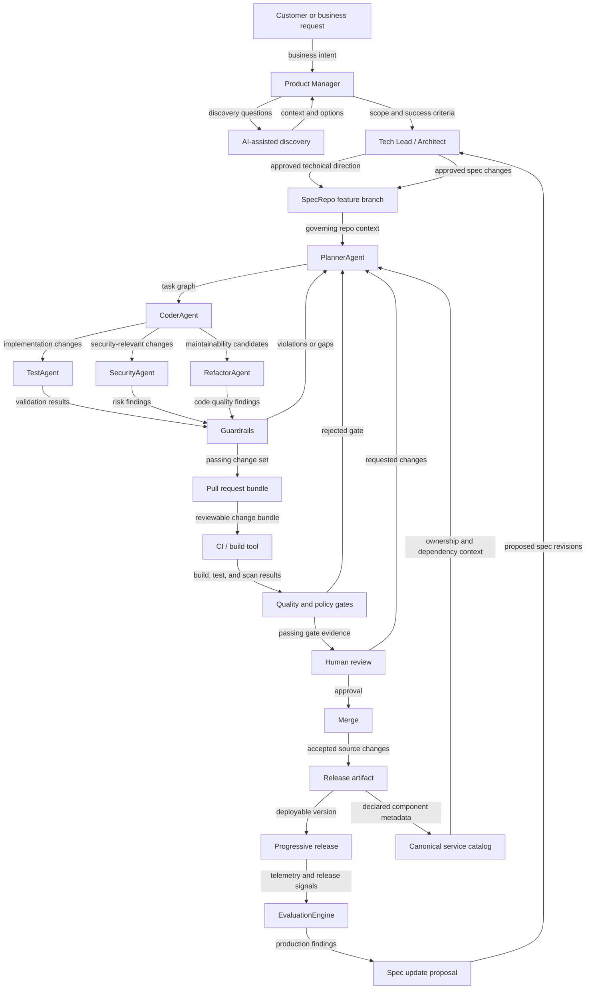

# Roles and Agents

This document gives a focused summary of who does what in the AI-native delivery model.

For the full system context, see [AI-Native Software Delivery System](./ai-native-software-delivery.md).

## High-Level Architecture

The [canonical service catalog](../02-spec-driven-development/canonical-service-catalog.md) is the cross-repo map of business capabilities, runtime components, owners, interfaces, and dependency relationships. Agents read it as planning and review context. In this model, the catalog is maintained from approved repo metadata and release artifacts; post-release evaluation informs follow-up work but is not treated as the primary catalog update path.

## Human Roles

### Product Manager
- Defines the business problem, target users, scope, and success criteria
- Usually drives `PROBLEM.md`

### Tech Lead or Architect
- Owns technical coherence, constraints, tradeoffs, and system boundaries
- Usually governs `INVARIANTS.md`, `REQUIREMENTS.md`, `DATA_MODEL.md`, `CONSISTENCY.md`, and `ARCHITECTURE.md`

### Engineers
- Refine edge cases, implementation detail, feasibility, and review feedback
- Review artificial-intelligence-generated changes against correctness and risk

## Agent Roles

### PlannerAgent
- Converts the governing specification into tasks, dependencies, and execution order

### CoderAgent
- Produces implementation changes from the spec and plan

### TestAgent
- Generates and runs tests against requirements and invariants

### SecurityAgent
- Checks dependencies, secrets, and policy-sensitive changes

### RefactorAgent
- Improves code structure, maintainability, and sometimes performance

### Guardrails
- Enforces scope boundaries, invariants, and quality gates

### EvaluationEngine
- Interprets release and runtime signals and proposes follow-up improvements

## What a Developer Interacts With Most

In day-to-day work, a developer most often interacts with:

- `PlannerAgent` for task decomposition
- `CoderAgent` for implementation
- `TestAgent` for validation support
- `Guardrails` during review and release gating

`SecurityAgent`, `RefactorAgent`, and `EvaluationEngine` usually act more like specialized reviewers than direct collaborators.

## Accountability Rule

Artificial intelligence can draft, decompose, implement, and summarize.

Humans still own:

- correctness
- tradeoffs
- production risk
- approval for high-impact changes
