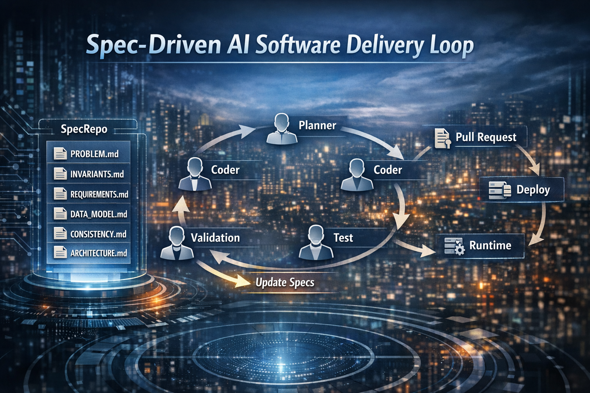

# Spec-Driven Development Is Moving From Concept to System

_How repository-based specifications, agent workflows, and emerging standards are reshaping software delivery_

---



Over the last year, one of the most important shifts in software engineering hasn’t been a new model or a better code-generation trick.

It’s something deeper:

> **Specifications are becoming executable inputs to the delivery system.**

The spec is no longer documentation.  
It is the interface between human intent and machine execution.

That sounds abstract—until you build something real with it.

Recently, I put together an end-to-end data pipeline with machine learning components in under seven days using a spec-driven approach:

- https://github.com/brandon-benge/example-data-pipeline-w-ml

The surprising part wasn’t just the speed.

It was *why* the speed was possible.

The system worked because the intent was explicit enough that an AI system could:
- plan the work
- implement it
- validate it
- iterate on it

…without relying on vague prompt memory.

That’s the real shift:

> **Written intent is no longer just documentation. It’s becoming operational.**

---

# The Shift: From Documentation to Execution

For years, software delivery has been fragmented:

- requirements in tickets  
- architecture in shared docs (Confluence, Google Docs, RFCs)  
- implementation in code  
- validation after the fact  

That model still works—but it breaks down when AI enters the loop.

Because AI doesn’t remember your Confluence page.

It reads what’s in the repository.

---

## A New Center of Gravity

In a spec-driven workflow, the system looks more like this:

- the problem is written clearly  
- requirements are explicit  
- invariants are documented  
- architecture and data shape are durable  
- AI reads that context and works from it  

Instead of starting from scratch every time, the system has **memory**.

That memory lives in files like:

- `PROBLEM.md`  
- `INVARIANTS.md`  
- `REQUIREMENTS.md`  
- `DATA_MODEL.md`  
- `CONSISTENCY.md`  
- `ARCHITECTURE.md`  

This is not just better documentation.

> **The difference is that these artifacts are now read by agents, not just humans—and they directly drive execution.**

---

# Spec-First vs Spec-Driven (Why This Matters)

### Spec-First (what we’ve always done)

- define APIs  
- define data models  
- define system boundaries  

This improves design clarity.

But it mostly lives in the **design phase**.

---

### Spec-Driven (what’s emerging)

- specs guide planning  
- specs guide implementation  
- specs drive test generation  
- specs influence review and release  
- specs evolve based on production feedback  

> **The spec stays active across the entire lifecycle.**

---

# What Actually Changed

The change is not that we are writing better documentation.

The change is that specifications are now part of the execution system.

- specs are **read by agents**, not just people  
- specs **drive execution**, not just alignment  
- specs participate in **validation and iteration**  

For example:

- an agent reads `REQUIREMENTS.md` to understand behavior  
- uses `DATA_MODEL.md` to align with schema  
- generates tests based on `INVARIANTS.md`  
- proposes a pull request tied back to those constraints  

In practice, this looks less like a chatbot and more like a coordinated delivery loop. Sometimes that is done with tools like OpenHands, Aider, or internal agents. The labels vary, but the pattern is increasingly familiar:

- PlannerAgent reads PROBLEM.md and REQUIREMENTS.md to generate a task graph  
- CoderAgent implements against DATA_MODEL.md and ARCHITECTURE.md  
- TestAgent derives test cases from INVARIANTS.md  
- Validation systems check those invariants before merge  

That is fundamentally different from “write a design doc and hope people follow it.”

---

# Where This Is Coming From

This shift is not coming from a single tool or company. It is emerging across the ecosystem.

## Platform Layer

GitHub is central.

With repositories, pull requests, automation, and now agents, it effectively *is* the delivery system for a huge part of the industry.

Projects like [Spec Kit](https://github.com/github/spec-kit) reinforce:
- repository-based workflows  
- spec → plan → tasks → implementation pipelines  
- validation before execution  

That matters because once the platform starts treating specifications as first-class inputs, the rest of the tooling ecosystem tends to follow.

---

## Tooling Layer

The tooling layer is where the workflow is getting operationalized.

Tools like [Augment](https://www.augmentcode.com/context-engine/), [Tessl](https://tessl.io/blog/tessl-launches-spec-driven-framework-and-registry), and [Kiro](https://kiro.dev/docs/specs/) are converging on similar ideas:

- durable repo context over prompt-only context  
- structured specs before implementation  
- stronger modeling of data, invariants, and architecture  
- task generation after clarity—not before  

What is notable is not that they all agree on one folder structure. They do not. What is notable is that they are all pushing toward the same operational truth: AI is much more useful when the repository contains stable, structured intent.

---

## Architecture & Research Layer

Organizations like [Thoughtworks](https://www.thoughtworks.com/en-us/radar/techniques/spec-driven-development) connect this to:

- source-controlled architecture  
- deliberate design practices  
- tradeoff-aware engineering  

Meanwhile, newer projects push toward:

- machine-checkable constraints  
- executable specifications  
- automatic rejection of unsafe changes  

This is the part of the landscape that matters most for technical leaders. It is where Spec-Driven Development stops being a productivity story and becomes a correctness and governance story.

---

# The Loop Is What Matters

At the system level, a new delivery loop is emerging:

- humans define intent, constraints, tradeoffs  
- agents decompose the work  
- agents generate code and tests  
- validation systems check correctness  
- humans review at the risk level  
- production signals feed back into the spec  

---

## From Tickets to Systems

Traditional model:

```text
Backlog → Tickets → Implementation → Review → Deploy
```

Emerging model:

```text
Spec → Plan → Generate → Validate → Review → Deploy → Evaluate → Update Spec
```

> **The unit of execution is no longer the ticket. It’s the specification.**

---

# The Pressure Is Moving Upstream

> **What happens when AI can implement faster than humans can specify?**

Systems will fail:
- not because they were implemented incorrectly  
- but because they were specified ambiguously  

That shifts responsibility toward clarity.

Technical leaders, staff engineers, and architects will feel this first. They will have to:
- define clearer problems  
- make invariants explicit  
- document data ownership  
- define consistency and concurrency rules  
- articulate tradeoffs upfront  

> **Ambiguity becomes the most expensive failure mode.**

---

## Where This Breaks (Today)

This model is not frictionless.

- specifications are hard to write well  
- invariants are rarely agreed on upfront  
- agents misinterpret incomplete context  

Most teams today do not have the discipline required to make this work consistently.

> **The bottleneck shifts from implementation to clarity.**

---

## A Note on Invariants

Invariants are not new.

But their explicit use as a first-class artifact is still uncommon.

Most systems rely on implicit rules embedded in code and operations.

They are usually discovered through production issues rather than defined upfront.

Making them explicit is one of the key shifts enabling AI-assisted delivery.

---

# The Pattern Is Emerging

A recurring structure is forming:

- `PROBLEM.md`  
- `INVARIANTS.md`  
- `REQUIREMENTS.md`  
- `DATA_MODEL.md`  
- `CONSISTENCY.md`  
- `ARCHITECTURE.md`  

These are becoming building blocks of executable intent.

---

# Why This Feels Familiar If You Grew Up On Grokking

One reason this pattern feels intuitive to many engineers is that it is not actually that far from the intent behind "grokking" style learning.

Grokking helped people learn how to approach system design by internalizing recurring building blocks:

- identify the problem clearly  
- understand the constraints  
- reason about tradeoffs  
- think in terms of data flow, consistency, scale, and failure  
- apply a reusable structure instead of starting from a blank page  

Spec-Driven Development is different in purpose, but similar in shape.

It takes that same pattern language and moves it into the repository.

Instead of using the pattern only to prepare for an interview or reason through a whiteboard exercise, the team writes those patterns down in files that can actively shape the system:

- `PROBLEM.md` captures the framing  
- `REQUIREMENTS.md` captures the expected behavior  
- `DATA_MODEL.md` captures the state and relationships  
- `CONSISTENCY.md` captures ordering and concurrency assumptions  
- `ARCHITECTURE.md` captures the system shape  
- `INVARIANTS.md` captures the rules that must always hold  

That is why I do not see this as a completely foreign way of working. In many ways, it feels like the same engineering instincts, just made explicit, durable, and machine-readable.

Grokking taught people to think in reusable system patterns.

Spec-Driven Development turns those patterns into reusable execution inputs.

---

# Closing Thought

The most important shift isn’t that AI can write code faster.

It’s this:

> **Software delivery is starting to reward teams that can define intent clearly enough for machines to execute it safely.**

We are moving toward a world where:

- intent is durable  
- specs guide execution  
- validation ties back to invariants  
- pull requests are reviewed against architecture and risk  
- systems evolve through feedback loops  

The standard is still forming.

But the shape is becoming clear.

That is the part I find most important. We do not need a fully ratified standard to recognize a pattern when it is already changing how systems get built.

And many teams will find themselves writing:

- `PROBLEM.md`  
- `INVARIANTS.md`  
- `REQUIREMENTS.md`  
- `DATA_MODEL.md`  
- `CONSISTENCY.md`  
- `ARCHITECTURE.md`  

…sooner than they expect.

The teams that learn to write for machines—not just humans—will have a structural advantage.

---

## References

- [GitHub Spec Kit repository](https://github.com/github/spec-kit)
- [GitHub Spec Kit documentation](https://github.github.com/spec-kit/index.html)
- [Tessl launch post for spec-driven framework and registry](https://tessl.io/blog/tessl-launches-spec-driven-framework-and-registry)
- [Augment Context Engine](https://www.augmentcode.com/context-engine/)
- [Augment Context Engine MCP announcement](https://www.augmentcode.com/changelog/context-engine-mcp-in-ga)
- [Kiro specs documentation](https://kiro.dev/docs/specs/)
- [Kiro first-project guide](https://kiro.dev/docs/getting-started/first-project/)
- [Thoughtworks Technology Radar entry on spec-driven development](https://www.thoughtworks.com/en-us/radar/techniques/spec-driven-development)
- [Thoughtworks article on spec-driven development as an emerging practice](https://www.thoughtworks.com/en-ec/insights/blog/agile-engineering-practices/spec-driven-development-unpacking-2025-new-engineering-practices)
