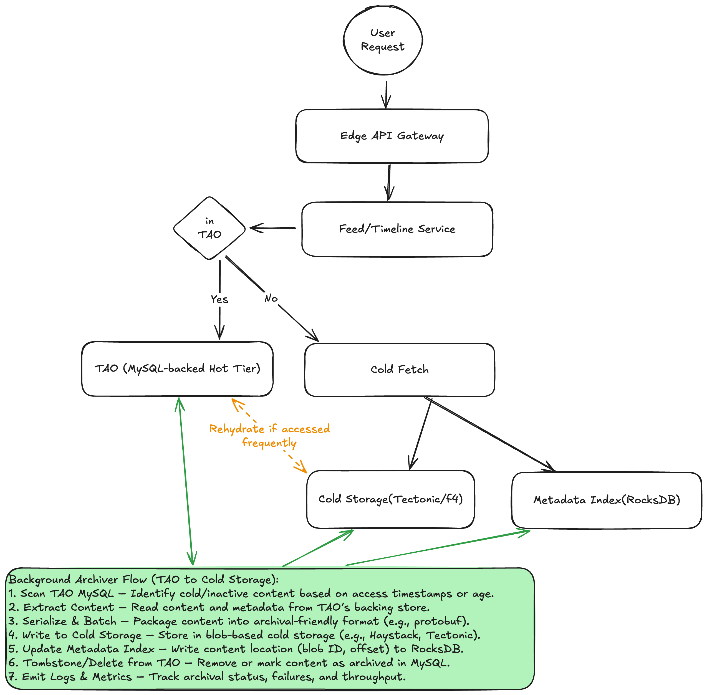

# Cold Storage Access and Archival Design

## Overview

This document describes the architecture and data flow for handling user content retrieval in a tiered storage system that separates **hot** and **cold** data. The system optimizes for performance, scalability, and cost-efficiency by keeping frequently accessed data in a MySQL-backed hot tier (TAO) and moving older data into a lower-cost cold storage system.

---

## Components

### 1. **User Request**
- Entry point initiated by user interactions with a social app or platform.

### 2. **Edge API Gateway**
- Handles authentication, routing, and rate-limiting.
- Forwards the request to the appropriate backend service.

### 3. **Feed/Timeline Service**
- Core service responsible for assembling the user feed.
- Determines whether requested content is available in TAO or needs to be fetched from cold storage.

### 4. **TAO (MySQL-backed Hot Tier)**
- Facebook’s cache-backed graph store.
- Stores frequently accessed objects and their relationships.
- Reads are fast and low-latency.
- Does not hold old or cold content.

### 5. **Cold Fetch Service**
- Invoked when data is not available in TAO.
- Looks up the location of cold content using the **Metadata Index**.
- Fetches the actual content from **Cold Storage**.

### 6. **Metadata Index (RocksDB)**
- Stores mappings of object IDs to blob locations in cold storage.
- Fast, local key-value store (RocksDB) used for efficient lookups.

### 7. **Cold Storage (e.g., Tectonic, F4, Haystack)**
- Stores serialized blobs of cold data (posts, media, etc.).
- Optimized for durability and cost rather than latency.

---

## Archiver Flow (Background Process)

The **archiver** runs in the background to migrate data from TAO to cold storage.

**Steps:**
1. **Scan TAO MySQL** – Identify cold/inactive content based on access timestamps or age.
2. **Extract Content** – Read content and metadata from TAO’s backing store.
3. **Serialize & Batch** – Package content into archival-friendly format (e.g., protobuf).
4. **Write to Cold Storage** – Store in blob-based cold storage (e.g., Haystack, Tectonic).
5. **Update Metadata Index** – Write content location (blob ID, offset) to RocksDB.
6. **Tombstone/Delete from TAO** – Remove or mark content as archived in MySQL.
7. **Emit Logs & Metrics** – Track archival status, failures, and throughput.

---

## Rehydration (Cold → Hot)

If cold content is accessed frequently, the system may **rehydrate** it by copying it back into the TAO hot tier to improve subsequent access latency.

- Triggered by cold fetch access patterns.
- Optional based on policy (e.g., number of hits within time window).
- Rehydrated content bypasses cold fetch in future requests.

---

## Benefits

- **Latency-optimized** for hot data access.
- **Storage-optimized** for older, infrequently accessed data.
- **Scalable** with background archiver and tiered lookup.
- **Cost-efficient** by reducing load on MySQL and warm storage.

---

## Future Considerations

- TTL-based automated expiry in RocksDB.
- Compression or deduplication of archival blobs.
- Preemptive rehydration during user login based on heuristics.

---

## Diagram

You can edit this diagram by uploading the PNG to [Excalidraw](https://excalidraw.com).
