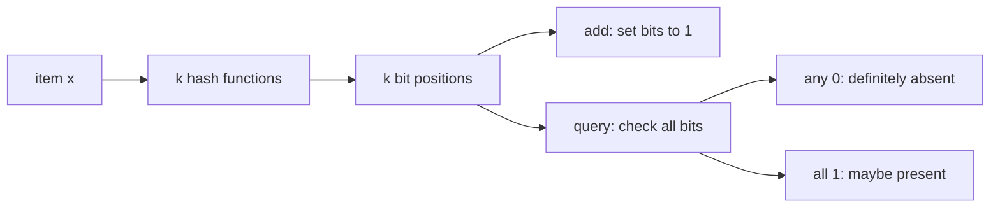

# Bloom Filter

A Bloom filter is a probabilistic data structure for testing whether an item may be in a set. It is space-efficient and fast, but it allows false positives: it can say an item might exist when it does not. It never returns false negatives if the filter is used correctly.

## When to use it
- Avoiding unnecessary disk reads in LSM/SSTable-based storage engines
- Cache admission or negative-cache checks before expensive lookups
- Deduplication pre-checks in streams and ingestion pipelines
- URL, IP, or ID membership checks where occasional false positives are acceptable

## How it works
1. Allocate a bit array of size `m`, initialized to 0.
2. Choose `k` independent hash functions.
3. To add item `x`, compute `k` hashes and set those bit positions to 1.
4. To query item `x`, compute the same `k` hashes:
   - If any bit is 0, `x` is definitely not present.
   - If all bits are 1, `x` may be present.

Example:

```text
bits: 0 0 0 0 0 0 0 0
add "alice" -> hashes to positions 1, 4, 6
bits: 0 1 0 0 1 0 1 0
```

## Error properties
Approximate false positive probability:

```text
p ~= (1 - e^(-kn/m))^k
```

where:

- `m` = number of bits
- `n` = inserted items
- `k` = number of hash functions

Optimal number of hash functions:

```text
k ~= (m / n) ln 2
```

## Operations and properties
- Add: O(k)
- Query: O(k)
- Delete: not supported by a standard Bloom filter
- Union: bitwise OR for filters with the same `m`, `k`, and hash functions
- Space: much smaller than storing the full set

## Practical notes
- Choose capacity and target false positive rate before allocating the filter.
- Overfilling the filter increases false positives quickly.
- Use stable, high-quality hashes across services and deployments.
- Use a counting Bloom filter if deletes are required.
- Use a scalable Bloom filter if the final set size is unknown.

## Mermaid sketch


## Interview Q&A
- Q: Can a Bloom filter produce false negatives?
  - A: No, not in the standard design if items are only added and the same hash functions are used.
- Q: Why does it produce false positives?
  - A: Different items can set overlapping bits, making a non-inserted item look present.
- Q: How do you tune a Bloom filter?
  - A: Pick `m` and `k` based on expected inserts `n` and acceptable false positive probability.
- Q: When should you not use one?
  - A: When exact membership is required or deletes are needed without a counting variant.

## See Also
- [hyperloglog.md](./hyperloglog.md)
- [count-min-sketch.md](./count-min-sketch.md)
- [caching.md](../components/caching.md)
- [big-data-storage-platforms.md](../components/big-data-storage-platforms.md)
