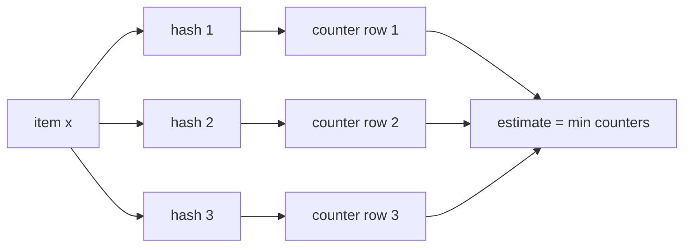

# Count-Min Sketch

Count-Min Sketch (CMS) is a probabilistic data structure for estimating item frequencies in a stream. It uses a small table of counters and multiple hash functions to answer "how many times have I seen this item?" with bounded overestimation.

## When to use it
- Heavy hitter detection in high-volume event streams
- Approximate per-key counts for telemetry, clicks, impressions, or API calls
- Abuse and rate-limit signals where exact per-key state is too expensive
- Frequency estimation before promoting hot keys into exact tracking

## How it works
1. Allocate a 2D table with `d` rows and `w` columns, initialized to 0.
2. Choose `d` hash functions, one per row.
3. To add item `x` with count `c`, increment one counter per row:
   - row `i`, column `hash_i(x) % w`
4. To estimate the count for `x`, read the same `d` counters and return the minimum.

The minimum is used because hash collisions only increase counters. CMS never underestimates counts in the standard positive-update model.

```text
estimate(x) = min(table[i][hash_i(x) % w] for i in 1..d)
```

## Error properties
For total stream count `N`, CMS can be configured so the estimate is at most:

```text
true_count(x) + epsilon * N
```

with probability at least:

```text
1 - delta
```

Typical sizing:

```text
w ~= e / epsilon
d ~= ln(1 / delta)
```

## Operations and properties
- Add/update: O(d)
- Query: O(d)
- Merge: element-wise addition for sketches with the same dimensions and hash functions
- Space: O(w * d)
- Bias: overestimates due to collisions; never underestimates for increment-only streams

## Practical notes
- CMS works best when approximate counts are acceptable and cardinality is high.
- Use conservative update to reduce overestimation in skewed streams.
- Use separate sketches per time window for recent-frequency queries.
- CMS is not ideal for negative updates unless the workload and variant are carefully defined.
- For exact top-k, pair CMS with a candidate heap or exact cache of likely heavy hitters.

## Mermaid sketch


## Interview Q&A
- Q: Why does Count-Min Sketch return the minimum counter?
  - A: Each counter may include collision noise, and the smallest counter is the least inflated estimate.
- Q: Can CMS undercount?
  - A: Not for increment-only streams with consistent hashing; collisions only add extra count.
- Q: How do you merge sketches from multiple shards?
  - A: Add corresponding counters, assuming the sketches use the same width, depth, and hash functions.
- Q: How does CMS differ from HyperLogLog?
  - A: CMS estimates per-item frequency; HyperLogLog estimates distinct cardinality.

## See Also
- [hyperloglog.md](./hyperloglog.md)
- [bloom-filter.md](./bloom-filter.md)
- [stream-processing.md](../components/stream-processing.md)
- [data-pipelines.md](../components/data-pipelines.md)
