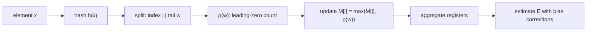

# HyperLogLog (Approximate Distinct Counting)

HyperLogLog (HLL) is a probabilistic data structure for estimating the number of distinct elements (cardinality) in a multiset using very little memory. It trades exactness for space and speed, delivering a tunable, bounded error with mergeability.

## When to use it
- Unique visitors, unique users per feature, distinct IPs, unique search queries
- Large-scale telemetry/event pipelines where exact counts are too costly
- Per-key cardinality in stream processors (e.g., uniques per campaign/post)
- Distributed systems needing mergeable counters across shards/partitions

## How it works (core algorithm)

Suppose we have four registers (a tiny key-value store):

```text
R0=0 R1=0 R2=0 R3=0
```

Three users arrive:

```text
Alice   → hash=001011 → bucket=00 (R0), remaining=1011 → first 1 at position 1 → R0=max(0,1)=1

Bob     → hash=000101 → bucket=00 (R0), remaining=0101 → first 1 at position 2 → R0=max(1,2)=2

Charlie → hash=010111 → bucket=01 (R1), remaining=0111 → first 1 at position 2 → R1=max(0,2)=2
```

After processing all three users, the only thing stored is:

```text
R0=2 R1=2 R2=0 R3=0
```

Alice, Bob, and Charlie are gone. Only these four numbers remain.

### How does HLL determine the count?

HLL looks at:

```text
R0=2 R1=2 R2=0 R3=0
```

and thinks:

- "I've seen two buckets with a value of 2."
- "Getting a value of 2 is somewhat rare."
- "This pattern suggests I have probably seen about 3 distinct values."

If 1 million users came through, the registers might look like:

```text
R0=17 R1=18 R2=16 R3=19
```

and HLL would infer:

> "Values this large are very rare. I must have seen roughly 1 million unique users."

The magic is that no user IDs are stored—just a few integers.

### Error properties

Standard error:

```text
≈ 1.04 / √m
```

where:

- `m = 2^p`
- `p` is the precision parameter

Typical configuration:

```text
p = 14
m = 16,384 registers
6 bits/register
≈ 12 KB memory
≈ 1% error
```

## Operations and properties
- Merge/union: register-wise maximum: M_union[j] = max(M_A[j], M_B[j]).
- Streaming-friendly: single pass, O(1) update per item.
- Order-independent: depends only on hashed elements.
- Per-key HLLs: maintain one HLL per dimension (e.g., per post, per tenant) and merge upstream.

## Practical notes
- Hashing: use high-quality 64-bit or 128-bit hashes; ensure stable hashing across services/languages.
- Sparse vs. dense: use a sparse representation for very small cardinalities, switch to dense at a threshold.
- Windows: for time-bounded uniques, maintain windowed HLLs (tumbling/sliding) and merge for aggregates.
- Memory: choose p by target error ε ≈ 1.04/√m; m = (1.04/ε)^2; ensure register bit-width fits max observed ρ.
- Limitations: cannot directly compute intersections; can approximate via inclusion–exclusion using multiple HLLs (adds variance).

## Mermaid sketch


## Interview Q&A
- Q: What is the error bound of HLL and how do you tune it?
  - A: Std error ≈ 1.04/√m; choose m = 2^p. Larger m lowers error but increases memory.
- Q: How do you merge results from multiple shards?
  - A: Take the register-wise maximum across HLLs (same p and register size).
- Q: When would you prefer HLL over exact counting?
  - A: When distinct counting is large-scale, approximate results are acceptable, and memory/latency budgets are tight.
- Q: How does HLL compare to Bloom filters or Count-Min Sketch?
  - A: [Bloom filters](./bloom-filter.md) test set membership with false positives, [Count-Min Sketch](./count-min-sketch.md) estimates frequency with overestimation; HLL estimates cardinality (uniques) with bounded relative error.
- Q: How are small cardinalities handled?
  - A: Use Linear Counting with the count of zero registers; many implementations use sparse encodings for this regime.

## See Also
- [data-pipelines.md](../components/data-pipelines.md)
- [batch-processing.md](../components/batch-processing.md)
- [stream-processing.md](../components/stream-processing.md)
- [caching.md](../components/caching.md)
- [bloom-filter.md](./bloom-filter.md)
- [count-min-sketch.md](./count-min-sketch.md)
