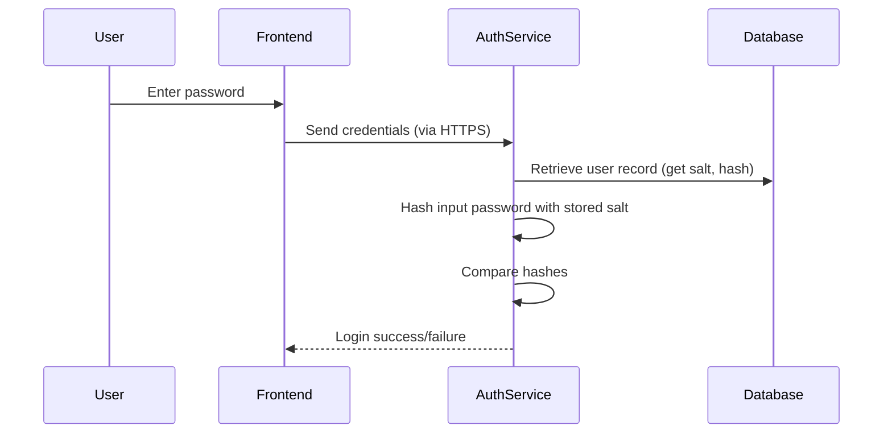
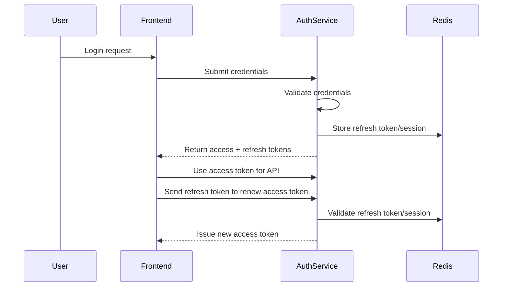
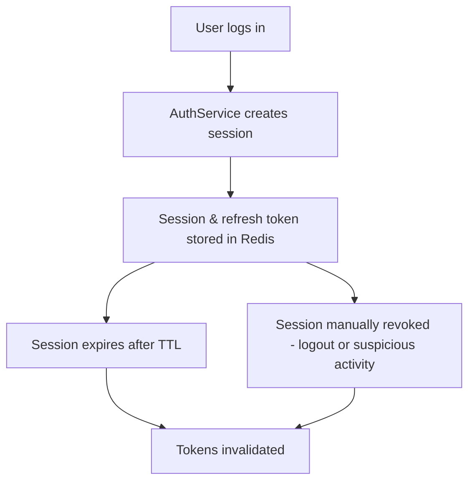
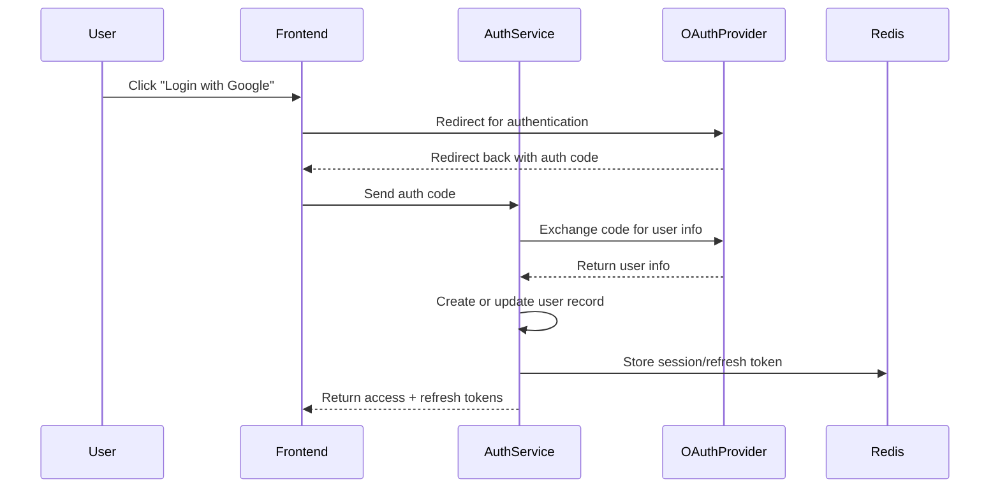
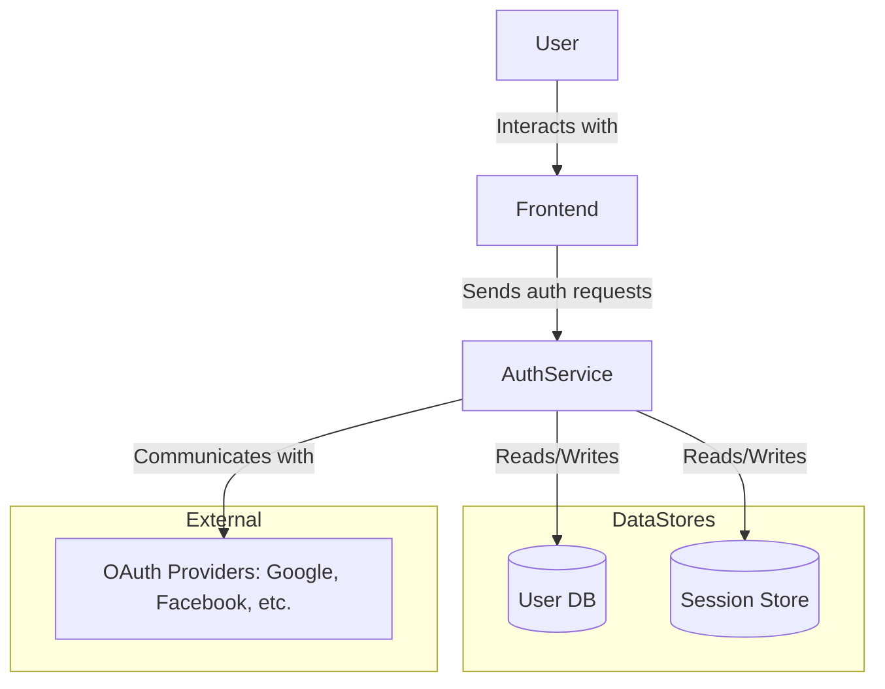

# Design a Secure Authentication System

## Problem
Design an auth system supporting password login, sessions, refresh tokens, and OAuth.

## Requirements
- Secure password hashing
- Access + refresh tokens
- Session expiration & revocation
- Optional SSO/OAuth

### Secure Password Hashing

Passwords are never stored in plaintext. When a user signs up or changes their password, the system hashes the password using a strong, adaptive algorithm (such as bcrypt or Argon2) with a unique, randomly generated salt for each user. During login, the provided password is hashed with the same algorithm and salt, and the result is compared to the stored hash. This approach ensures that even if the database is compromised, attackers cannot easily recover original passwords.

**Key Protections**
- Passwords are never stored or transmitted in plaintext.
- Unique salts prevent use of precomputed rainbow tables.
- Adaptive hashing algorithms slow down brute-force attacks.

### Access + Refresh Tokens

Upon successful authentication, the system issues a short-lived access token (typically a JWT) and a long-lived refresh token. The access token is used for authorizing API requests, while the refresh token allows the client to obtain new access tokens without re-entering credentials. Refresh tokens are securely stored server-side (e.g., in Redis) and can be revoked at any time.

**Key Protections**
- Access tokens have short lifetimes to limit exposure.
- Refresh tokens are stored securely and can be revoked.
- Tokens are signed to prevent tampering.

### Session Expiration & Revocation

Sessions are tracked in an in-memory store (like Redis) with associated metadata (expiration, device info, etc.). Each session is tied to a refresh token. Sessions expire automatically after a set period or can be revoked manually (e.g., on logout or suspicious activity), immediately invalidating associated tokens.

**Highlights**
- Sessions automatically expire after inactivity or a maximum age.
- Revocation enables immediate logout across devices.
- Centralized session store allows scalable management and monitoring.

### Optional SSO / OAuth Integration

The system can integrate with external OAuth providers (e.g., Google, Facebook) to support single sign-on (SSO). Users authenticate with the provider, and the auth service handles callbacks, retrieves user info, and issues local tokens and sessions just as with password login.

**Highlights**
- No password is handled by the local system for OAuth users.
- OAuth tokens are exchanged securely, and only trusted providers are allowed.
- Local sessions and tokens are managed identically to password-based users.

## Architecture Overview

The authentication system consists of several key components that work together to provide secure and seamless user authentication.

- **Frontend:** The client-side application (web or mobile) where users enter credentials or initiate OAuth login. It communicates with the auth service via secure HTTPS APIs.
- **Auth Service:** The backend service responsible for handling user authentication, issuing and verifying tokens, managing sessions, and integrating with external OAuth providers.
- **Database:** Stores user records including securely hashed passwords and user profile information.
- **Redis:** An in-memory data store used to manage active sessions and refresh tokens, enabling quick revocation and expiration.
- **External OAuth Providers:** Third-party services (e.g., Google, Facebook) that provide OAuth-based single sign-on capabilities.

## Data Model & Protection

- **Passwords:** Stored in the database after being hashed using strong, adaptive algorithms such as bcrypt or Argon2 with unique salts per user. Plaintext passwords are never stored or logged.
- **Access Tokens:** Typically JWTs signed with a secure secret or private key. They contain user identity and authorization claims and have short expiration times (e.g., 15 minutes).
- **Refresh Tokens:** Long-lived opaque tokens stored securely in Redis and associated with user sessions. They allow obtaining new access tokens without re-authentication.
- **Sessions:** Session identifiers and metadata (e.g., expiration time, device info) are stored in Redis to enable session management, expiration, and revocation.

## Flow Summary

- **Sign-up:** User provides credentials via frontend → Auth service hashes password and stores user in database → Optionally, an initial session and tokens are created.
- **Login:** User submits credentials → Auth service verifies password hash → On success, generates access and refresh tokens → Stores session in Redis → Returns tokens to frontend.
- **Token Refresh:** Frontend sends refresh token → Auth service validates token and session → Issues new access token and optionally a new refresh token → Updates session info in Redis.
- **Logout:** Frontend requests logout → Auth service deletes session and refresh token from Redis → Access tokens expire naturally or are blacklisted if implemented.
- **OAuth Login:** User initiates OAuth flow on frontend → Auth service handles OAuth callbacks → Retrieves user info from provider → Creates or updates user record → Issues tokens and sessions as in login flow.

## Security Measures

- **Password Hashing:** Use bcrypt or Argon2 with unique salts and sufficient cost factor to resist brute-force attacks.
- **HTTPS/TLS:** All communication between frontend, auth service, and external providers is encrypted to prevent eavesdropping.
- **JWT Signing:** Access tokens are signed with strong secrets or asymmetric keys to prevent tampering.
- **Token Expiration:** Access tokens have short lifetimes; refresh tokens have longer but limited lifetimes with revocation support.
- **CSRF and XSS Defenses:** Implement CSRF tokens and sanitize inputs to protect against cross-site request forgery and scripting attacks.
- **Refresh Token Revocation:** Store refresh tokens server-side (in Redis) and invalidate them on logout or suspicious activity to prevent reuse.

## Summary

This design provides a robust authentication system that balances security and usability. It ensures that user credentials are protected through strong hashing, tokens are securely managed with expiration and revocation, and OAuth integration allows flexible sign-on options. By leveraging in-memory session stores and careful security practices, the system supports scalable, secure authentication for modern applications.

## See Also
- Design Docs
    - [Rate Limiter](../rate-limiter/rate-limiter-design.md)
    - [Notification System (email/SMS verifications, resets)](../notification-system/notification-system-design.md)
    - [Policy System (Authorization/ABAC/RBAC)](../policy-system/policy-system.md)

- API & Gateway
    - [REST API Design](../../components/rest-api.md)
    - [gRPC API Design](../../components/grpc-api.md)
    - [GraphQL API Design](../../components/graphql-api.md)
    - [API Versioning](../../components/api-versioning.md)
    - [API Gateway](../../components/api-gateway.md)
    - [Idempotency](../../components/idempotency.md)

- Architecture & Data
    - [Stateless Architecture](../../components/stateless-architecture.md)
    - [Stateful Architecture](../../components/stateful-architecture.md)
    - [Layered Architecture](../../components/layered-architecture.md)
    - [Caching](../../components/caching.md)
    - [Consistency](../../components/consistency.md)
    - [Replication](../../components/replication.md)

- Security & Tokens
    - [Salt: Usage in Systems](../../components/salt.md)
    - [Real-Time Communication](../../components/real-time-communication.md)
