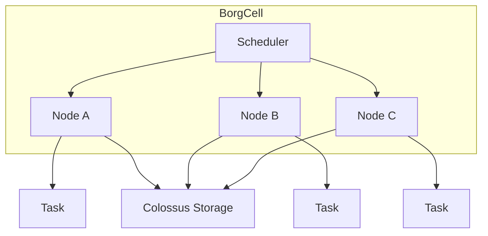

# Borg

Borg is Google’s internal cluster manager and container orchestration system, precursor to Kubernetes. It emphasizes efficiency, priority scheduling, and scale across massive clusters.

## Core Concepts
- **Job / Task Model:** A job is composed of many identical tasks scheduled across nodes.
- **Cells:** Borg clusters (cells) isolate workloads at massive scale.
- **Priorities & Quotas:** High-priority production jobs can preempt lower-priority batch jobs; quotas ensure fairness across teams.
- **Bin Packing:** Aggressively co-locates workloads to maximize utilization.
- **Failure Recovery:** Tasks automatically rescheduled on node failures.

## Colossus
Colossus is Google's distributed storage system that underpins Borg's persistent storage needs. It provides high durability, availability, and scalability by distributing data across multiple machines and datacenters.

## High-Level Architecture

## Trade-offs
- Extremely high utilization and robust preemption
- Centralized, monolithic scheduler (optimized but less flexible)
- Tight integration with internal Google systems
