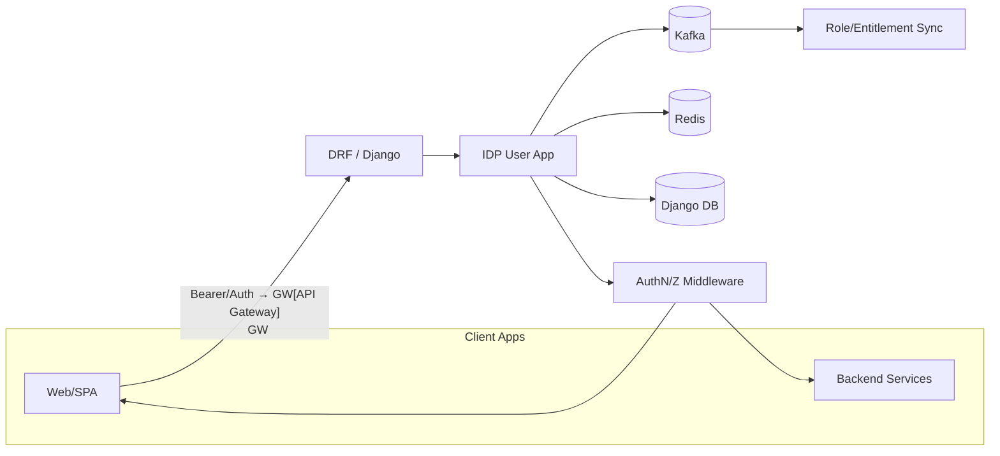
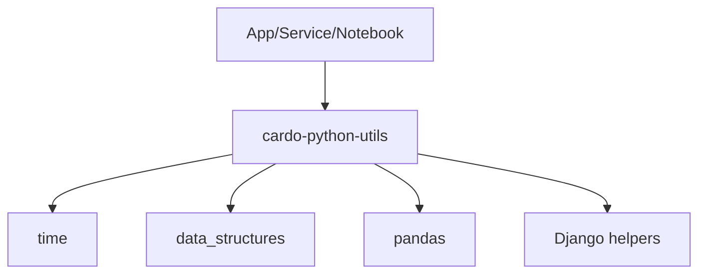
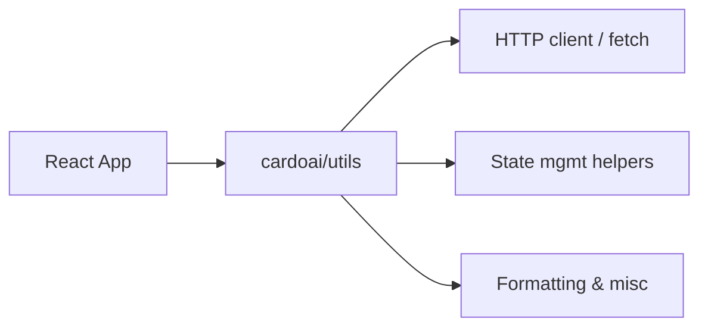
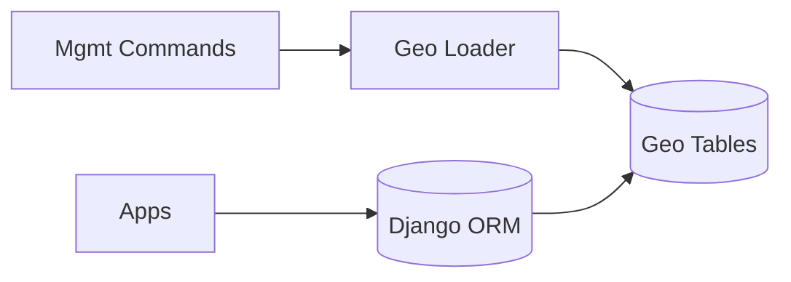
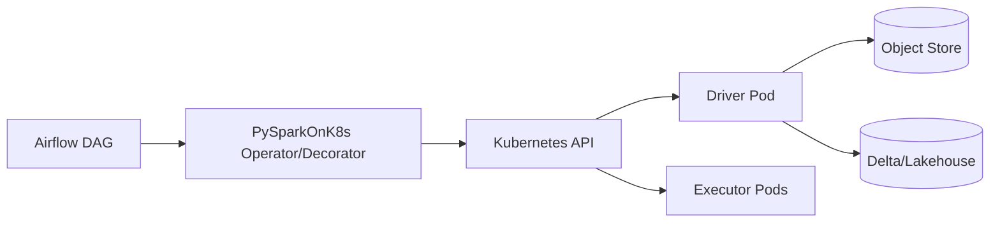
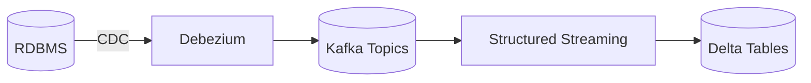
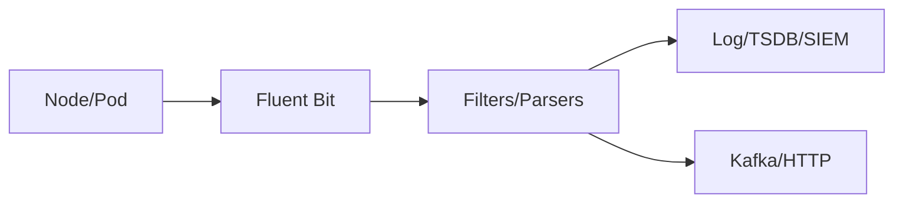
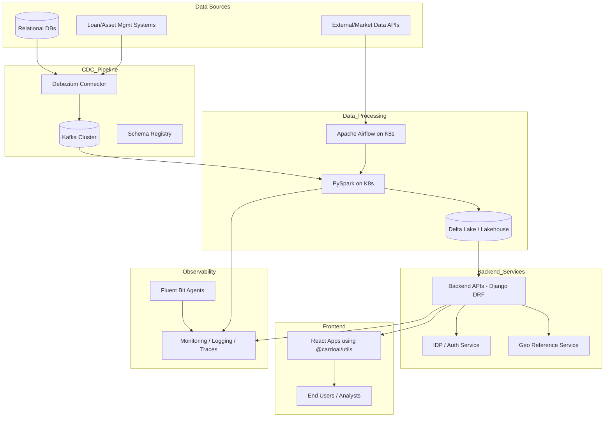

<file name=0 path=/Users/brandonbenge/Desktop/GitProjects/InterviewPrep/system-design/case-study/cardoai.md># Cardo AI — Public GitHub Footprint (quick scan)

> Snapshot of CardoAI’s public repos and what they imply about the stack. Focus: what it does, where it sits in the stack, license, and a high‑level data‑flow sketch for each project.

At a high level, Debezium captures change data from relational sources (e.g., RDBMS) into Kafka, which is then consumed by Spark jobs or Airflow DAGs to populate the lakehouse (Delta). The frontend React apps query aggregated or curated data from these analytical stores or APIs exposed by Django-based backend services.

---

## 1) `django-idp-user`
**What it does**: Django app that integrates products with an internal Identity Provider (IDP) for user authorization; supports async, Kafka-backed role propagation, DRF integration, Channels middleware, and Redis caching.

**Where it lives in the stack**: Backend platform/auth layer shared by multiple services; touches messaging (Kafka), cache (Redis), HTTP APIs (Django/DRF), and WebSocket auth (Channels).

**License**: MIT

**High‑level data flow**

---

## 2) `cardo-python-utils`
**What it does**: Python helper library with utilities across time, strings, data structures, math, pandas, Django, REST support; 100% test coverage target and extras for optional deps.

**Where it lives in the stack**: Shared library used across data/ML and backend repos to standardize common helpers.

**License**: MIT

**High‑level data flow**

---

## 3) `cardo-react-utils`
**What it does**: TypeScript/React utility package published as `@cardoai/utils`; bundles reusable client-side helpers/services for CardoAI frontends.

**Where it lives in the stack**: Frontend shared library consumed by SPAs.

**License**: (not stated in repo root; treat as internal until a LICENSE appears)

**High‑level data flow**

---

## 4) `django-geographical-module`
**What it does**: Django app providing models/commands to load/postcode and NUTS geo relationships; ships migrations and management commands.

It standardizes geographical reference data (NUTS regions, postcodes, geo hierarchies) for use across analytics and credit models—helping unify how geographic data is represented and joined to financial datasets.

**Where it lives in the stack**: Data/reference-services layer used by products that need standardized geo lookups.

**License**: MIT

**High‑level data flow**

---

## 6) `apache-airflow-providers-pysparkonk8s` (fork)
**What it does**: Airflow provider that launches PySpark tasks on Kubernetes (Client/Local/Connect modes); decorates TaskFlow functions and provides an operator; handles pod placement/affinity and dynamic worker requests/limits.

**Where it lives in the stack**: Data engineering & ML platform orchestration (Airflow) running Spark on K8s.

**License**: Apache-2.0

**High‑level data flow**

---

## 7) `kafka2delta` (fork)
**What it does**: Streams Debezium CDC messages from Kafka (Confluent Avro + Schema Registry) into Delta Lake using Spark Structured Streaming.

Upstream CDC source: Debezium typically listens to relational databases (e.g., PostgreSQL, MySQL, SQL Server) to capture inserts, updates, and deletes in real time.

**Where it lives in the stack**: Data ingestion / lakehouse pipelines; RDBMS → Kafka → Delta replication.

**License**: Apache-2.0

**High‑level data flow**

---

## 8) `fluent-bit` (fork)
**What it does**: CNCF Fluent Bit — high‑performance log/metric/trace processing and forwarding. Presence as a fork suggests downstream config/patching for observability pipelines.

**Where it lives in the stack**: Observability/telemetry edge agent on nodes/containers feeding log/metric/trace backends.

**License**: Apache-2.0

**High‑level data flow**

---

## What this says about CardoAI’s tech stack (public signal)
- **Backend**: Django/DRF with async support; custom auth/IDP integration; Redis; Kafka.
- **Data/Platform**: Airflow on Kubernetes, Spark (incl. Connect), Delta Lake, Debezium CDC via Kafka.
- **Frontend**: React/TypeScript utilities consumed via `@cardoai/utils`.
- **Observability**: Fluent Bit fork implies custom pipelines and config for logs/metrics/traces.
- **Shared libs**: Python and React utility packages to reduce duplication across products.

---

### Notes & caveats
- Licenses listed above reflect the repo LICENSE files at the time of this scan (MIT or Apache‑2.0 where present). Treat any repo without a LICENSE file as **all‑rights‑reserved** by default.
- Several projects are forks (Airflow provider, kafka2delta, fluent‑bit); expect internal patches or curated versions.
- This is a high‑level scan; private repos/apps are not visible here.

---

## Probable Cardo AI Architecture (inferred)

> This diagram reflects an inferred high‑level architecture based on Cardo AI’s open‑source footprint and public business model around asset‑based finance and credit analytics.

**Interpretation**
- **Data ingestion**: Relational or transactional systems feed into Kafka via Debezium CDC; market/CRM data enters via APIs.
- **Processing layer**: Spark jobs (triggered/orchestrated by Airflow) enrich and aggregate data into Delta Lake.
- **Backend services**: Django apps expose curated and modelled datasets through authenticated APIs; Geo and IDP modules support reference data and user authorization.
- **Frontend**: React SPAs consume backend APIs to visualize or manage portfolio and credit analytics.
- **Observability**: Fluent Bit agents collect logs/metrics/traces from K8s workloads and feed centralized monitoring.

---</file>