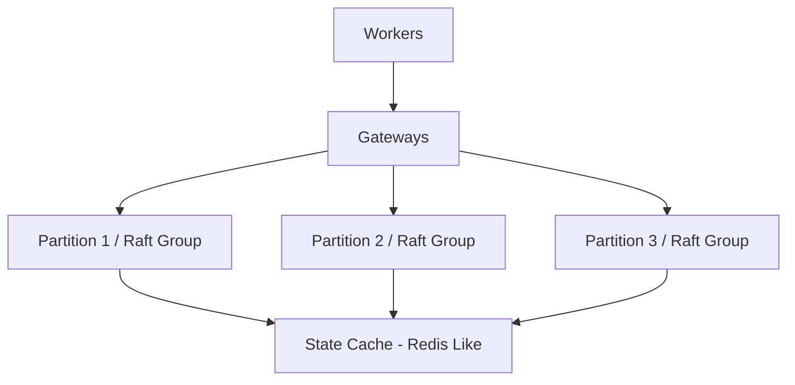
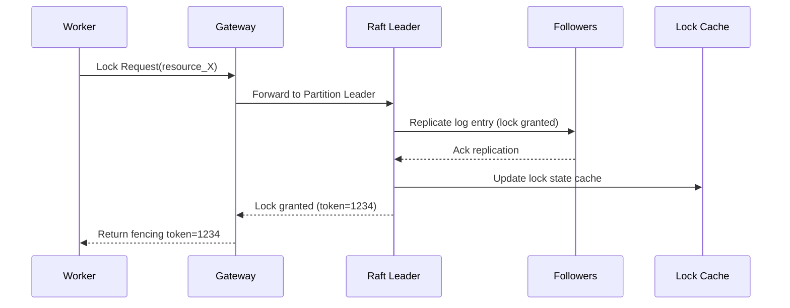
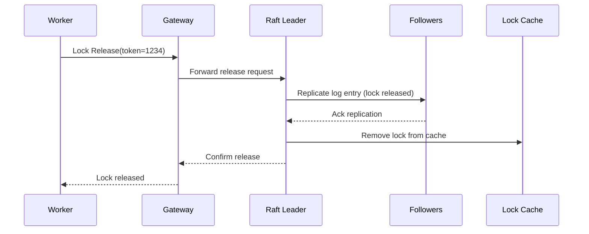
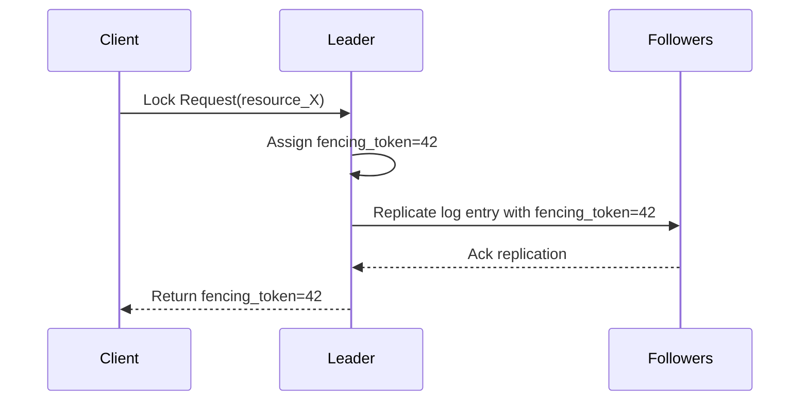
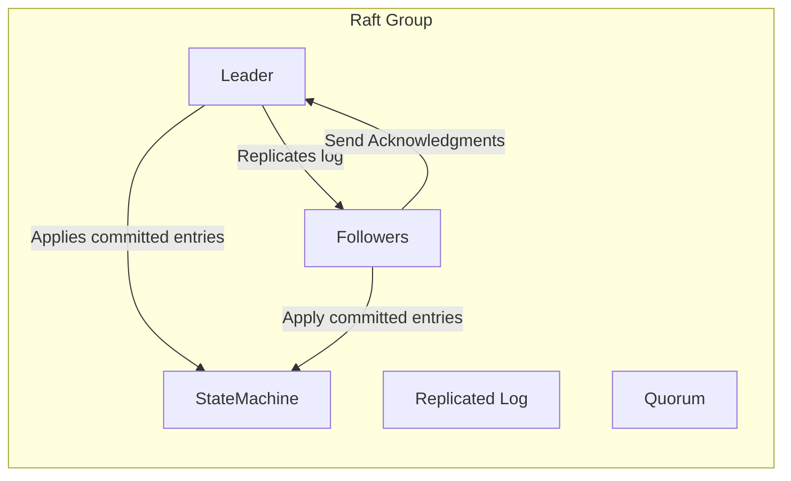
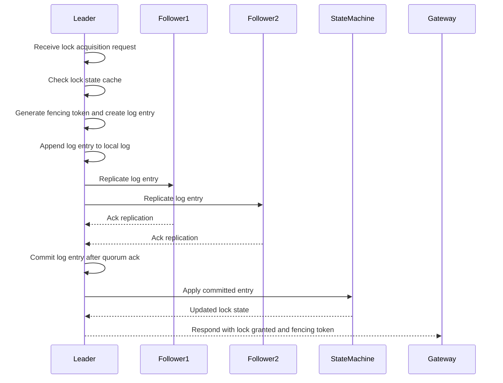

# Distributed Locking System Design

## Goals
- Provide mutual exclusion for distributed resources.
- Ensure fault tolerance and high availability.
- Support scalability for a large number of resources.
- Minimize latency for lock acquisition and release.
- Provide strong consistency guarantees.

## High-Level Architecture

At a high level, workers (clients) communicate with Gateways, which serve as the API layer. The Gateways determine the partition by computing a hash on the `resource_id` before routing lock requests to the appropriate partition leaders. Each partition is managed by a Raft group, composed of a leader and followers. The Raft group persists the lock state in a replicated log and applies updates to the state machine to maintain consistency. For fast access, a lock state cache is maintained alongside the Raft group, implemented using a Redis-like system for fast lookups.

## Components

### 1. Clients (Workers)
- Request locks to access shared resources.
- Release locks after use.
- Handle lock acquisition failures and retries.

### 2. Gateway (API Layer)
- Entry point for client requests.
- Routes lock requests to the appropriate partition leader based on `resource_id` hashing.
- Handles client communication and responses.

### 3. Partitioned Lock Service
- The lock space is partitioned and each partition is managed by a Raft group.
- Each Raft group handles consensus and lock state for its subset of resources.
- Gateways perform hash-based routing to partition leaders.

### 4. Raft Consensus Module
- Ensures strong consistency of lock state across replicas.
- Handles leader election, log replication, and fault tolerance.
- Guarantees that lock state changes are durable and ordered.

### 5. Lock State Cache
- Maintains the current state of locks for quick access.
- Updated by the Raft leader after log entries are committed.
- Used to quickly determine lock availability.

## Data Model
- **Lock Request:** {resource_id, client_id, request_type (acquire/release), fencing_token}
- **Lock State:** {resource_id, owner_client_id, fencing_token, expiration_time}

## Lock Lifecycle

### Lock Acquisition Flow
1. Client sends a lock acquisition request to the Gateway.
2. Gateway determines the partition leader for the resource.
3. Gateway forwards the request to the partition leader.
4. Leader checks the current lock state cache:
   - If the resource is unlocked or the lock has expired, the leader:
     - Generates a new fencing token.
     - Creates a log entry for lock acquisition.
     - Replicates the log entry to followers via Raft.
   - If locked by another client, rejects or queues the request.
5. Upon log commitment, leader updates the lock state cache.
6. Leader responds to Gateway with lock granted and fencing token.
7. Gateway returns the fencing token to the client.

### Lock Release Flow
1. Client sends a lock release request with fencing token to Gateway.
2. Gateway forwards the request to the partition leader.
3. Leader verifies the fencing token matches the current owner.
4. Leader creates a log entry for lock release.
5. Replicates log entry to followers via Raft.
6. Upon commitment, leader updates the lock state cache to unlock.
7. Leader responds to Gateway confirming release.
8. Gateway informs client of successful release.

### Expiration & Renewal
- Locks have a TTL (time-to-live) to prevent indefinite locking due to client failures.
- The expiration time is stored in the lock state.
- If a lock expires, it is considered released and can be acquired by others.
- Clients can renew locks by sending a renewal request before expiration, which the leader processes similarly to acquisition.
- Expired locks are evicted from the cache and state machine upon log commitment.

### Handling Failures
- Raft leader failure triggers leader election to maintain availability.
- Clients retry requests on failure or redirection.
- Lock state is preserved and consistent due to Raft log durability.
- Expired locks can be forcibly released to avoid deadlocks.

## Fencing Tokens

### What it is
- A monotonically increasing token assigned to each lock acquisition.
- Used to prevent stale clients from accessing resources after losing the lock.

### How Managed
- The Raft leader of each partition generates and increments the fencing token whenever a new lock is granted.
- The token value is persisted as part of the Raft log, ensuring durability and monotonicity.
- Followers replicate and apply the token through the log, so if the leader fails, the new leader continues from the latest token.
- The fencing token is stored in the state machine along with the lock state.

### Why Needed
- Ensures that clients holding stale locks cannot perform operations on the resource.
- Provides a safety mechanism in distributed environments with failures and retries.

## Raft Group Internals

A Raft group is composed of the following components that work together to maintain consensus and consistency for the distributed lock state:

- **Leader:** The node responsible for handling client requests, appending log entries, and coordinating replication.
- **Followers:** Nodes that replicate the leader's log entries and participate in elections.
- **Replicated Log:** An ordered log of state-changing commands that is replicated across all nodes in the group.
- **State Machine:** Applies committed log entries to update the lock state consistently across all replicas.
- **Quorum:** A majority of nodes required to agree on log entries to ensure fault tolerance.

### Lock Acquisition Inside a Raft Group

When a lock acquisition request reaches the Raft leader, the following steps occur inside the Raft group:

1. The leader receives the lock acquisition request from the Gateway.
2. It checks the current lock state cache to determine if the resource is available.
3. If available, the leader generates a new fencing token and creates a log entry representing the lock acquisition.
4. The leader appends the log entry to its local replicated log.
5. The leader replicates the log entry to follower nodes.
6. Followers acknowledge the replication.
7. Once a quorum of followers have acknowledged, the leader commits the log entry.
8. The leader applies the committed entry to the state machine, updating the lock state cache.
9. The leader responds to the Gateway with confirmation and the fencing token.

## Scalability
- Partitioning by resource ID allows horizontal scaling.
- Multiple Raft groups handle different subsets of locks.
- Gateways can be scaled horizontally behind a load balancer.

## Observability & Operations
- **Metrics:** Track lock acquisition/release rates, latencies, failure counts, leader election events, and cache hit/miss ratios.
- **Tracing:** Distributed tracing for lock request flows across Gateway and Raft groups to diagnose latency and failures.
- **Configuration Hot-Reload:** Support dynamic configuration changes (e.g., partition count, TTL settings) without downtime.
- **Monitoring:** Alerts on leader unavailability, quorum loss, high latency, and cache inconsistencies.
- **Logging:** Structured logs for lock state changes and Raft events to facilitate debugging and audits.

---

## See Also
- [Sharding: Concepts & Trade-offs](../../components/sharding.md)
- Example: [Consistent Hashing Ring](../../../coding/consistent_hashing_ring/consistent_hashing_ring.md)

- [Write-Ahead Log (WAL): Concepts & Trade-offs](../../components/wal.md)
- [Raft Consensus Algorithm](../../components/raft.md)
