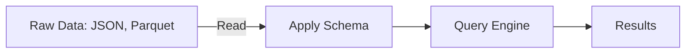
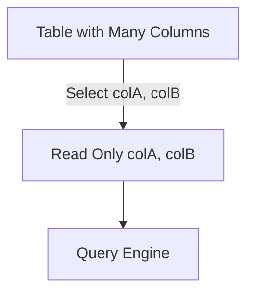
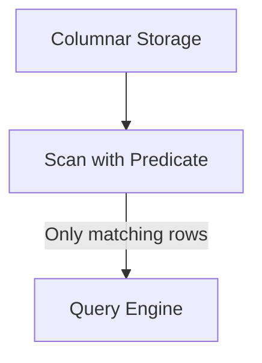

# Google Dremel System Design

## Overview

> This document outlines the architecture and data flow of Google Dremel, a distributed query engine for interactive analysis of large-scale datasets. Dremel powers BigQuery and is known for its tree-based aggregation, columnar storage, and scalable query execution.

---

## Requirements

#### *Functional*
- Support distributed, interactive SQL queries on petabyte-scale datasets
- Enable fast aggregation, filtering, and ad-hoc analysis
- Efficiently scan and process columnar data

#### *Non-Functional*
- Horizontal scalability across thousands of nodes
- High availability and fault tolerance
- Low-latency query response
- Optimized for analytical workloads

---

## 1. Distributed Data Processing

> Dremel uses a multi-level execution tree to parallelize queries across thousands of nodes, enabling fast aggregation and filtering.

#### *Key Flow (with Analytical Optimizations)*
- Client submits SQL query
- Query Coordinator (Root Server) receives and coordinates execution
- **Schema-on-Read:** Planner applies schema to raw data at read time (enables flexible ingestion of nested/semi-structured data)
- Planner splits query into sub-scans
- Intermediate Servers fan out requests and aggregate partial results
- Leaf Servers execute scans on shard data
- **Column Pruning:** Column Readers fetch only required columns needed for the query (reduces I/O)
- **Predicate Pushdown:** Local Filters/Aggregations apply filter predicates as early as possible at the scan/storage layer (skips irrelevant data)
- Partial Aggregations computed at leaf level
- Intermediate Aggregations combine leaf results
- Root Aggregation finalizes results
- Results streamed back to client

#### *Diagram*

---

## 2. Columnar Storage

> Data is stored in a column-oriented format, enabling efficient scanning, compression, and aggregation for analytical queries.

#### *Key Technologies*
- Table schema with nested/repeated fields
- Record shredding: flatten nested records to columns
- Columns segmented into chunks for parallelism
- Encodings: RLE, dictionary, etc. for compact storage
- Block-level compression reduces I/O
- Repetition/Definition levels encode nested/repeated structure
- Row groups align columns into manageable groups
- Metadata (min, max, nulls) for pruning
- Table manifest: index of chunks and metadata
- Distributed filesystem (Colossus) for scalable, reliable storage

#### *Diagram*

---

## 3. Query Engine

> Dremel supports SQL-like queries with fast aggregation, filtering, and ad-hoc analysis using a tree-based execution model.

#### *Key Flow (with Analytical Optimizations)*
- Parser converts SQL to internal representation
- Analyzer resolves schema, types, and permissions
- **Schema-on-Read:** Logical plan applies schema to data at read time
- Logical plan builds high-level operations (joins, filters)
- **Predicate Pushdown:** Optimizer rewrites plan to push filter predicates down to scan/storage layer
- **Column Pruning:** Optimizer/pruner identifies and selects only columns needed for the query
- Physical plan defines actual execution steps
- Task partitioning divides work into root/intermediate/leaf tasks
- Leaf tasks execute column scans and local filters (with predicate pushdown and column pruning)
- Intermediate tasks merge and aggregate partials
- Root task finalizes aggregations, sorting, and limits
- Result streaming sends results back incrementally to client

#### *Diagram*

---

## Use Cases

- Interactive analytics on large datasets
- Real-time business intelligence
- Log analysis and monitoring

---

---

## Key Analytical Concepts in Dremel

### Schema-on-Read

Schema-on-read is a data processing paradigm where the schema is applied to data only when it is read, not when it is written. This enables flexible ingestion of semi-structured or evolving data formats (e.g., JSON, Parquet), and is a core feature in Dremel-inspired systems.

**Pros:**
- Flexibility for evolving data formats
- Supports semi-structured/nested data
- Enables late binding of schema for analytics

**Cons:**
- Data quality issues may surface at query time
- Slower queries if schema inference is complex

**Mermaid Diagram:**

---

### Column Pruning

Column pruning is an optimization where only the columns required by a query are read and processed. Dremel’s columnar storage and metadata make this efficient, reducing I/O and speeding up analytics.

**How it works:**
- Query planner analyzes which columns are needed
- Only those columns are read from storage
- Unused columns are skipped entirely

**Mermaid Diagram:**

---

### Predicate Pushdown

Predicate pushdown is an optimization where filter conditions (predicates) are applied as early as possible—ideally at the storage or scan layer—so irrelevant data is skipped before it reaches the query engine. Dremel and columnar formats like Parquet/ORC support this for efficient scans.

**How it works:**
- Query planner identifies filter conditions
- Pushes filters to storage/scan layer
- Only rows matching predicates are read

**Mermaid Diagram:**

---

Dremel’s columnar, nested-data-aware storage and tree-based aggregation model has influenced many modern analytics systems:

- BigQuery (Google): Productization of Dremel with serverless, interactive SQL; separation of storage (Colossus + columnar) and compute; hierarchical aggregation for low-latency scans.
- Apache Drill: Open-source system explicitly modeled after Dremel; schema-on-read for nested data (JSON/Parquet), columnar execution, distributed hierarchical planning.
- Apache Parquet and ORC: Columnar file formats that encode nested/repeated structures (e.g., repetition/definition levels), enabling column pruning, predicate pushdown, and efficient scans.
- Presto/Trino: MPP SQL engines with vectorized, columnar operators and stage/fragment DAGs (Directed Acyclic Graphs); extensive use of Parquet/ORC with pruning and pushdown reminiscent of Dremel’s design goals.
- Apache Impala: Low-latency SQL on Hadoop with columnar execution, codegen/vectorization, predicate pushdown; optimized for interactive analytics like Dremel.
- Spark SQL: Catalyst optimizer with column pruning/pushdown, Parquet/ORC as first-class formats, and whole-stage codegen—embracing columnar storage principles popularized by Dremel. Execution is organized as a DAG (Directed Acyclic Graph) of stages.
- Procella (Google): Successor concepts behind BigQuery evolution that unify analytical and operational use cases while retaining Dremel-style scalable, interactive querying.

## See Also
- [Sharding: Concepts & Trade-offs](../../components/sharding.md)
- Example: [Consistent Hashing Ring](../../../coding/consistent_hashing_ring/consistent_hashing_ring.md)
- [Consistency: Concepts & Trade-offs](../../components/consistency.md)
- [Replication: Concepts & Trade-offs](../../components/replication.md)
- [Caching: Concepts & Trade-offs](../../components/caching.md)
- Example: [LRU Cache Implementation](../../../coding/caching_kv_store/lru_cache.md)
- Example: [TTL Cache Implementation](../../../coding/caching_kv_store/ttl_cache.md)

- [Colossus: Google’s Distributed File System](../colossus/colossus.md)

