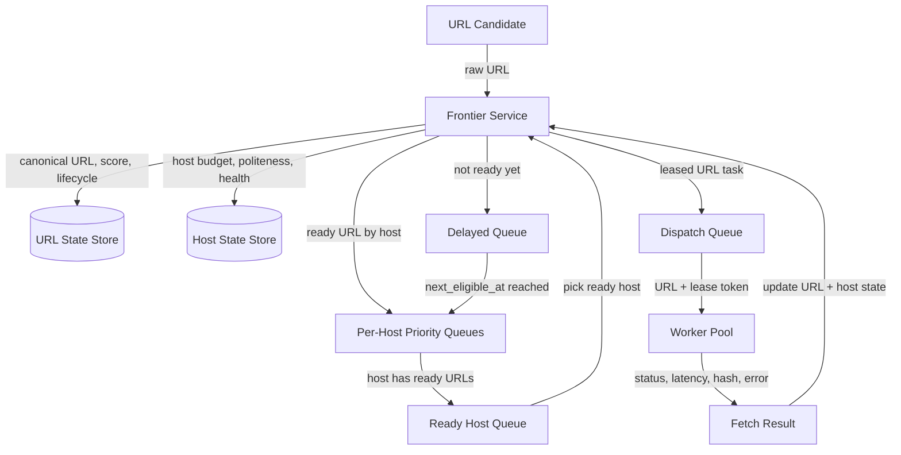

# Crawl Frontier Prioritization

## Purpose

The crawl frontier decides **which URL should be fetched next** and **when it is safe to fetch it**.

Crawler workers do not choose hosts, drain host queues, or manage politeness. They only consume leased URL tasks created by the frontier.

## Mental Model

```text
Host = chooses the queue.
URL score = chooses ordering inside that host queue.
Host state = decides when that host can be fetched.
Lease = temporary ownership of one fetch attempt.
Dispatch queue = delivery mechanism for leased work.
```

## Simplified Scheduling Flow

1. A URL candidate comes in.
2. The frontier canonicalizes and deduplicates the URL.
3. The frontier scores the URL and stores the score in `URL State`.
4. The URL's host determines which per-host priority queue it belongs to.
5. If the URL is not ready yet, it goes to the delayed queue.
6. If the URL is ready now, it goes into that host's priority queue.
7. The scheduler selects a host whose politeness window is open.
8. The scheduler calculates how many fetch slots are available for that host.
9. The scheduler pops the best eligible URL or small batch of URLs from that host queue.
10. The scheduler creates leases for those URLs.
11. The scheduler publishes leased tasks to the dispatch queue.
12. Workers consume leased tasks and fetch the URLs.
13. Fetch results update `URL State` and `Host State`.
14. The URL becomes completed, retry-delayed, recrawl-delayed, tombstoned, or blocked.

## High-Level Diagram



## URL State

`URL State` is the source of truth for a URL's scheduling and lifecycle.

```text
url_state {
  canonical_url
  host
  fetch_status
  priority_class
  crawl_score
  next_eligible_at
  retry_count
  recrawl_interval
  lease_owner
  lease_token
  lease_expires_at
  url_version
  last_fetch_at
  last_success_at
  last_content_hash
}
```

Important fields:

- `crawl_score`: ranks URLs inside the same host queue.
- `next_eligible_at`: prevents premature retry or recrawl.
- `fetch_status`: tracks lifecycle such as READY, LEASED, FETCHED, RETRY_DELAYED, TOMBSTONED.
- `lease_token`: proves the worker owns this fetch attempt.
- `url_version`: prevents stale workers from overwriting newer state.

## Host State

`Host State` is the source of truth for host safety and politeness.

```text
host_state {
  host
  crawl_delay
  max_parallel_fetches
  active_fetches
  next_host_fetch_at
  remaining_budget_tokens
  recent_error_rate
  average_fetch_latency
  host_priority_weight
}
```

A host is ready only when:

```text
next_host_fetch_at <= now
active_fetches < max_parallel_fetches
remaining_budget_tokens > 0
host has at least one ready URL
```

## Queues and Indexes

### Per-Host Priority Queue

Each host has a priority queue of ready URLs.

```text
a.com queue:
  /breaking-news   score 95
  /homepage        score 88
  /article-123     score 64
```

This is not FIFO. It is a scheduling index ordered by priority, eligibility, and score.

### Delayed Queue

URLs that are not ready yet wait here until `next_eligible_at`.

```text
/page5 retry at 12:30
/page9 recrawl at 13:00
```

### Ready Host Queue

Hosts with ready URLs are ordered by host readiness, fairness, and best available URL.

```text
a.com next_host_fetch_at=now best_score=95
c.com next_host_fetch_at=now best_score=70
```

## Scheduler Logic

```text
1. Pop a ready host.
2. Validate host state.
3. Calculate available slots:
   min(max_parallel_fetches - active_fetches,
       remaining_budget_tokens,
       scheduler_batch_limit,
       ready_url_count)
4. Pop the best N URLs from that host's priority queue.
5. Create a lease for each URL.
6. Update URL State to LEASED.
7. Update Host State active_fetches and next_host_fetch_at.
8. Publish leased tasks to the dispatch queue.
```

The scheduler may pull a small batch from a host, but it should not drain the host.

## Lease Behavior

A lease means one worker temporarily owns one fetch attempt.

```text
lease {
  url
  lease_token
  lease_owner
  lease_expires_at
  url_version
}
```

The lease is authoritative in `URL State`. The dispatch queue only delivers the leased task.

If a worker dies, the lease expires and the URL can be made eligible again.

## Worker Behavior

Workers are intentionally simple.

```text
1. Read leased task from dispatch queue.
2. Fetch the URL.
3. Return status, latency, content hash, redirect, or error.
4. Do not choose another URL from the host.
5. Do not manage host budget.
```

## Result Handling

The frontier validates the lease token and URL version before accepting a result.

Then it updates:

```text
URL State:
  fetch_status
  retry_count
  last_fetch_at
  last_success_at
  last_content_hash
  next_eligible_at
  lease fields cleared

Host State:
  active_fetches decremented
  remaining_budget_tokens updated
  next_host_fetch_at updated
  error rate and latency updated
```

## URL Lifecycle

```text
DISCOVERED
  -> READY
  -> LEASED
  -> FETCHED
  -> RECRAWL_DELAYED
  -> READY
```

Failure paths:

```text
LEASED -> RETRY_DELAYED -> READY
LEASED -> TOMBSTONED
LEASED -> BLOCKED
LEASED -> LEASE_EXPIRED -> READY
```

## Common Outcomes

| Result | Frontier Action |
| --- | --- |
| HTTP 200 changed | Mark fetched, schedule recrawl |
| HTTP 200 unchanged | Mark fetched, lengthen recrawl interval |
| Timeout | Retry with backoff |
| HTTP 429 | Respect retry-after and reduce host budget |
| HTTP 5xx | Retry with host throttling |
| HTTP 404/410 | Tombstone or recrawl rarely |
| Robots blocked | Mark blocked until policy refresh |
| Worker crash | Lease expires and URL becomes eligible again |

## Key Takeaways

- The host determines the queue.
- The URL score determines ordering inside the host queue.
- The scheduler chooses a ready host before choosing a URL.
- The scheduler can lease a small batch, but it should not drain a host.
- Workers consume leased tasks; they do not own scheduling.
- `URL State` is authoritative for URL lifecycle and leases.
- `Host State` is authoritative for politeness, budget, and safety.