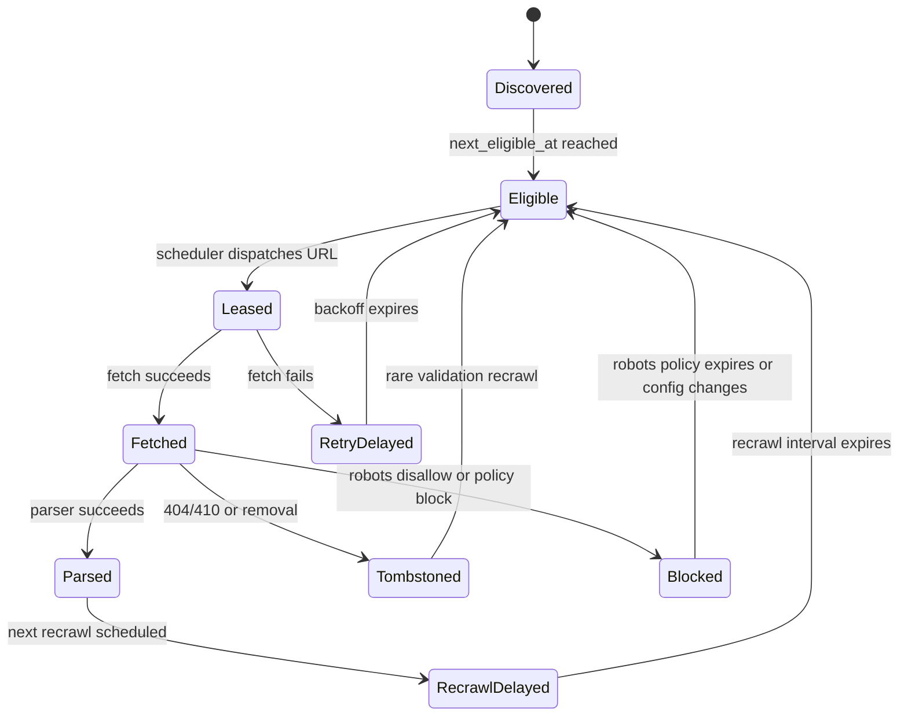

# Crawl Frontier Prioritization

## Overview

The crawl frontier decides which URL should be crawled next and when a known URL should be recrawled. It is the scheduling brain of the crawler. Crawler workers only fetch URLs that the frontier has already made eligible.

The frontier optimizes for:

1. **Freshness:** Important pages that change often should be recrawled quickly.
2. **Coverage:** The crawler should keep discovering new useful pages.
3. **Quality:** High-value pages should consume more crawl budget than spam, duplicate, or low-value pages.
4. **Politeness:** The crawler must respect `robots.txt`, host crawl delays, per-host concurrency limits, and IP-level limits.
5. **Efficiency:** The crawler should avoid repeatedly fetching unchanged, duplicate, failing, or non-indexable URLs.

The hard part is that these goals conflict. A high-priority URL may be blocked by a host politeness window, a low-priority URL may be the only ready URL for a host, and an important page may be unchanged across many recrawls. The frontier should make these tradeoffs explicitly through scores, budgets, and eligibility timestamps.

## Functional Requirements

1. Accept seed URLs and discovered URLs from parsers, sitemaps, feeds, and manual crawl configuration.
2. Canonicalize and deduplicate URLs before scheduling fetch work.
3. Assign a crawl priority to each canonical URL.
4. Compute a `next_eligible_at` timestamp for first crawls, retries, and recrawls.
5. Enforce `robots.txt`, domain/host limits, IP limits, and per-domain crawl budgets.
6. Dispatch eligible URLs to crawler workers with leases to prevent duplicate fetches.
7. Update URL state from fetch results, content changes, failures, redirects, and parser feedback.
8. Avoid starvation so lower-priority URLs still receive some crawl capacity over time.

## Core Data Model

### URL State

Each canonical URL has durable state.

```text
url_state {
  document_id
  canonical_url
  url_hash
  host
  registrable_domain
  discovery_source
  first_seen_at
  last_seen_at
  last_fetch_at
  last_success_at
  last_content_hash
  fetch_status
  http_status
  robots_status
  priority_class
  crawl_score
  recrawl_interval
  next_eligible_at
  retry_count
  last_error_type
  content_change_rate
  inlink_count
  source_authority_score
  page_quality_score
  spam_score
  duplicate_cluster_id
  lease_owner
  lease_expires_at
  url_version
}
```

Important fields:

- `crawl_score` ranks URLs within the same scheduling window.
- `next_eligible_at` prevents premature recrawls and implements backoff.
- `url_version` lets workers ignore stale leases or stale fetch completions.
- `lease_expires_at` allows another worker to retry work if the original worker dies.
- `duplicate_cluster_id` connects near-duplicate pages so the scheduler can demote non-canonical copies.

### Host State

Host-level state enforces politeness and crawl budgets.

```text
host_state {
  host
  registrable_domain
  ip_or_cidr
  robots_policy_version
  robots_checked_at
  crawl_delay
  max_parallel_fetches
  active_fetches
  next_host_fetch_at
  daily_budget
  remaining_budget_tokens
  recent_error_rate
  average_fetch_latency
  host_quality_score
  host_priority_weight
}
```

Important fields:

- `next_host_fetch_at` enforces delay between fetches for the same host.
- `max_parallel_fetches` prevents accidental overload.
- `remaining_budget_tokens` prevents one large domain from consuming the whole crawler.
- `recent_error_rate` can temporarily reduce host throughput when the host is unhealthy.

## Priority Inputs

The frontier combines several signals into a crawl score. These signals do not need to be perfect; they need to be stable, explainable, and tunable.

### Positive Signals

- **Source authority:** URLs linked from high-authority pages get a higher initial score.
- **Inlink count:** URLs discovered from many independent pages are more likely to be valuable.
- **Page quality:** Pages with useful content, low spam score, and good historical engagement get more budget.
- **Freshness demand:** News, forums, marketplaces, documentation, and homepages may need shorter recrawl intervals.
- **Historical change rate:** Pages whose content hash changes frequently should be recrawled more often.
- **Sitemap and feed hints:** `lastmod`, priority, RSS/Atom feeds, and submitter signals can raise priority.
- **Query demand:** Pages that appear in results for active or freshness-sensitive queries deserve tighter freshness.
- **Anchor text quality:** Descriptive anchor text from relevant pages is a better signal than boilerplate footer links.
- **URL pattern quality:** Clean, stable content URLs are more valuable than session, calendar, sort, or tracking URLs.

### Negative Signals

- **Spam or malware risk:** Suspicious pages are demoted or excluded.
- **Duplicate content:** Near-duplicate pages are demoted behind the selected canonical page.
- **Soft 404s:** Pages that look like "not found" despite returning HTTP 200 should be demoted.
- **Infinite spaces:** Faceted search, calendars, sort parameters, and session IDs can generate unbounded URLs.
- **Repeated unchanged fetches:** A page that has not changed across many recrawls should receive a longer interval.
- **Repeated failures:** DNS errors, timeouts, 5xxs, and 429s apply retry backoff and can reduce host budget.
- **Low-value file types:** Non-indexable or unsupported content types are skipped or sent to specialized pipelines.

## Priority Classes

Use a small number of priority classes before applying numeric score. This keeps operational behavior predictable.

| Class | Purpose | Example |
| --- | --- | --- |
| `P0` | Safety, policy, and critical freshness | Manual recrawl of important pages, urgent removals, major canonical changes |
| `P1` | High-value fresh content | Major news pages, high-authority homepages, frequently updated docs |
| `P2` | Normal discovery and normal recrawl | Most known content pages |
| `P3` | Exploration and backfill | Newly discovered low-confidence URLs |
| `P4` | Retry, low quality, or expensive URLs | Timeout retries, low-value duplicate clusters, slow hosts |

Within each class, the scheduler uses `crawl_score`, `next_eligible_at`, and host fairness to choose work.

## Scoring Model

A simple crawl score can start as a weighted sum:

```text
crawl_score =
  w1 * source_authority_score
+ w2 * page_quality_score
+ w3 * freshness_urgency
+ w4 * change_probability
+ w5 * query_demand
+ w6 * discovery_confidence
+ w7 * starvation_age
- w8 * spam_score
- w9 * duplicate_penalty
- w10 * failure_penalty
- w11 * crawl_cost
```

Where:

- `freshness_urgency` increases as `now - last_success_at` approaches or exceeds the expected recrawl interval.
- `change_probability` estimates how likely a new fetch is to produce a new content hash.
- `starvation_age` slowly increases for URLs or hosts that have waited too long.
- `crawl_cost` accounts for slow hosts, large content, expensive rendering, or repeated redirects.

The frontier should store both the final score and the main contributing features. This makes priority changes debuggable when operators ask why a URL was or was not crawled.

## Recrawl Scheduling

Recrawl scheduling decides `next_eligible_at` after a successful fetch.

The interval should shrink when a page is important and changes often. It should grow when a page is low-value, unchanged, duplicate, or expensive to fetch.

```text
base_interval = interval_for_page_type(url, host, content_type)

change_multiplier =
  if content_changed_recently: 0.5
  if repeatedly_unchanged: 2.0
  else: 1.0

quality_multiplier =
  if high_authority_or_high_query_demand: 0.5
  if low_quality_or_duplicate: 3.0
  else: 1.0

failure_multiplier =
  if recent_fetch_failures: 2.0 to 16.0
  else: 1.0

recrawl_interval = clamp(
  base_interval * change_multiplier * quality_multiplier * failure_multiplier,
  min_interval,
  max_interval
)

next_eligible_at = now + recrawl_interval + jitter
```

Use jitter so many URLs from the same host do not become eligible at the same instant.

### Estimating Change Probability

Useful inputs:

- Historical content hash changes.
- HTTP `ETag` and `Last-Modified` behavior.
- Sitemap `lastmod`.
- RSS/Atom feed updates.
- Page type inferred from URL and content.
- Link velocity, such as many new pages linking to the URL.
- Query demand for freshness-sensitive topics.
- Host-level update pattern.

If a page changes on most fetches, shorten the interval. If it stays unchanged across repeated fetches, lengthen the interval exponentially until a cap.

### Example Intervals

| URL Type | Typical Behavior | Recrawl Policy |
| --- | --- | --- |
| News homepage | Changes many times per day | Minutes |
| Breaking news article | Changes rapidly at first, then stabilizes | Minutes, then hours, then days |
| Product detail page | Changes with price and inventory | Hours to days |
| Documentation page | Changes occasionally | Daily to weekly |
| Old static blog post | Rarely changes | Monthly or longer |
| Duplicate or low-quality page | Low serving value | Very long interval or skip |
| 404 or 410 page | Gone | Tombstone and retry rarely |
| Repeated timeout | Host or URL unhealthy | Exponential backoff with retry budget |

## Frontier Queue Design

The frontier should separate durable URL state from scheduling indexes.

### Durable Stores

- **URL State Store:** Source of truth for canonical URL state.
- **Host State Store:** Source of truth for politeness, budgets, and host health.
- **Robots Store:** Cached `robots.txt` policies with versions and expiry.
- **Discovery Log:** Append-only record of discovered URLs for replay and auditing.

### Scheduling Indexes

Use scheduling structures optimized for dispatch:

1. **Per-host queues:** Each host has a priority queue of URLs ordered by `(priority_class, next_eligible_at, crawl_score)`.
2. **Host ready heap:** Hosts are ordered by `next_host_fetch_at`, budget availability, and best ready URL score.
3. **Delayed URL heap:** URLs with future `next_eligible_at` stay delayed until they become eligible.
4. **Leased set:** URLs currently assigned to workers are hidden until completed or lease expiry.

The key is to avoid one global queue of URLs. A single global queue makes it hard to enforce host politeness because the top URLs may all belong to the same blocked host.

## Scheduling Algorithm

At a high level:

1. Accept a candidate URL from seed input, parser output, sitemap input, or recrawl generation.
2. Canonicalize the URL.
3. Check robots policy and URL filters.
4. Upsert `url_state`.
   - If it is new, assign initial priority and `next_eligible_at`.
   - If it already exists, update `last_seen_at`, discovery signals, inlink count, and possibly score.
5. Place the URL into the appropriate per-host queue.
6. Scheduler selects a host whose politeness window is open and whose budget has tokens.
7. Scheduler selects the best eligible URL from that host.
8. Scheduler creates a lease with `lease_owner`, `lease_expires_at`, and `url_version`.
9. Crawler fetches the URL and returns the result.
10. Frontier updates URL and host state from the result.
11. Frontier schedules retry, recrawl, redirect target, or terminal state.

Pseudo-code:

```text
while true:
  host = host_ready_heap.pop_ready(now)
  if host is None:
    sleep_until_next_host_or_url_ready()
    continue

  if host.remaining_budget_tokens <= 0:
    delay_host_until_budget_refill(host)
    continue

  url = host.queue.pop_best_eligible(now)
  if url is None:
    delay_host_until_next_url_ready(host)
    continue

  if robots_disallows(url):
    mark_blocked_by_robots(url)
    continue

  lease = create_fetch_lease(url)
  update_host_politeness_window(host)
  dispatch_to_crawler(lease)
```

## Politeness and Budgets

Politeness is a hard constraint. Priority can decide which URL to fetch first, but it should not override external site safety.

Controls:

- **`robots.txt`:** Respect disallowed paths and crawl-delay where applicable.
- **Per-host delay:** Maintain `next_host_fetch_at`.
- **Per-host concurrency:** Limit active fetches for a host.
- **Per-IP concurrency:** Prevent many hostnames on the same IP from being overloaded.
- **Daily host budget:** Cap total fetches per host or domain.
- **Error-sensitive throttling:** Reduce budget when 429s, 5xxs, timeouts, or high latency increase.
- **Retry budget:** Limit how much capacity failing URLs can consume.

Large sites should receive a bigger budget only when their content quality and change rate justify it. Small sites should still get crawl opportunities through host fairness and aging.

## New URL Discovery

When parser workers extract outbound links, they should submit candidates to the frontier rather than fetching them directly.

Discovery scoring should consider:

- Authority and quality of the source page.
- Whether the link appears in main content, navigation, footer, comments, or boilerplate.
- Anchor text relevance and uniqueness.
- Number of independent source pages linking to the same URL.
- URL depth and pattern.
- Whether the URL is already known, already fetched, or already in a duplicate cluster.
- Host-level quality, error rate, and crawl budget.

If the URL is already known, the frontier should not enqueue a duplicate fetch. It should update discovery signals such as `last_seen_at`, `inlink_count`, and source authority.

## Canonicalization and Dedupe

Canonicalization reduces wasted crawl work before fetching.

Typical normalization:

- Lowercase scheme and host.
- Remove default ports.
- Remove fragments.
- Normalize percent encoding.
- Normalize path dot segments.
- Drop known tracking parameters such as `utm_*`.
- Sort query parameters only when safe for that host or URL pattern.
- Normalize trailing slashes according to host rules where known.

Be conservative with query parameters. Some sites use query order or repeated parameters semantically. The crawler can learn safe normalization rules per host instead of applying aggressive global rules.

After fetching, content-level dedupe is more reliable:

- Use exact content hashes for identical pages.
- Use shingles or SimHash for near duplicates.
- Choose a canonical representative for each duplicate cluster.
- Demote or skip non-canonical duplicates.
- Transfer useful link signals to the canonical page where appropriate.

## Failure Handling

Failures should reduce priority or delay work without losing the URL forever.

| Failure | Frontier Behavior |
| --- | --- |
| Timeout | Retry with exponential backoff and jitter |
| DNS failure | Retry less frequently; reduce host confidence |
| HTTP 429 | Respect `Retry-After`; sharply reduce host budget |
| HTTP 5xx | Retry with host-level error throttling |
| HTTP 401/403 | Mark blocked or low priority unless configured otherwise |
| HTTP 404 | Tombstone; recrawl rarely |
| HTTP 410 | Tombstone more aggressively than 404 |
| Redirect | Canonicalize target, transfer signals, avoid redirect loops |
| Robots disallow | Mark blocked and refresh after robots policy expiry |
| Malware or spam | Quarantine, demote, or exclude from indexing |

Retries should use a retry budget so a failing host does not crowd out healthy crawl work.

## Distributed Ownership

Partition frontier ownership by host or registrable domain. This keeps politeness decisions local to one scheduler shard.

Common pattern:

1. `host_hash(host) -> frontier_shard`.
2. Each shard owns URL queues and host state for its assigned hosts.
3. Parser workers route discovered URLs to the owning shard.
4. Crawler workers poll multiple shards or receive assignments through a dispatch queue.
5. Shard leadership uses leases so only one scheduler actively dispatches a host partition.

Benefits:

- Host politeness state does not need cross-shard coordination for the common case.
- Per-host queues are small enough to manage efficiently.
- A hot host can be isolated and throttled without affecting unrelated hosts.

Tradeoff:

- Very large hosts can create hot partitions. Mitigate with sub-partitioning by URL path or document range while keeping a single host-level politeness coordinator.

## Recrawl State Transitions



## Operational Metrics

Frontier metrics:

- Eligible URL count by priority class.
- Delayed URL count by delay reason.
- Per-host queue depth.
- Per-host budget usage.
- Lease creation rate and lease expiry rate.
- Duplicate suppression rate.
- URL canonicalization drop rate.
- Retry queue depth by error type.
- Average and p95 time from discovery to first fetch.
- Average and p95 time from content change to recrawl.
- Crawl score distribution.
- Starvation age by priority class.

Crawler interaction metrics:

- Dispatch rate.
- Fetch success rate.
- Fetch latency.
- HTTP status distribution.
- Robots blocked count.
- Host throttling count.
- Retry budget exhaustion.

Quality metrics:

- Fraction of crawls that produce changed content.
- Fraction of fetched pages that become indexed.
- Fraction of crawls discarded as duplicate, spam, soft 404, or low quality.
- Freshness of top-ranked documents for freshness-sensitive queries.

## Common Bottlenecks

### Hot Hosts

Large domains can produce millions of URLs and dominate scheduling. Use host budgets, weighted fairness, and host-level queues so these domains cannot starve the rest of the web.

### Low-Value URL Explosions

Faceted search, calendars, sort parameters, session IDs, and tracking parameters can create unbounded URL spaces. Use URL pattern filters, conservative query normalization, duplicate detection, and host-specific crawl rules.

### Stale High-Value Pages

If recrawl intervals are too long, important pages become stale in the index. Monitor freshness for high-value pages separately from average corpus freshness.

### Retry Storms

When a large host has widespread failures, naive retry logic can waste crawl capacity. Use host-level error throttling, retry budgets, exponential backoff, and `Retry-After`.

### Scheduler Hot Partitions

Host-based partitioning can overload the shard that owns a very large host. Use sub-partitioning for URL queues, but keep host-level politeness coordinated.

## Design Tradeoffs

### Strict Priority vs Fairness

Strict priority maximizes short-term value but can starve low-priority discovery. Weighted fairness and aging preserve coverage.

### Freshness vs Cost

Short recrawl intervals improve freshness but waste capacity if pages rarely change. Change-rate estimation lets the frontier spend crawl budget where it is likely to matter.

### Global Queue vs Per-Host Queues

A global queue is simpler but fights politeness constraints. Per-host queues make politeness local and predictable.

### Aggressive Canonicalization vs Correctness

Aggressive URL normalization saves crawl budget but can collapse distinct pages. Prefer conservative global rules plus host-specific learned rules.

### In-Place Priority Updates vs Append-Only Events

In-place updates make the current state easy to query. Append-only discovery and scheduling logs make replay, debugging, and backfills easier. A production frontier usually uses both: append-only events plus materialized URL and host state.

## See Also

- [Search Engine System Design](./web-crawler.md)
- [Google Search Engine](./search.md)
- [Rate Limiting: Concepts & Trade-offs](../../components/rate-limiter.md)
- [Idempotency: Concepts & Trade-offs](../../components/idempotency.md)
- [Consistency: Concepts & Trade-offs](../../components/consistency.md)
