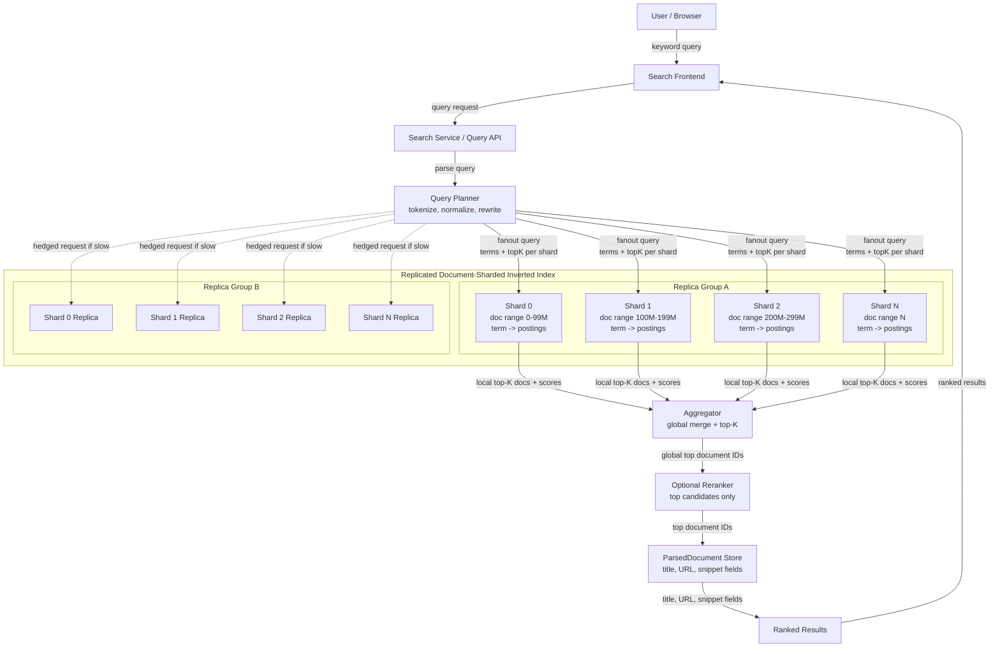

# Design Google Search Engine

## Problem
Design a web search engine like Google that can index and serve billions of web pages with sub-second query response times. Assume the web crawling system is already designed (see [web-crawler](./web-crawler.md)).

## Requirements
- Index billions of crawled web pages efficiently
- Handle millions of search queries per second
- Return relevant results with p95 < 200 ms at 100K peak QPS
- Support autocomplete and suggestions
- Rank results by relevance and authority
- Handle different query types (text, images, videos)
- Keep personalization and ads out of scope for the first design
- Scale globally across multiple data centers by deploying the search infrastructure across multiple geographic regions to reduce latency and improve fault tolerance. This involves multi-region deployment of query servers, index shards, and caching layers. Load balancing distributes user queries to the nearest or least loaded data center. Replication strategies ensure that indexes and data are synchronized across regions with consistency models balancing freshness and availability. Latency optimization techniques like edge caching, CDN integration, and smart routing are used to serve results quickly to users worldwide.

## Architecture Overview
The Google Search Engine architecture consists of several major components working together to provide fast, relevant search results:

- **Search Serving Layer:** Handles incoming user search requests, parses/tokenizes queries, plans shard fanout, applies shard deadlines, and coordinates result aggregation.
- **Indexing Pipeline:** Processes crawled web pages, extracts content, builds inverted indexes, and partitions them into distributed shards.
- **Ranking Service:** Applies lexical and quality ranking signals such as BM25, field boosts, phrase proximity, link authority, spam score, freshness, language, and content quality. Personalization and ads are intentionally out of scope for the first design.
- **Data Freshness Layer:** Ensures the index is updated with new and changed documents in near-real-time, while also running periodic full reindexing jobs to maintain accuracy.
- **Global Distribution:** Distributes query servers, index shards, and caches across multiple data centers worldwide to reduce latency and increase fault tolerance.

## Search-Serving Inverted Index
The inverted index maps terms to compressed posting lists. Each posting list contains the document IDs that contain the term plus lightweight scoring features needed for fast ranking.

A posting entry should include:
- `doc_id`
- term frequency
- field matches such as title, body, anchor text, headings, and URL
- positions or position skips for phrase and proximity matching
- precomputed static ranking features such as authority, freshness, spam score, language, and content-quality signals

The serving index is document-sharded rather than term-sharded. Each logical shard owns a document partition and stores the term dictionary and posting lists for only that partition. This keeps query execution parallel while allowing every shard to independently produce local top-K results.

**Key index-serving optimizations:**
1. **In-memory term dictionary:** Quickly maps normalized query terms to posting-list offsets.
2. **Compressed postings:** Reduces memory and disk bandwidth using delta-encoded document IDs and compact feature encoding.
3. **Skip pointers / block-max metadata:** Allows the shard to skip low-value posting blocks and avoid scoring every matching document.
4. **Precomputed ranking features:** Stores static quality signals next to postings or in a fast feature store to avoid expensive runtime joins.
5. **Hot query and posting-list caches:** Keeps frequent queries and high-frequency term data close to the serving path.
6. **Replicated logical shards:** Each document shard has multiple replicas so the query planner can pick a healthy replica and hedge slow requests.

**Query-time flow:**
1. The Search Service parses, tokenizes, normalizes, and optionally rewrites the query.
2. The Query Planner fans the query out to one replica for each logical document shard.
3. Each shard retrieves candidate documents from its local posting lists.
4. Each shard performs local top-K ranking using lexical and precomputed quality signals.
5. The Aggregator merges local top-K lists into a global top-K list.
6. The system optionally reranks only the top candidates using more expensive features.
7. The Search Service batch-fetches display metadata from the ParsedDocument Store.
8. The Frontend returns ranked results to the user.

## Ranking Algorithm Details
For the first design, ranking should focus on lexical relevance and document quality. Personalization and ads are out of scope.

**Primary ranking signals:**
- **BM25 / lexical relevance:** Scores how well query terms match the document while accounting for term frequency, inverse document frequency, and document length.
- **Field boosts:** Gives stronger weight to matches in title, headings, URL, and anchor text than matches in the body.
- **Phrase proximity:** Boosts documents where query terms appear close together or in the same phrase.
- **Link authority:** Uses precomputed authority signals from the web graph.
- **Spam score:** Penalizes low-quality, spammy, or manipulative pages.
- **Freshness:** Boosts recent or recently updated content when freshness matters for the query.
- **Language and region fit:** Favors documents in the user's query language and appropriate region.
- **Content quality:** Uses offline quality features such as source reliability, content depth, duplication, and historical engagement aggregates.

A simple first-pass score could look like:

$$Score = w_1 \times BM25 + w_2 \times FieldBoost + w_3 \times Proximity + w_4 \times Authority + w_5 \times Freshness - w_6 \times SpamPenalty + w_7 \times Quality$$

The first-pass ranker runs inside each shard and returns local top-K results. A second-stage reranker can run only on the global top candidates, which keeps expensive ranking work off the critical path for most documents.

## Serving Flow
Example query: `best running shoes`

1. User submits the query to the Search Frontend.
2. Search Service tokenizes and normalizes the terms.
3. Query Planner selects one healthy replica per logical shard using health and load data.
4. Query Planner fans out the query to the selected index shard replicas.
5. Each shard searches only its owned document partition.
6. Each shard returns local top-K documents and scores.
7. Aggregator merges local top-K lists into global top-K results.
8. Optional reranker reranks only the top global candidates.
9. Search Service batch-fetches title, URL, and snippet fields from the ParsedDocument Store.
10. Frontend returns ranked results.

## Meeting p95 < 200 ms at 100K QPS
The biggest bottleneck is the search-serving inverted index, especially query fanout and ranking at 100K peak QPS under a 200 ms p95 target. Crawling 1,000 pages/sec is manageable with horizontal fetchers and queues, but serving low-latency ranked results across a large document-sharded index requires careful shard replication, top-K ranking, hot query caches, precomputed ranking features, strict deadlines, and partial-result behavior.

**Latency strategy:**
1. Use document-sharded replicated index serving so every shard can rank independently.
2. Keep term dictionaries in memory to avoid lookup latency.
3. Use compressed postings, skip pointers, and block-level metadata to reduce scan work.
4. Store static ranking features ahead of time so shards do not need expensive runtime joins.
5. Use hot query and posting-list caches for frequent queries and high-traffic terms.
6. Return only local top-K from each shard instead of full candidate sets.
7. Merge local top-K lists globally using a bounded heap.
8. Batch-fetch display metadata after ranking instead of during shard scoring.

**Slow shard handling:**
1. Query Planner picks one replica per logical shard using health and load data.
2. Each shard request gets a strict per-shard timeout, for example 50-80 ms.
3. If a shard is slow, the planner sends a hedged request to another replica.
4. The Aggregator accepts the first valid response for that logical shard.
5. Late duplicate responses are ignored.
6. If no replica responds before the deadline, the Aggregator returns partial or degraded results.

This keeps tail latency bounded. The result may be slightly less complete during shard failures, but the system preserves the user-facing p95 target and avoids one slow shard delaying the entire query.

## Data Freshness and Index Update Architecture
To maintain up-to-date search results, the system employs a multi-layered approach to data freshness:

- **Near-Real-Time Ingestion:** Newly crawled or updated documents are ingested continuously into the indexing pipeline, enabling rapid inclusion in the search index with minimal delay.
- **Daily/Weekly Reindex Jobs:** Periodic full or partial reindexing runs to refresh data, correct errors, and incorporate large-scale changes.
- **Freshness Scoring:** Documents are scored based on recency and update frequency to boost relevant fresh content in rankings.
- **Delta Updates vs Full Reindex:** Incremental (delta) updates apply changes to small index segments, while full reindexing rebuilds large portions of the index when necessary.
- **Incremental Index Merges:** Small index shards are merged incrementally to minimize latency and maintain index consistency without full rebuilds.
- **Segment-Based Serving:** New index segments can be published alongside existing immutable segments. Query servers search both old and new segments until background merges compact them, which keeps serving available while the index is continuously updated.

This architecture balances the need for fresh, accurate results with system performance and scalability.
