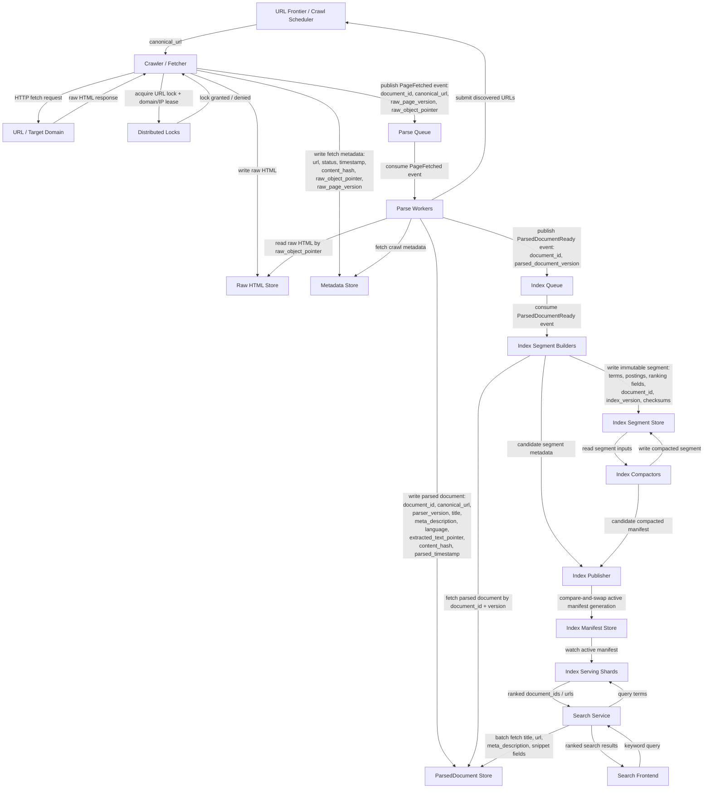
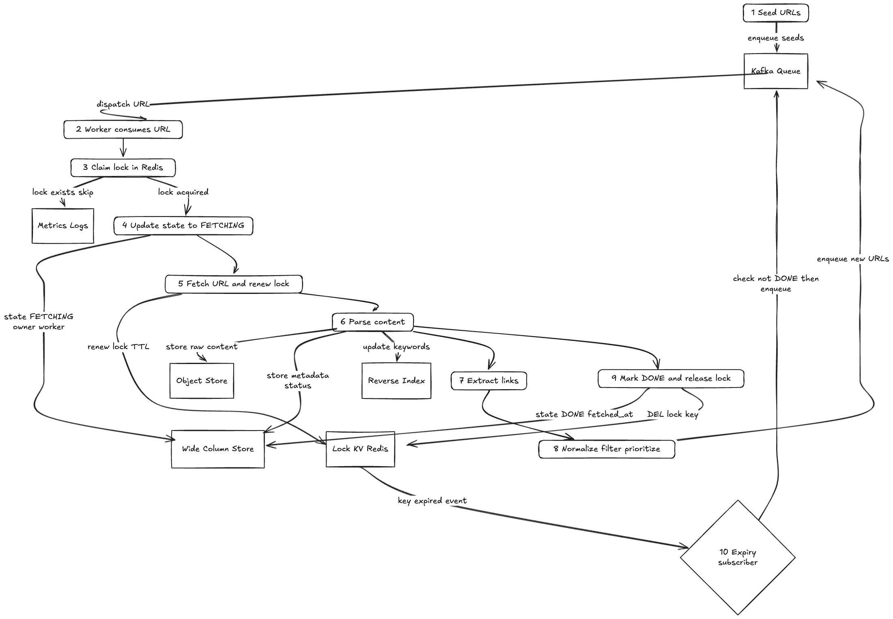

# Search Engine System Design

## Overview
Design a web search engine like Google that can crawl, index, and search billions of web pages while providing relevant ranked results in milliseconds.

The system has two major paths:

1. **Write path:** discover URLs, fetch pages, store raw HTML, parse content, extract links, and build index segments asynchronously.
2. **Read path:** serve keyword search queries from the inverted index, rank results, and fetch display metadata from the parsed document store.

The crawler and indexing pipeline are eventually consistent. Search serving must remain low latency and highly available even while new pages are being crawled, parsed, indexed, compacted, replicated, and published.

## Functional Requirements

1. The system can discover URLs from seed URLs and previously crawled pages.
2. The system can fetch pages while respecting `robots.txt` and domain crawl limits.
3. The system can store raw HTML and page metadata.
4. The system can extract text and links from crawled pages.
5. The system can build and update an inverted index.
6. The system can serve keyword search queries with ranked results.
7. The system can support crawler configuration changes.

## Out of Scope

1. Ads ranking.
2. Personalized search.
3. Image/video search.
4. Real-time indexing guarantees.
5. Browser product features.

## Non-Functional Requirements

### Scale

- **Corpus:** Millions to low billions of webpages.
- **Average raw page size:** 10 KB compressed or normalized average.
- **Raw storage:** Up to 10 TB including multiple versions.
- **Crawl fetch rate:** 1,000 pages/second.
- **Search traffic:** 100M DAU, 100K peak query RPS.
- **Read/write ratio:** Approximately 99:1, dominated by search reads.
- **Search latency target:** p95 < 200 ms.

### Availability

- **Data Plane SLA:** 99.99%.
- **Control Plane SLA:** 99.95%.
- **RTO:** 30 minutes.
- **RPO:** 5 minutes.

**Data Plane includes:**

- Search query serving.
- Index serving.
- Crawl execution.
- Parse/index pipelines.

**Control Plane includes:**

- Crawler configuration.
- Domain crawl policies.
- Ranking/config changes.
- Admin operations.
- Deployment/config promotion.

**Durability:**

- Configuration data, crawl metadata, parsed documents, and inverted index segments should be replicated across regions.
- Raw web pages may also be replicated across regions, but that is a cost tradeoff because raw content can be large and may be refetchable.

**Failure handling:**

- Use domain-level rate limiting to enforce politeness.
- Use exponential backoff and jitter for failed fetches and failed writes.
- Use retry budgets so bad domains, bad URLs, or bad downstream dependencies do not overwhelm the system.
- Use multi-region failover for search serving, index serving, configuration data, and metadata stores.

### Performance

- Search p95 latency < 200 ms.
- Crawl fetch throughput target is 1,000 pages/second.
- Crawl, parse, and index updates are asynchronous and eventually consistent.
- Crawler configuration updates are strongly consistent before activation because a bad crawl policy can overload external domains or violate `robots.txt`.

### Consistency

- **Web page processing:** Eventually consistent / AP-oriented.
- **Configuration database:** Strongly consistent / CP-oriented.
- **Search index publication:** Eventually consistent with versioned segment publication.

**Idempotency:**

- URL canonicalization produces a stable `canonical_url`.
- Fetch attempts have a stable `fetch_attempt_id`.
- Page versions are keyed by `canonical_url + version`.
- Parser output is idempotent by `raw_page_version`.
- Index updates are idempotent by `document_id + version`.
- Duplicate discovered links are deduped before entering the frontier.

### Partitioning

**Crawl Frontier partitioning:**

- Use domain/host-based partitioning to enforce politeness, crawl priority, and domain-level scheduling.

**Raw/metadata partitioning:**

- Partition by `domain + URL hash` or `canonical_url hash`, depending on access pattern.

**Inverted index partitioning:**

- Use term-based or document-sharded index partitions depending on query fanout and serving strategy.
- For the search-serving design, document-sharded index serving is preferred because each shard can independently produce local top-K results and the aggregator can merge globally.

### Replication

- Inverted index and metadata stores should be replicated across multiple regions for availability and performance.
- Crawler configuration should be replicated with strong consistency guarantees before activation.
- Raw HTML replication is a cost tradeoff because it may be expensive relative to metadata and index replication.

## Security

- AuthN/AuthZ for admin and configuration APIs.
- Private network access for internal crawler, parser, index-building, metadata, and index-serving services.
- Audit logging for configuration changes and admin actions.
- `robots.txt` and domain politeness enforcement.
- Malware, phishing, adult-content, and spam classification before indexing or serving.
- Sensitive-data handling for content that should not be indexed or should be removed.

## Observability

- **Metrics:** Fetch failures, fetch TPS, parse lag, index queue lag, segment publish latency, shard p95 latency, degraded-query rate, missing-shard rate, and golden signals.
- **Logs:** Audit logs for config/admin actions and system logs for crawler, parser, index-building, compaction, publication, and search-serving services.
- **Traces:** End-to-end traces across crawler fetches, parse events, index events, and search query fanout.
- **Alerting:** SLO-based alerts and golden-signal alerts for latency, traffic, errors, and saturation.
- **Deployment strategy:** GitOps, PR reviews, environment promotion, and approval gating for risky configuration or crawler policy changes.

## Cost Management

- Autoscale crawlers and parsers based on queue lag.
- Autoscale segment builders and compactors based on index queue lag, compaction backlog, and segment publish latency.
- Use an `N-2 + 1 year` purge policy for web content.
- Keep raw HTML retention separate from parsed document and index retention because raw storage has different cost and recovery tradeoffs.
- Prefer compressed object storage for raw HTML and immutable index segments.

## Architecture Overview



## Core Components

### URL Frontier / Crawl Scheduler

The URL Frontier owns crawl scheduling. It decides which URLs are eligible to crawl next based on priority, recrawl timing, dedupe state, domain politeness, and crawler configuration.

Responsibilities:

- Store seed URLs and discovered URLs.
- Deduplicate URLs by canonical form.
- Partition work by domain/host to enforce politeness.
- Apply crawl priority and recrawl timing.
- Reschedule URLs that are blocked by politeness windows.
- Emit eligible URLs to crawler workers.

See [Crawl Frontier Prioritization](./crawl-frontier-prioritization.md) for a deeper walkthrough of URL priority scoring, per-host scheduling, crawl budgets, retries, and recrawl intervals.

### Crawler / Fetcher

The crawler fetches web pages while respecting domain and IP constraints.

Responsibilities:

- Canonicalize URLs.
- Check whether the URL/version is already in progress or recently fetched.
- Check `robots.txt` policy.
- Check domain and IP politeness windows.
- Acquire URL-level lock or idempotency lease.
- Fetch the page.
- Store raw HTML.
- Update crawl metadata.
- Publish `PageFetched` events.

### Raw HTML Store

The Raw HTML Store keeps the fetched page content, usually in compressed object storage.

Key fields:

- `canonical_url`
- `raw_page_version`
- `raw_object_pointer`
- compressed raw HTML
- content hash
- fetch timestamp

### Metadata Store

The Metadata Store tracks crawl state and page metadata.

Key fields:

- `canonical_url`
- `fetch_status`
- `fetch_timestamp`
- `http_status`
- `content_hash`
- `raw_object_pointer`
- `raw_page_version`
- `fetch_attempt_id`
- robots status
- retry count
- next eligible crawl time

### Parse Queue and Parse Workers

The parse path is asynchronous. Parse workers consume `PageFetched` events, read raw HTML, extract useful content, and publish downstream index events.

Parser output includes:

- extracted text
- title
- metadata
- canonical URL
- outbound links
- language
- content signals

### ParsedDocument Store

The ParsedDocument Store contains the normalized representation of a page used by search serving and indexing.

Key fields:

- `document_id`
- `canonical_url`
- `raw_page_version`
- `parser_version`
- `title`
- `meta_description`
- `language`
- `extracted_text_pointer` or `extracted_text`
- `content_hash`
- `parsed_timestamp`

### Index Queue and Segment Builders

Index segment builders consume `ParsedDocumentReady` events and build immutable inverted index segments.

Responsibilities:

- Read parsed documents.
- Tokenize and normalize terms.
- Build postings lists.
- Attach ranking fields.
- Write immutable index segments.
- Register segment metadata and checksums.
- Emit candidate segments for publication.

### Index Segment Store

The Index Segment Store keeps immutable segment files, usually in replicated object storage or a distributed file store.

Each segment contains:

- term dictionary
- compressed postings lists
- positions or proximity metadata
- static ranking fields
- document version metadata
- tombstone or deletion metadata
- checksums and footer metadata

### Index Compactors

Compactors merge many small segments into fewer larger segments for each logical index shard.

Responsibilities:

- Merge postings lists.
- Remove tombstoned or stale document versions.
- Recompute skip pointers and block-max metadata.
- Reduce query-time segment fanout.
- Write new compacted immutable segments.
- Publish candidate manifests that replace the compacted input segments.

### Index Publisher / Manifest Store

The publisher controls which index segments are visible to the search-serving path. It does not mutate live serving segments in place. Instead, it writes a new versioned manifest and atomically advances the active manifest pointer.

The manifest records:

- logical shard ID
- manifest generation
- segment IDs
- segment checksums
- document version range
- schema and analyzer version
- creation timestamp
- previous manifest generation for rollback

### Index Serving Shards

Index Serving Shards load the active manifest for each logical shard and serve queries from the listed immutable segments.

The inverted index maps terms to posting lists that contain document IDs and lightweight ranking fields.

A posting entry can include:

- `document_id`
- term frequency
- field matches
- positions
- ranking features
- index version

### Search Service

The Search Service is the read path. It queries the inverted index, ranks results, and fetches display fields from the ParsedDocument Store.

Responsibilities:

- Parse and normalize keyword queries.
- Query the inverted index.
- Merge/rank results.
- Batch-fetch title, URL, description, and snippet fields.
- Return ranked search results.

## Order of Operation

1. Crawl Scheduler selects an eligible URL from the frontier.
2. Crawler canonicalizes the URL and checks whether this URL/version is already in progress or recently fetched.
3. Crawler checks `robots.txt` policy for the domain.
   - If disallowed, mark metadata as `blocked_by_robots` and do not fetch.
4. Crawler checks domain/IP politeness controls.
   - If not eligible yet, reschedule URL for later.
5. Crawler acquires URL-level lock or idempotency lease.
   - If lock acquisition fails, another worker owns the fetch, so reschedule or skip.
6. Crawler fetches the page.
7. Crawler stores raw HTML in object storage.
8. Crawler updates crawl metadata:
   - `canonical_url`
   - `fetch_status`
   - `fetch_timestamp`
   - `http_status`
   - `content_hash`
   - `raw_object_pointer`
   - `raw_page_version`
   - `fetch_attempt_id`
9. Crawler publishes `PageFetched` event to Parse Queue:
   - `document_id`
   - `canonical_url`
   - `raw_page_version`
   - `raw_object_pointer`
10. Parser consumes `PageFetched` event.
11. Parser fetches crawl metadata and reads raw HTML from Raw HTML Store.
12. Parser extracts:
   - text
   - title
   - metadata
   - canonical URL
   - outbound links
   - language
   - content signals
13. Parser writes `ParsedDocument`:
   - `document_id`
   - `canonical_url`
   - `raw_page_version`
   - `parser_version`
   - `title`
   - `meta_description`
   - `language`
   - `extracted_text_pointer` or `extracted_text`
   - `content_hash`
   - `parsed_timestamp`
14. Parser sends newly discovered URLs back to the URL Frontier.
   - Frontier owns dedupe, priority, recrawl timing, and domain scheduling.
15. Parser emits `ParsedDocumentReady` to the Index Queue:
   - `document_id`
   - `parsed_document_version`
16. Index segment builder consumes `ParsedDocumentReady`.
17. Segment builder reads `ParsedDocument`, tokenizes content, and writes an immutable candidate segment.
18. Segment builder registers segment metadata, checksums, document versions, and shard ownership.
19. Index publisher validates candidate segments and advances the active manifest generation.
20. Index serving shards watch the manifest, load new segments, and atomically swap to the new generation.
21. Search Service queries the active index generation and fetches display metadata from ParsedDocument Store.

## Fetching and Lock Flow

The crawler uses a distributed frontier and lock/lease system to prevent duplicate work and enforce crawl safety.

1. Worker receives an eligible URL from the frontier.
2. Worker canonicalizes the URL.
3. Worker checks recent fetch and in-progress state.
4. Worker checks cached `robots.txt` policy.
5. Worker checks domain/IP rate limits.
6. Worker acquires a URL-level lock or idempotency lease.
7. Worker fetches the page.
8. Worker writes raw HTML and metadata.
9. Worker publishes `PageFetched`.
10. Worker releases the lock or lets the lease expire.

If the fetch fails, the URL is re-queued with an incremented retry count and exponential backoff with jitter.

## Parsing and Extraction

After fetching, the content is parsed to extract useful information.

- **HTML parsing:** Extract text content, headings, title, metadata, and links.
- **Link extraction:** Extract, normalize, canonicalize, and submit outbound links to the frontier.
- **Content filtering:** Remove duplicate, low-value, malformed, unsafe, or non-indexable content.
- **Content classification:** Detect language, spam, malware/phishing signals, adult content, and quality signals.
- **Data transformation:** Convert raw HTML into a normalized ParsedDocument format.

Extracted links are not directly crawled by parser workers. They are submitted back to the URL Frontier, which owns dedupe, priority, recrawl timing, and domain scheduling.

## Storage and Indexing

The system separates raw storage, crawl metadata, parsed documents, and index segments.

- **Raw HTML Store:** Stores compressed raw page content and multiple raw versions.
- **Metadata Store:** Stores crawl status, fetch metadata, retry state, content hashes, and object pointers.
- **ParsedDocument Store:** Stores normalized page content and display metadata used by search serving.
- **Index Segment Store:** Stores immutable term-to-postings segment files and ranking fields for low-latency search.
- **Index Manifest Store:** Stores the active segment generation for each logical serving shard.

Index updates are asynchronous. New parsed documents are written to immutable index segments, published through versioned manifests, replicated, and eventually compacted.

## Index Build Pipeline

The serving path should not mutate live posting lists in place. Instead, the index is built from immutable segments. Query servers search the active set of segments for their shard, and publication changes the active segment manifest rather than editing files currently serving traffic.

### Segment Build Mechanics

1. **Consume parsed-document events:** Builders consume `ParsedDocumentReady` events from the Index Queue. Events are partitioned by logical document shard so each builder writes segments for a bounded shard range.
2. **Create a build batch:** The builder groups events by shard, size, and time window. For example, flush after 30 seconds, 50,000 documents, or a target segment size.
3. **Read parsed documents:** The builder fetches `ParsedDocument` rows by `document_id + parsed_document_version`. If the event is stale, the builder skips it.
4. **Analyze content:** The builder tokenizes, normalizes, stems where appropriate, records field matches, stores positions, and computes lightweight static ranking fields.
5. **Build postings:** For each term, the builder creates sorted postings lists. Posting entries include document ID, term frequency, field flags, positions, and ranking features.
6. **Compress and index:** The builder delta-encodes document IDs, compresses posting blocks, creates skip pointers, builds block-max metadata, and writes an in-memory term dictionary.
7. **Write immutable files:** The builder writes the segment to a staging path with a footer, checksums, schema version, analyzer version, document version range, and shard ID.
8. **Commit the segment:** The builder atomically marks the segment as complete only after all files and checksums are durable.
9. **Register metadata:** The builder records segment metadata in the manifest store as a candidate segment that is not yet visible to query traffic.

### Upserts and Deletes

Document updates are append-only from the index perspective. A changed page produces a new parsed document version and then a new segment entry.

The system handles old versions with:

- **Document version map:** Query serving keeps only the newest visible version for a `document_id`.
- **Tombstone segments:** Deletes, removals, robots changes, and spam decisions can be represented as compact deletion segments.
- **Compaction cleanup:** Background compaction physically removes old document versions and tombstoned postings.

This avoids in-place mutation and makes retry behavior idempotent. If the same parsed document version is processed twice, the manifest publisher can detect duplicate segment metadata and ignore the duplicate.

### Compaction

Small segments keep indexing fresh but make queries slower because each shard must search more segment files. Compaction reduces this fanout.

Compactors:

1. Select a set of small or overlapping segments for the same logical shard.
2. Read term dictionaries and postings from the input segments.
3. Merge postings for the same term.
4. Drop stale document versions using the latest document-version map.
5. Apply tombstones for deleted or blocked documents.
6. Recompute skip pointers, block-max scores, term statistics, and segment metadata.
7. Write a new immutable compacted segment.
8. Publish a candidate manifest that replaces the input segments with the compacted segment.

Old segments remain readable until no active query server references the old manifest generation. Garbage collection should use a grace period based on query lifetime, replication lag, and rollback needs.

### Atomic Publication

The active serving index for each logical shard is a manifest:

```text
active_manifest {
  shard_id
  generation
  segment_ids
  schema_version
  analyzer_version
  created_at
  previous_generation
}
```

Publication flow:

1. Publisher verifies that all candidate segments exist, have valid checksums, match the expected shard, and use a compatible schema/analyzer version.
2. Publisher verifies that required replicas have the segment files before exposing the generation in a serving region.
3. Publisher writes a new manifest generation containing the old active segments plus new delta segments, or a compacted replacement set.
4. Publisher advances the active manifest pointer with a compare-and-swap operation against the previous generation.
5. Query servers watch or poll the manifest store.
6. Each query server downloads or memory-maps the new segments in the background.
7. The server validates checksums and warms required dictionaries or caches.
8. Only after load succeeds does the server switch its local pointer from the old generation to the new generation.

Queries pin a manifest generation for their lifetime. A query that starts on generation `42` finishes on generation `42`, even if generation `43` becomes active during the request. This prevents mixed-generation reads inside one query.

### Rollback and Failure Handling

- **Partial segment write:** The segment is ignored because there is no complete marker or valid checksum.
- **Builder retry:** Reprocessing the same parsed version is safe because segment registration is idempotent.
- **Publisher failure before CAS:** No serving change occurs.
- **Publisher failure after CAS:** Query servers either continue serving the previous local generation or load the new generation when available.
- **Bad segment detected by serving:** The query server rejects the generation locally and reports load failure; the publisher can roll back the active manifest pointer.
- **Compaction failure:** Input segments remain active. The failed compacted output is never published.
- **Regional replication lag:** A region should not advance to a generation until all required segment files are present locally or in a low-latency backing store.

### Serving Behavior During Updates

Search serving reads from the active manifest and searches all listed segments for a shard. Newer small delta segments can be searched alongside older base segments until compaction merges them.

At query time:

1. The query server pins the current manifest generation.
2. It looks up query terms in every segment dictionary for that generation.
3. It merges postings across base and delta segments.
4. It filters tombstoned or stale document versions.
5. It ranks local top-K results for that shard.
6. The aggregator merges shard-local top-K results globally.

This keeps search serving available while the crawler, parser, builders, compactors, and publishers continue running asynchronously.

## Re-queuing and Retry Logic

To handle transient failures and ensure coverage:

- **Retry count:** Each URL fetch maintains a retry count.
- **Backoff strategy:** Exponential backoff with jitter is applied between retries.
- **Maximum retries:** URLs exceeding max retries are marked as failed.
- **Retry budget:** Per-domain retry budgets prevent unhealthy domains from consuming crawler capacity.
- **Re-queuing:** Discovered URLs are submitted to the frontier, which dedupes and schedules them.

## Scaling and Resiliency

- **Distributed crawlers:** Multiple crawler instances run concurrently and poll eligible URLs from the frontier.
- **Domain-based partitioning:** Frontier partitions URLs by domain/host to enforce politeness and domain-level scheduling.
- **Distributed locking/leases:** URL-level leases prevent duplicate fetches.
- **Asynchronous queues:** Parse and index work is decoupled from fetch work.
- **Worker autoscaling:** Crawlers, parsers, segment builders, and compactors scale based on queue lag and throughput.
- **Data replication:** Metadata, parsed documents, and index segments are replicated for availability.
- **Multi-region failover:** Search serving and index serving can fail over across regions.
- **Partial degradation:** Search can continue from existing published index segments even if crawling or indexing is delayed.

## Bottlenecks

A major bottleneck is index freshness: parsers can produce `ParsedDocument` events faster than segment builders, compactors, replicators, and publishers can make new segments visible.

The first indicators to monitor are:

- Index queue lag.
- Segment publish latency.
- Index compaction backlog.
- Index replication lag.
- Shard p95 latency.
- Missing-shard or degraded-query rate.

Crawling at 1,000 pages/second is manageable with horizontal crawlers and queues, but publishing fresh searchable content quickly requires careful segment-builder scaling, segment sizing, compaction, replication, and rollout control.

## Architecture Diagram

> 

---

## See Also

- [Sharding: Concepts & Trade-offs](../../components/sharding.md)
- [Crawl Frontier Prioritization](./crawl-frontier-prioritization.md)
- Example: [Consistent Hashing Ring](../../../coding/consistent_hashing_ring/consistent_hashing_ring.md)
- [Replication: Concepts & Trade-offs](../../components/replication.md)
- [Consistency: Concepts & Trade-offs](../../components/consistency.md)
- [Rate Limiting: Concepts & Trade-offs](../../components/rate-limiter.md)
- [API Gateway: Concepts & Trade-offs](../../components/api-gateway.md)
- [Idempotency: Concepts & Trade-offs](../../components/idempotency.md)
