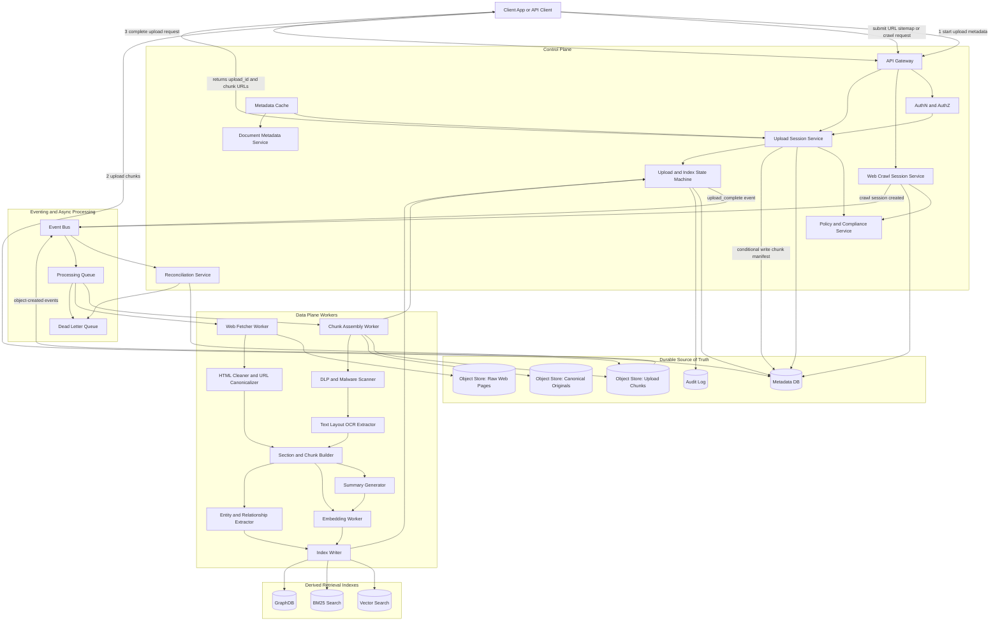
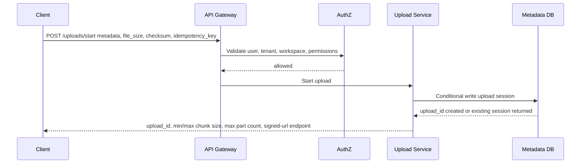
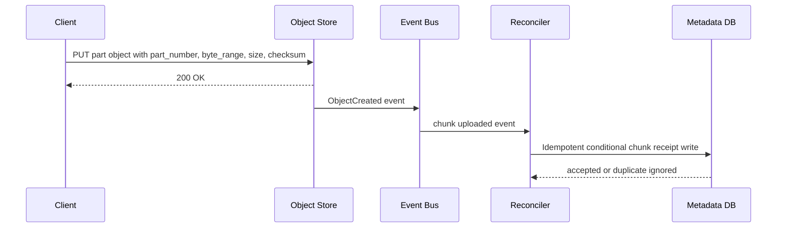
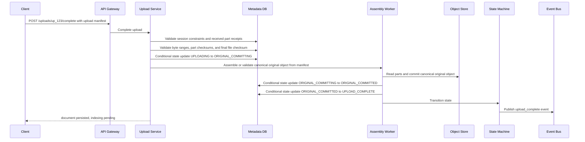
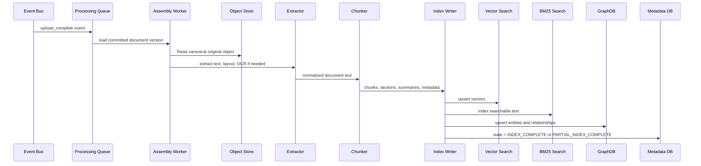
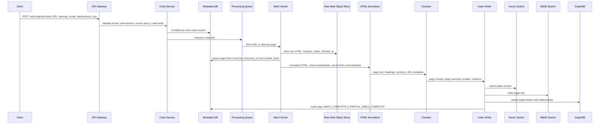
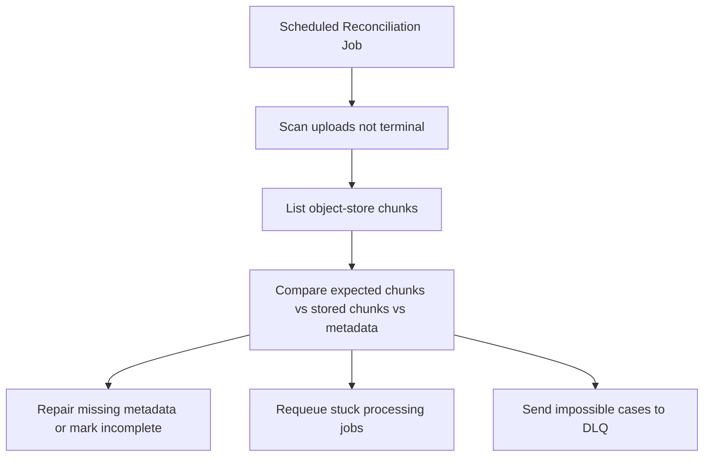
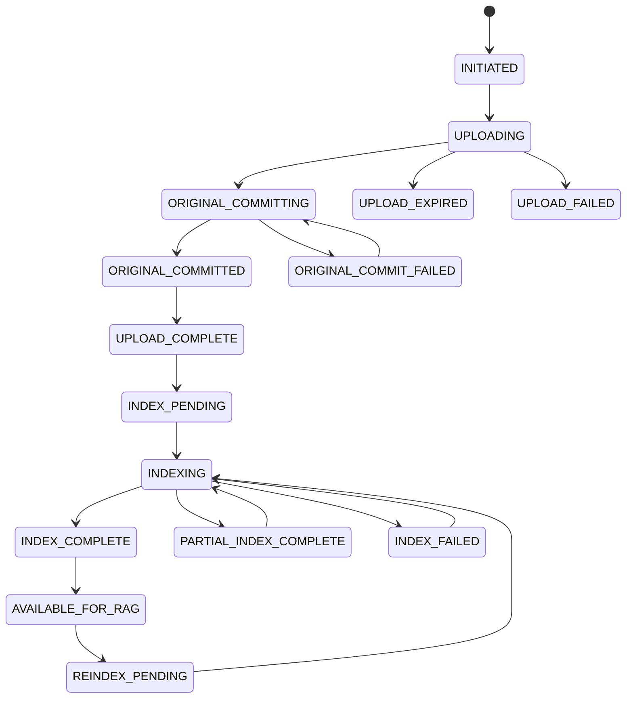
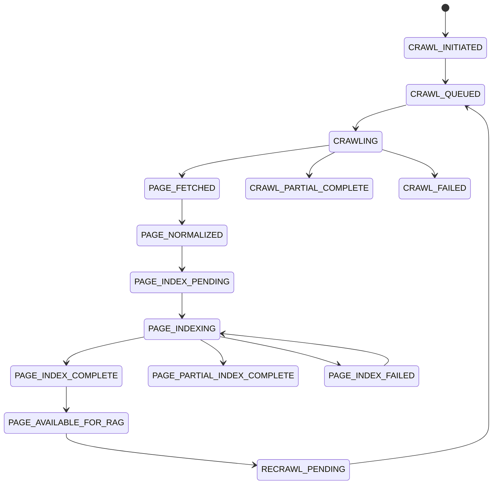
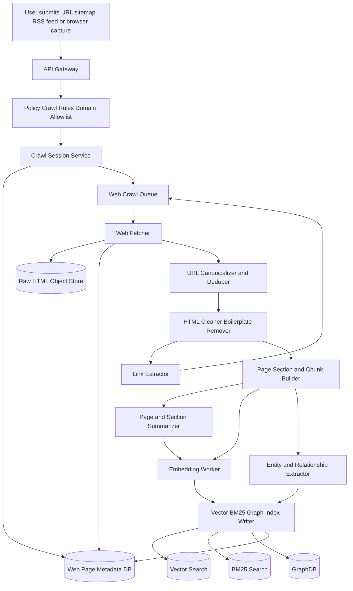

# Datasite RAG Document and Web Ingestion System Design

## Core Design Principle

Upload success means the original content is durably persisted and the document record is committed. It does not mean vector, BM25, or GraphDB indexing has completed.

Indexing is async, event-driven, idempotent, and reconciled.

---

# 1. Functional Requirements

## Core document ingestion

1. Clients can upload large documents, including PDFs, Word files, spreadsheets, images, HTML exports, and text files.
2. Clients can upload web content by providing a URL, sitemap, RSS feed, or browser-captured HTML.
3. The system supports large file uploads through chunked upload.
4. The system persists uploaded file chunks before marking the document upload as complete.
5. The system reassembles or validates uploaded chunks into a canonical original object in object storage.
6. The system stores document metadata, tenant metadata, access-control metadata, and upload state.
7. The system emits durable events after upload completion to trigger async processing.

## RAG indexing

The ingestion pipeline must populate:

### Vector Search

1. Document summary vectors.
2. Section summary vectors.
3. Chunk vectors.
4. Metadata filters for tenant, deal room, document id, ACLs, document type, version, page, and section.

### BM25 Search

1. Exact keyword index.
2. Phrase matching.
3. Field-specific search over title, body, page text, headings, entities, and tags.

### GraphDB

1. Entities extracted from documents and web pages.
2. Relationships between companies, people, documents, projects, assets, deals, ownership, dependencies, and references.
3. Provenance back to source document, page, section, or URL.

## RAG indexing patterns

- **Hierarchical indexing:** Create document, section, and chunk-level records so retrieval can search broad-to-narrow.
- **Multi-vector indexing:** Store vectors for summaries, sections, chunks, tables, and images when one vector per document is not enough.
- **Incremental indexing:** Re-index only changed chunks using content hashes and document versions.
- **Index lifecycle:** Handle deletes, document updates, tombstones, ACL changes, and stale index cleanup.

## Upload lifecycle

1. Client starts upload with document metadata, file size, file checksum, and idempotency key.
2. Server creates an upload session and returns upload constraints, including minimum chunk size, maximum chunk size, maximum part count, allowed content types, and signed URL creation rules.
3. Client chooses the actual chunk size within server-provided limits and uploads chunks independently.
4. Each chunk is idempotently persisted using `upload_id`, `part_number`, byte range, and checksum.
5. Client submits a final upload manifest containing part numbers, byte ranges, sizes, checksums, and total file checksum.
6. Server validates the manifest against the upload session constraints, received chunks, byte ranges, expected file size, and expected file checksum.
7. Server assembles or validates the canonical original object and commits it to object storage.
8. Server marks upload complete only after all manifest parts are present, checksums validate, byte ranges are complete, and the canonical object is committed.
9. Downstream processing happens asynchronously.

## Web ingestion lifecycle

1. Client submits a URL, sitemap, RSS feed, domain allowlist, or authenticated browser capture request.
2. Server validates tenant permissions, crawl policy, robots policy, data residency, and source allowlist rules.
3. Server creates a crawl session with an idempotency key and crawl scope.
4. Crawler fetches pages asynchronously and stores raw HTML, HTTP metadata, screenshots if needed, and extracted assets in object storage.
5. Each fetched page is tracked as a source object before downstream parsing or indexing begins.
6. The system canonicalizes URLs, deduplicates pages by canonical URL and content hash, and records redirects.
7. The system extracts text, title, headings, links, structured data, and page metadata.
8. The system chunks page content and indexes it into Vector Search, BM25 Search, and GraphDB.
9. The system supports scheduled recrawls and re-indexes only pages whose content hash or metadata changed.
10. The system preserves URL-level citations, retrieved time, published time, and source freshness metadata for RAG responses.

## Processing lifecycle

1. Extract text and layout.
2. Run OCR when needed.
3. Normalize content.
4. Split document into logical sections and chunks.
5. Summarize document and sections.
6. Generate embeddings.
7. Index chunks into Vector Search.
8. Index text into BM25.
9. Extract entities and relationships.
10. Upsert graph nodes and edges.
11. Mark indexing state as complete, partial, failed, or requiring review.

---

# 2. Non-Functional Requirements

## Scale

Assume Datasite-style enterprise usage:

| Area | Requirement |
|---|---|
| Tenants | Thousands of organizations |
| Deal rooms / workspaces | Millions over time |
| Documents | Hundreds of millions |
| Large files | 100 MB to 5 GB supported |
| Upload chunk size | 8 MB to 64 MB |
| Text chunks | 500 to 1,500 tokens each |
| Index fanout | 1 uploaded document can create hundreds or thousands of chunks |
| Peak uploads | Burst-heavy, especially during transaction deadlines |
| Web ingestion | URL submissions, sitemap crawls, scheduled refreshes, crawl depth limits, robots/policy controls |
| Web pages | Millions to billions of fetched pages over time depending on tenant scope |
| Recrawl volume | Burst-heavy when sitemaps, domains, or source systems are refreshed |

Important scale point:

**Upload traffic and indexing traffic should be decoupled. Uploads are latency-sensitive. Indexing is throughput-sensitive.**

## Availability

| Area | Requirement |
|---|---|
| Upload API | Highly available, because users must be able to submit deal documents |
| Object storage | Strong durability requirement |
| Metadata store | Highly available with conditional writes |
| Processing workers | Horizontally scalable, can lag under load |
| Vector/BM25/Graph indexing | Eventually consistent |
| Search freshness | New documents become searchable after async processing |
| Web crawler | Degraded crawler should not impact document uploads or existing search |
| DLQ | Failed jobs preserved for retry and investigation |

Important availability tradeoff:

**The system should accept and persist uploads even if Vector Search, BM25 Search, GraphDB, embedding models, or OCR services are degraded.**

## Performance

| Flow | Target |
|---|---|
| Start upload | Low latency, usually under 500 ms |
| Chunk upload | Direct-to-object-store preferred |
| Upload completion | Fast metadata validation plus checksum verification |
| Indexing latency | Minutes for normal docs, longer for very large docs |
| Search freshness | Near-real-time for priority docs, eventual for bulk ingestion |
| Metadata reads | Cached aggressively |
| Hot documents | Protected with cache, request coalescing, and rate limits |

Important performance point:

**The client should not wait for OCR, chunking, embeddings, BM25 indexing, or GraphDB updates before seeing upload success.**

## Consistency

| Area | Consistency Model |
|---|---|
| Upload session creation | Strong consistency |
| Chunk receipt | Idempotent conditional writes |
| Original object commit | Strong consistency |
| Document state | State-machine controlled |
| Indexing | Eventually consistent |
| Search indexes | Rebuilt/reconciled from source of truth |
| GraphDB | Idempotent upserts |
| URL canonicalization | Deterministic canonical URL and content hash |
| Web recrawls | Eventually consistent with source website changes |
| Metadata cache | Read-through with TTL and invalidation |

Important consistency rule:

**The source of truth is object storage plus the document metadata database. Vector Search, BM25, and GraphDB are derived indexes.**

## Security and Compliance

| Area | Requirement |
|---|---|
| AuthN | SSO, OIDC, SAML, service identity |
| AuthZ | Tenant, workspace, deal-room, document, group, and role-based access |
| Encryption in transit | TLS everywhere |
| Encryption at rest | Object store, metadata DB, queues, search indexes, graph store |
| Tenant isolation | Tenant id on every object, row, event, index entry, graph node, and edge |
| DLP (Data Loss Prevention) | Optional scanning for sensitive content |
| Malware scanning | Before indexing or preview generation |
| Audit logs | Upload, view, download, index, delete, permission changes |
| Legal hold | Prevent deletion when required |
| Retention | Per-tenant and per-room retention policies |
| Data residency | Region-aware routing and storage |
| Web source controls | Domain allowlists, crawl policies, robots policy, and authenticated-source boundaries |
| Public/private separation | Public web pages and tenant-confidential documents must be isolated by source type and policy |
| RAG permissions | Retrieval filters must enforce ACLs before generation |

Important security invariant:

**No chunk, embedding, BM25 document, graph node, graph edge, summary, or citation can exist without tenant, source document, version, and authorization metadata.**

## Observability

Track:

1. Upload started, chunk uploaded, upload completed, upload failed.
2. Chunk retry count and duplicate chunk count.
3. Object-store event lag.
4. Queue depth by stage.
5. DLQ count by failure reason.
6. OCR latency and failure rate.
7. Embedding latency and token cost.
8. Vector upsert success rate.
9. BM25 indexing lag.
10. GraphDB upsert latency.
11. Documents stuck in a state.
12. Reconciliation repairs.
13. Search freshness lag.
14. Per-tenant ingestion cost.
15. Crawl session success rate.
16. Page fetch latency and failure rate.
17. HTTP status distribution by domain.
18. Recrawl freshness lag.
19. URL deduplication and content-change rate.

Important alert:

**Alert when documents are uploaded but not indexed within the expected freshness SLA.**

## Cost and Chargeback

Track cost by:

| Cost Driver | Chargeback Dimension |
|---|---|
| Object storage | Tenant, workspace, document size, retention |
| Chunk upload bandwidth | Tenant, region |
| OCR (Optical Character Recognition)  | Pages processed |
| Embeddings | Tokens embedded |
| LLM summarization | Input/output tokens |
| Vector storage | Number of vectors and dimensions |
| BM25 storage | Indexed text size |
| GraphDB storage | Nodes, edges, traversals |
| Processing compute | Worker CPU/memory time |
| Cache | Hot metadata and generated previews |
| Reconciliation | Repairs and reprocessing jobs |
| Web crawling | Pages fetched, domains crawled, bandwidth, and refresh frequency |
| HTML/page storage | Raw HTML, screenshots, extracted assets, and normalized text |

Cost controls:

1. Use tiered storage for old original documents.
2. Cache hot metadata, not everything.
3. Deduplicate files by checksum when policy allows.
4. Avoid re-embedding unchanged chunks.
5. Use content-hash-based chunk IDs.
6. Rate-limit expensive tenants or bulk imports.
7. Use priority queues for customer-facing uploads.
8. Move low-priority web crawls to cheaper batch processing.
9. Store embeddings only for approved content.
10. Use summary-first retrieval for large documents to reduce search-time cost.

---

# 3. High-Level Architecture



---

# 4. Control Plane vs Data Plane

## Control Plane

The control plane manages decisions, state, metadata, authorization, and lifecycle.

Examples:

1. Create upload session.
2. Validate tenant and workspace permissions.
3. Track upload state.
4. Store document metadata.
5. Issue pre-signed upload URLs.
6. Enforce idempotency.
7. Emit lifecycle events.
8. Expose document status to clients.
9. Manage retries and reconciliation.
10. Record audit events.

Control plane services:

1. API Gateway
2. AuthN/AuthZ
3. Upload Session Service
4. Document Metadata Service
5. Policy Service
6. State Machine
7. Metadata Cache
8. Reconciliation Service

## Data Plane

The data plane moves and transforms large content.

Examples:

1. Upload chunks.
2. Assemble original file.
3. Run OCR.
4. Extract text.
5. Chunk text.
6. Generate summaries.
7. Generate embeddings.
8. Extract graph entities.
9. Write to Vector Search, BM25, and GraphDB.

Data plane services:

1. Object Storage
2. Processing Queue
3. Assembly Workers
4. OCR Workers
5. Chunking Workers
6. Embedding Workers
7. Entity Extraction Workers
8. Index Writers

Important interview line:

**The control plane owns correctness and state. The data plane owns high-throughput content movement and transformation.**

---

# 5. Main Flows

## Flow 1: Start Large Document Upload



Start upload request:

```json
{
  "tenant_id": "t1",
  "workspace_id": "deal-room-123",
  "filename": "security-policy.pdf",
  "content_type": "application/pdf",
  "file_size_bytes": 2147483648,
  "file_sha256": "abc123",
  "chunk_size_bytes": 16777216,
  "idempotency_key": "client-generated-key-001"
}
```

Start upload response:

```json
{
  "upload_id": "up_123",
  "document_id": "doc_456",
  "version_id": "v1",
  "min_chunk_size_bytes": 8388608,
  "max_chunk_size_bytes": 67108864,
  "max_part_count": 10000,
  "signed_url_endpoint": "/uploads/up_123/parts/{part_number}/signed-url",
  "manifest_endpoint": "/uploads/up_123/complete",
  "expires_at": "2026-06-01T16:00:00Z"
}
```

---

## Flow 2: Upload Chunks

The client chooses chunk sizes within the server-provided limits, splits the file into byte ranges, and uploads chunks directly to object storage or through a thin upload gateway.

Preferred path:



Chunk object path:

```text
s3://datasite-ingest/t1/workspace-123/uploads/up_123/parts/part-00001
```

Chunk metadata:

```json
{
  "tenant_id": "t1",
  "upload_id": "up_123",
  "document_id": "doc_456",
  "version_id": "v1",
  "part_number": 1,
  "byte_range_start": 0,
  "byte_range_end": 16777215,
  "part_sha256": "parthash123",
  "size_bytes": 16777216
}
```

Important rule:

**Each part write is idempotent. Retrying the same `upload_id` and `part_number` with the same checksum should not create duplicate logical parts. Retrying the same part number with a different checksum is a conflict.**

---

## Flow 3: Complete Upload



Upload manifest request:

```json
{
  "upload_id": "up_123",
  "document_id": "doc_456",
  "version_id": "v1",
  "file_size_bytes": 2147483648,
  "file_sha256": "abc123",
  "parts": [
    {
      "part_number": 1,
      "byte_range_start": 0,
      "byte_range_end": 16777215,
      "size_bytes": 16777216,
      "part_sha256": "parthash123"
    },
    {
      "part_number": 2,
      "byte_range_start": 16777216,
      "byte_range_end": 33554431,
      "size_bytes": 16777216,
      "part_sha256": "parthash456"
    }
  ]
}
```

Upload complete response:

```json
{
  "document_id": "doc_456",
  "version_id": "v1",
  "upload_state": "UPLOAD_COMPLETE",
  "index_state": "INDEX_PENDING",
  "message": "Document uploaded successfully. Indexing is pending."
}
```

Important interview point:

**The client receives success only after all chunks are durably persisted, the canonical original object is committed, and the upload state reaches `UPLOAD_COMPLETE`. The client does not wait for RAG indexing.**

---

## Flow 4: Async Processing and Indexing



---

## Flow 4B: Web Page Ingestion and Recrawl



Web ingestion request:

```json
{
  "tenant_id": "t1",
  "workspace_id": "deal-room-123",
  "source_type": "WEB_URL",
  "url": "https://example.com/investor-relations/acquisition.html",
  "crawl_scope": {
    "max_depth": 2,
    "allowed_domains": ["example.com"],
    "include_patterns": ["/investor-relations/*"],
    "exclude_patterns": ["/login", "/cart"]
  },
  "recrawl_policy": {
    "frequency": "DAILY",
    "only_reindex_on_content_change": true
  },
  "idempotency_key": "client-generated-web-key-001"
}
```

Web page source record:

```json
{
  "page_source_id": "websrc_001",
  "tenant_id": "t1",
  "workspace_id": "deal-room-123",
  "crawl_session_id": "crawl_123",
  "submitted_url": "https://example.com/investor-relations/acquisition.html",
  "canonical_url": "https://example.com/investor-relations/acquisition.html",
  "final_url": "https://example.com/investor-relations/acquisition.html",
  "http_status": 200,
  "content_type": "text/html",
  "content_hash": "htmlhash123",
  "raw_object_uri": "s3://datasite-web-raw/t1/crawl_123/page_001.html",
  "retrieved_at": "2026-06-01T15:15:00Z",
  "published_at": "2026-05-28T09:00:00Z",
  "index_state": "INDEX_PENDING"
}
```

Important web ingestion rule:

**A web page is considered fetched once raw HTML and HTTP metadata are durably stored. It is considered available for RAG only after parsing, chunking, indexing, and authorization metadata are complete.**

---

## Flow 5: Object-Store Events and Reconciliation

Object-store events are useful, but they should not be trusted as the only source of correctness.

Why?

1. Events can be delayed.
2. Events can be duplicated.
3. Events can arrive out of order.
4. A worker can fail after receiving the event.
5. A metadata write can fail after object upload succeeds.

Use reconciliation.



Reconciliation repairs:

1. Chunk exists in object store but missing from metadata.
2. Metadata says chunk uploaded but object missing.
3. Upload stuck in `UPLOADING`.
4. Upload marked complete but no processing job exists.
5. Document stuck in `INDEXING`.
6. Partial index missing BM25, Vector, or GraphDB writes.
7. Object-store event was duplicated and caused no-op processing.

---

# 6. Data Model

## Document

```json
{
  "document_id": "doc_456",
  "tenant_id": "t1",
  "workspace_id": "deal-room-123",
  "current_version_id": "v1",
  "title": "Security Policy",
  "source_type": "UPLOAD",
  "created_by": "user_123",
  "created_at": "2026-06-01T15:00:00Z",
  "classification": "confidential",
  "acl_id": "acl_789",
  "retention_policy_id": "ret_001",
  "legal_hold": false
}
```

## Document Version

```json
{
  "document_id": "doc_456",
  "version_id": "v1",
  "tenant_id": "t1",
  "original_object_uri": "s3://datasite-originals/t1/doc_456/v1/original.pdf",
  "file_sha256": "abc123",
  "file_size_bytes": 2147483648,
  "content_type": "application/pdf",
  "upload_state": "UPLOAD_COMPLETE",
  "processing_state": "INDEX_PENDING",
  "created_at": "2026-06-01T15:00:00Z"
}
```

## Upload Session

```json
{
  "upload_id": "up_123",
  "document_id": "doc_456",
  "version_id": "v1",
  "tenant_id": "t1",
  "workspace_id": "deal-room-123",
  "idempotency_key": "client-generated-key-001",
  "min_chunk_size_bytes": 8388608,
  "max_chunk_size_bytes": 67108864,
  "max_part_count": 10000,
  "file_sha256": "abc123",
  "state": "UPLOADING",
  "created_at": "2026-06-01T15:00:00Z",
  "expires_at": "2026-06-02T15:00:00Z"
}
```

## Upload Part Receipt

```json
{
  "upload_id": "up_123",
  "part_number": 1,
  "tenant_id": "t1",
  "object_uri": "s3://datasite-ingest/t1/uploads/up_123/parts/part-00001",
  "byte_range_start": 0,
  "byte_range_end": 16777215,
  "part_sha256": "parthash123",
  "size_bytes": 16777216,
  "state": "RECEIVED",
  "received_at": "2026-06-01T15:05:00Z"
}
```

Primary key:

```text
(upload_id, part_number)
```

Conditional write rule:

```text
Insert part receipt only if (upload_id, part_number) does not already exist.
If it exists with the same checksum and byte range, treat as success.
If it exists with a different checksum or byte range, reject as conflict.
```

## Document Chunk

```json
{
  "chunk_id": "chk_doc456_v1_000042_hash789",
  "document_id": "doc_456",
  "version_id": "v1",
  "tenant_id": "t1",
  "workspace_id": "deal-room-123",
  "section_id": "sec_007",
  "page_start": 12,
  "page_end": 13,
  "token_count": 720,
  "content_hash": "hash789",
  "text": "Datasite uses role-based access control...",
  "source_uri": "datasite://documents/doc_456/v1/chunks/000042",
  "acl_id": "acl_789",
  "created_at": "2026-06-01T15:20:00Z"
}
```

Chunk ID should be deterministic:

```text
chunk_id = hash(tenant_id + document_id + version_id + chunk_index + content_hash)
```

This helps with idempotency and avoids duplicate embeddings.

## Vector Index Entry

```json
{
  "vector_id": "vec_chk_doc456_v1_000042",
  "chunk_id": "chk_doc456_v1_000042_hash789",
  "tenant_id": "t1",
  "workspace_id": "deal-room-123",
  "document_id": "doc_456",
  "version_id": "v1",
  "embedding_model": "text-embedding-3-large",
  "embedding_version": "2026-06-01",
  "metadata": {
    "acl_id": "acl_789",
    "document_type": "policy",
    "page_start": 12,
    "page_end": 13,
    "source_uri": "datasite://documents/doc_456/v1/chunks/000042"
  }
}
```

## BM25 Index Entry

```json
{
  "bm25_id": "bm25_chk_doc456_v1_000042",
  "tenant_id": "t1",
  "workspace_id": "deal-room-123",
  "document_id": "doc_456",
  "version_id": "v1",
  "chunk_id": "chk_doc456_v1_000042_hash789",
  "title": "Security Policy",
  "heading": "Access Controls",
  "body": "Datasite uses role-based access control...",
  "acl_id": "acl_789",
  "source_uri": "datasite://documents/doc_456/v1/chunks/000042"
}
```

## Graph Node

```json
{
  "node_id": "entity_company_acme",
  "tenant_id": "t1",
  "type": "Company",
  "canonical_name": "Acme Corp",
  "aliases": ["Acme", "Acme Corporation"],
  "source_documents": ["doc_456"],
  "confidence": 0.93
}
```

## Graph Edge

```json
{
  "edge_id": "edge_acme_acquired_beta_doc456_p12",
  "tenant_id": "t1",
  "from_node_id": "entity_company_acme",
  "to_node_id": "entity_company_beta",
  "relationship": "ACQUIRED",
  "source_uri": "datasite://documents/doc_456/v1/pages/12",
  "document_id": "doc_456",
  "version_id": "v1",
  "confidence": 0.88
}
```

## Web Crawl Session

```json
{
  "crawl_session_id": "crawl_123",
  "tenant_id": "t1",
  "workspace_id": "deal-room-123",
  "source_type": "WEB_SITEMAP",
  "seed_url": "https://example.com/sitemap.xml",
  "idempotency_key": "client-generated-web-key-001",
  "allowed_domains": ["example.com"],
  "max_depth": 2,
  "state": "CRAWLING",
  "created_by": "user_123",
  "created_at": "2026-06-01T15:00:00Z"
}
```

## Web Page Source

```json
{
  "page_source_id": "websrc_001",
  "crawl_session_id": "crawl_123",
  "tenant_id": "t1",
  "workspace_id": "deal-room-123",
  "submitted_url": "https://example.com/page",
  "canonical_url": "https://example.com/page",
  "final_url": "https://example.com/page",
  "url_hash": "urlhash123",
  "content_hash": "contenthash456",
  "raw_object_uri": "s3://datasite-web-raw/t1/crawl_123/page_001.html",
  "http_status": 200,
  "retrieved_at": "2026-06-01T15:15:00Z",
  "last_modified": "2026-05-30T12:00:00Z",
  "index_state": "INDEX_PENDING",
  "acl_id": "acl_789"
}
```

## Web Page Chunk

```json
{
  "chunk_id": "chk_websrc001_000004_hash789",
  "page_source_id": "websrc_001",
  "tenant_id": "t1",
  "workspace_id": "deal-room-123",
  "canonical_url": "https://example.com/page",
  "heading": "Acquisition Overview",
  "token_count": 640,
  "content_hash": "hash789",
  "text": "Acme Corp announced the acquisition of Beta Corp...",
  "source_uri": "https://example.com/page#section-acquisition-overview",
  "retrieved_at": "2026-06-01T15:15:00Z",
  "acl_id": "acl_789"
}
```

---

# 7. Upload State Machine

## Upload states



## State definitions

| State | Meaning |
|---|---|
| `INITIATED` | Upload session created |
| `UPLOADING` | Client is uploading chunks |
| `UPLOAD_COMPLETE` | Canonical original object has been committed, upload validation succeeded, and the document is durably persisted |
| `UPLOAD_EXPIRED` | Client did not finish before deadline |
| `UPLOAD_FAILED` | Upload failed validation |
| `ORIGINAL_COMMITTING` | Worker is assembling or validating original object |
| `ORIGINAL_COMMIT_FAILED` | Canonical original object assembly or validation failed; retryable by worker or reconciliation |
| `ORIGINAL_COMMITTED` | Canonical original file exists in object storage and is ready for upload completion |
| `INDEX_PENDING` | Document is ready for async processing |
| `INDEXING` | OCR, chunking, embedding, BM25, and graph processing are running |
| `PARTIAL_INDEX_COMPLETE` | Some indexes succeeded, others failed |
| `INDEX_FAILED` | Indexing failed after retry limit |
| `INDEX_COMPLETE` | All required indexes succeeded |
| `AVAILABLE_FOR_RAG` | Search and RAG can retrieve the document |
| `REINDEX_PENDING` | Permissions, model version, parser version, or document version changed |

Critical rule:

**`UPLOAD_COMPLETE` is a persistence milestone. `AVAILABLE_FOR_RAG` is a retrieval milestone. Do not collapse them into one state.**

**Upload completion occurs only after the canonical original object has been successfully assembled or validated and committed. Upload success therefore guarantees durable persistence of the final document, not merely receipt of individual chunks.**

## Web crawl state machine



Web crawl lifecycle rule:

**A crawl session can be partially complete while individual pages have their own fetch, normalize, index, and available-for-RAG states. This prevents one bad URL from failing the entire crawl.**

---

# 8. Indexing State Model

Track each index separately.

```json
{
  "document_id": "doc_456",
  "version_id": "v1",
  "tenant_id": "t1",
  "index_state": "PARTIAL_INDEX_COMPLETE",
  "vector_index": {
    "state": "COMPLETE",
    "indexed_chunks": 342,
    "embedding_model": "text-embedding-3-large"
  },
  "bm25_index": {
    "state": "COMPLETE",
    "indexed_chunks": 342
  },
  "graph_index": {
    "state": "FAILED",
    "error": "graph write timeout",
    "retry_count": 3
  }
}
```

This allows the system to say:

1. Document uploaded.
2. Document searchable by text.
3. Document searchable by vector.
4. Graph relationships are still pending.
5. Retry only the failed graph stage.

---

# 9. Idempotency Design

## Upload session idempotency

Client sends:

```http
POST /uploads/start
Idempotency-Key: client-generated-key-001
```

Conditional write:

```text
Put upload session if tenant_id + idempotency_key does not exist.
If it exists, return the existing upload_id.
```

## Upload part idempotency

Primary key:

```text
(upload_id, part_number)
```

Rules:

1. Same part number, same byte range, and same checksum means duplicate retry, return success.
2. Same part number with a different byte range or checksum means conflict.
3. Missing part from the submitted manifest means upload cannot complete.
4. Overlapping byte ranges or gaps in byte ranges means upload cannot complete.
5. Duplicate object-store event means no-op.

## Processing job idempotency

Processing job key:

```text
(document_id, version_id, stage_name, stage_version)
```

Example:

```json
{
  "job_key": "doc_456:v1:embedding:text-embedding-3-large:2026-06-01",
  "state": "COMPLETE"
}
```

If the job already completed, the worker skips it.

## Index write idempotency

Use deterministic IDs:

```text
vector_id = hash(chunk_id + embedding_model + embedding_version)
bm25_id = hash(chunk_id + analyzer_version)
edge_id = hash(source_entity + relationship + target_entity + source_uri)
```

This makes retries safe.

---

# 10. Metadata Caching and Hot-Key Protection

Metadata is read frequently by upload, retrieval, authorization, preview, and status APIs.

## Cache strategy

Use a read-through cache for:

1. Tenant policy.
2. Workspace policy.
3. ACLs.
4. Upload session metadata.
5. Document status.
6. Document version metadata.
7. Processing status.

Cache keys:

```text
tenant:{tenant_id}:policy
workspace:{workspace_id}:policy
acl:{acl_id}
upload:{upload_id}:status
document:{document_id}:current_version
document:{document_id}:index_status
```

## Hot-key risks

Hot documents or active deal rooms can overload one cache key.

Examples:

1. Many users open the same document.
2. Many clients poll upload status.
3. A large deal room triggers bulk ingestion.
4. A popular document is repeatedly retrieved by RAG.

## Hot-key protections

1. Add TTL jitter.
2. Use request coalescing.
3. Use stale-while-revalidate.
4. Split hot metadata into smaller keys.
5. Use local in-process cache for ultra-hot policy data.
6. Rate-limit status polling.
7. Push status updates over WebSocket/SSE when appropriate.
8. Avoid putting large chunk text in metadata cache.
9. Cache only metadata, not sensitive full document content unless explicitly approved.

---

# 11. Backpressure and Graceful Degradation

## Backpressure controls

1. Limit active uploads per tenant.
2. Limit concurrent chunks per upload.
3. Limit object-store write throughput per tenant.
4. Use priority queues for paid tiers or urgent deal rooms.
5. Separate queues by stage:
   - OCR queue
   - Chunking queue
   - Embedding queue
   - Vector index queue
   - BM25 index queue
   - Graph index queue
6. Apply token-budget limits for summarization and embeddings.
7. Pause low-priority web crawls during upload spikes.
8. Move expensive LLM summarization to delayed processing if needed.

## Graceful degradation

If embedding provider is down:

```text
Upload succeeds.
BM25 indexing can continue.
Vector indexing becomes INDEX_PENDING or PARTIAL_INDEX_COMPLETE.
```

If GraphDB is down:

```text
Upload succeeds.
Vector and BM25 indexing continue.
Graph indexing retries later.
```

If OCR is overloaded:

```text
Native text extraction runs first.
OCR-only pages are queued separately.
Document may be partially searchable.
```

If BM25 is down:

```text
Vector and GraphDB continue.
BM25 stage retries from DLQ or reconciliation.
```

Important interview line:

**Failures in derived indexes should not block durable upload completion. They should only affect search freshness or retrieval coverage.**

---

# 12. Event-Driven Updates and Reconciliation

## Event-driven path

Events are emitted for:

1. `upload.started`
2. `chunk.received`
3. `upload.completed`
4. `original.committed`
5. `document.extracted`
6. `document.chunked`
7. `summary.generated`
8. `embedding.completed`
9. `vector.indexed`
10. `bm25.indexed`
11. `graph.indexed`
12. `index.completed`
13. `index.failed`

Example event:

```json
{
  "event_id": "evt_001",
  "event_type": "upload.completed",
  "tenant_id": "t1",
  "document_id": "doc_456",
  "version_id": "v1",
  "upload_id": "up_123",
  "occurred_at": "2026-06-01T15:10:00Z",
  "idempotency_key": "doc_456:v1:upload_completed"
}
```

## Reconciliation path

Scheduled reconciliation checks:

1. Metadata DB vs object store.
2. Upload state vs chunk receipts.
3. Upload complete state vs event publication.
4. Event log vs processing job table.
5. Processing job table vs index state.
6. Metadata DB vs Vector Search.
7. Metadata DB vs BM25 Search.
8. Metadata DB vs GraphDB.

Reconciliation is the safety net that turns eventually consistent event processing into operationally reliable ingestion.

---

# 13. Web Content Ingestion

Web ingestion should be treated as a first-class ingestion path, not just a small variation of file upload. The source object is not an uploaded PDF. The source object is the fetched page, including raw HTML, HTTP headers, canonical URL, final URL after redirects, retrieval timestamp, and content hash.



## Web-specific requirements

1. Validate tenant permissions before accepting a URL, sitemap, RSS feed, or browser capture.
2. Enforce domain allowlists, crawl depth, URL include/exclude patterns, and source policy.
3. Store raw HTML and HTTP metadata before parsing or indexing.
4. Record submitted URL, canonical URL, final URL, redirects, HTTP status, content type, content hash, and retrieved time.
5. Deduplicate pages by canonical URL and content hash.
6. Support recrawl policies by source, tenant, workspace, or domain.
7. Re-index only when content hash, title, metadata, ACL, parser version, or embedding version changes.
8. Preserve URL-level citations and section anchors where possible.
9. Separate public web content from private tenant documents by source type, policy, and index metadata.
10. Allow partial crawl success, because one failed URL should not fail the entire crawl session.

## Web page idempotency

Primary key options:

```text
(tenant_id, workspace_id, canonical_url)
```

or, for versioned fetch history:

```text
(tenant_id, workspace_id, canonical_url, content_hash)
```

Rules:

1. Same canonical URL and same content hash means no re-index is needed.
2. Same canonical URL and different content hash creates a new page version.
3. Redirects are stored so future fetches use the final canonical URL.
4. Failed fetches are retried with backoff and eventually sent to a DLQ.
5. HTTP 404, 401, 403, and timeout failures are tracked separately because they require different retry and alerting behavior.

## Web ingestion vs document upload

| Area | Document Upload | Web Ingestion |
|---|---|---|
| Source | Client-uploaded file chunks | URL, sitemap, RSS feed, or browser capture |
| Persistence milestone | All chunks persisted and original object committed | Raw HTML and HTTP metadata persisted |
| Idempotency key | Upload id plus chunk number | Canonical URL plus content hash |
| Completion model | One document version completes | Crawl session can be partially complete |
| Freshness | New version on upload | Recrawl and reindex on content change |
| Citation | Document, page, section, chunk | URL, retrieved time, heading, anchor |
| Failure isolation | Failed file blocks that document version | Failed URL does not fail entire crawl |

---

# 14. Main Design Invariants

1. **Upload success requires durable persistence, not successful indexing.**
2. **Object storage plus metadata DB is the source of truth.**
3. **Vector Search, BM25, and GraphDB are derived indexes.**
4. **Every upload part must be idempotent, and the server must validate the client-submitted manifest before upload completion.**
5. **Every processing stage must be retry-safe.**
6. **Every index write must be deterministic or conditionally written.**
7. **Every chunk, vector, BM25 entry, graph node, and graph edge must carry tenant and authorization metadata.**
8. **Events drive processing, but reconciliation guarantees eventual repair.**
9. **Backpressure protects the platform from expensive OCR, embedding, and graph workloads.**
10. **Cost chargeback must be tracked per tenant, workspace, document, and processing stage.**
11. **For web ingestion, raw HTML and HTTP metadata must be persisted before page parsing or indexing begins.**
12. **A crawl session can be partially complete while successful pages continue through indexing.**
13. **Canonical URL plus content hash should drive web-page idempotency and recrawl decisions.**
14. **Web citations must preserve canonical URL, retrieved time, and source freshness metadata.**

---

# 15. One-Sentence Interview Summary

**I would separate upload persistence from RAG indexing: the control plane creates an idempotent upload session, tracks chunk receipt with conditional writes, commits the canonical original document to object storage, marks upload success only after the final document object is durable, and then an event-driven data plane asynchronously extracts, chunks, embeds, indexes BM25, and upserts graph entities, with queues, DLQs, reconciliation, metadata caching, backpressure, and per-tenant cost chargeback.**
