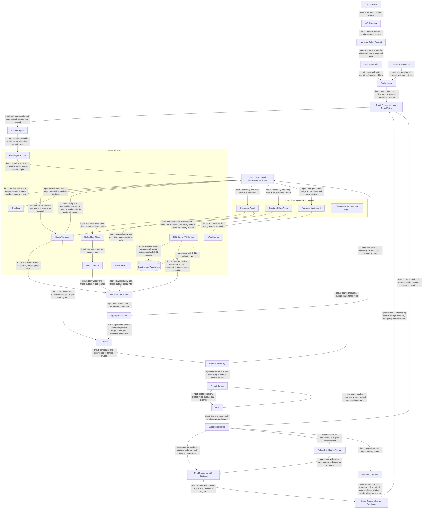

# RAG Ratrieval Patterns

## Components Index

- Embedding Model: Converts text into vectors for semantic search. 
    - Best technology: OpenAI text-embedding-3-small/large, Voyage AI, or open-source BGE/E5. 
    - Input: `{ "text": "How does Datasite secure documents?" }`. Output: `{ "embedding": [0.012, -0.044, 0.087], "dimension": 1536 }`.
- Ontology: Defines canonical entities, aliases, relationship types, and domain vocabulary used to normalize retrieval queries.
    - Best technology: RDF/OWL, SKOS, Neo4j schema constraints, Amazon Neptune, Stardog, or a curated domain taxonomy.
    - Input: `{ "text": "Datasite VDR acquisition" }`. Output: `{ "entities": [{ "canonical_name": "Virtual Data Room", "aliases": ["VDR"], "type": "product" }], "relationships": ["ACQUIRED", "OWNS", "SECURES"] }`.
- Router Agent: Decides which specialized agent or workflow should handle the request.
    - Best technology: LangGraph conditional edges, Semantic Kernel planners, custom routing service, or LLM classifier with deterministic fallback rules.
    - Input: `{ "query": "How many VDRs were created last month and what were the top security issues?", "history": [], "policy": { "allowed_agents": ["document", "structured_data", "web"] } }`. Output: `{ "routes": [{ "agent": "structured_data", "reason": "metric question" }, { "agent": "document", "reason": "security issue explanation" }], "confidence": 0.91 }`.
- Planner Agent: Decides what steps and tool calls are needed to answer the request.
    - Best technology: LangGraph, LangChain agents, LlamaIndex agents, Semantic Kernel, AutoGen, or a custom planner service with tool schemas.
    - Planning Graph: Uses an independent planning graph of tools, workflows, dependencies, and decision rules to determine subsequent retrieval steps.
    - Input: `{ "query": "How are documents secured?", "available_tools": ["vector_search", "bm25_search", "graph_query", "sql_query", "web_search"], "policy": { "require_citations": true } }`. Output: `{ "plan": [{ "step": 1, "tool": "vector_search", "input": "document security controls" }, { "step": 2, "tool": "bm25_search", "input": "RBAC SOC2 access controls" }], "stop_condition": "sufficient_grounded_context" }`.
- Vector Search: Finds semantically similar vectorized objects, including document summaries, section summaries, and chunks, with metadata used for filtering, hierarchy, authorization, and citations.
    - Best technology: Pinecone, Qdrant, Weaviate, Milvus, or pgvector. 
    - Input: `{ "query_vector": [0.012, -0.044], "top_k": 20, "filter": { "allowed_groups": ["deal-team-a"] } }`. Output: `{ "chunks": [{ "chunk_id": "c123", "doc_id": "d456", "source_uri": "datasite://documents/d456", "title": "Security Policy", "page": 4, "score": 0.92, "text": "Datasite uses RBAC..." }] }`.
- BM25 Search: Finds exact keyword and phrase matches using authorization filtering. 
    - Best technology: Elasticsearch, OpenSearch, or Apache Solr. 
    - Input: `{ "query": "SOC2 Type II access controls", "filter": { "allowed_groups": ["deal-team-a"] } }`. Output: `{ "hits": [{ "chunk_id": "c789", "doc_id": "d456", "source_uri": "datasite://documents/d456", "title": "SOC2 Controls", "page": 8, "field": "body", "score": 14.7, "snippet": "SOC2 Type II controls..." }] }`.
- Graph Traversal: Finds relationship-based facts using authorization filtering. 
    - Best technology: Neo4j, Amazon Neptune, TigerGraph, or PostgreSQL recursive queries for simpler graphs. 
    - Guidance:
        - Use a GraphDB when relationship traversal and multi-hop reasoning are primary retrieval requirements (ownership, dependencies, hierarchies, knowledge graphs).
        - Do not use a GraphDB when answers come directly from documents or structured records; Vector Search and BM25 are usually sufficient.
    - GraphDB Usage Patterns:
        - Direct Retrieval: Input = entity + relationship; Output = relationship facts sent to the LLM.
        - Query Expansion: Input = entity from query; Output = related entities used to build Vector Search or BM25 queries.
        - Ranking Data: Input = candidates + graph relationships; Output = relationship distance, authority, and entity importance for the Reranker.
    - Input: `{ "start_entity": "Company A", "relationship": "ACQUIRED|OWNS|INVESTED_IN", "max_depth": 2, "allowed_groups": ["deal-team-a"] }`. Output: `{ "paths": [{ "nodes": ["Company A", "Company B"], "node_ids": ["n101", "n202"], "edges": ["ACQUIRED"], "edge_ids": ["e303"], "source_uri": "datasite://graph/e303", "facts": ["Company A acquired Company B"] }] }`.
- SQL Query API Service: Retrieves structured facts through a governed abstraction between the agent/calling service and the database.
    - Best technology: Internal Query API service backed by Snowflake, BigQuery, Databricks SQL, PostgreSQL, or SQL Server. Prefer semantic-layer/query APIs over raw LLM-generated SQL. Allow dynamic SQL only behind read-only credentials, table/column allowlists, row-level security, query validation, cost limits, timeouts, and audit logging.
    - Input from calling service: `{ "metric": "vdr_count", "filters": { "created_after": "2026-05-01" }, "user_context": { "allowed_groups": ["deal-team-a"] } }`.
    - Query API internal database call: `{ "sql": "SELECT count(*) FROM vdr WHERE created_at >= ?", "params": ["2026-05-01"], "policy_checks": ["read_only", "allowed_tables", "row_level_security", "cost_limit"] }`.
    - Output to calling service: `{ "query_id": "q555", "source_uri": "datasite://query-api/vdr/q555", "tables": ["vdr"], "columns": ["count"], "rows": [{ "count": 15234 }], "provenance": { "service": "query-api", "database": "snowflake", "policy_passed": true } }`.
- Web Search: Retrieves external/public information when allowed. 
    - Best technology: Bing Search API, Google Programmable Search, Tavily, SerpAPI, or internal approved web-search service. 
    - Input: `{ "query": "Datasite latest acquisition", "recency_days": 30 }`. Output: `{ "results": [{ "title": "...", "url": "https://example.com/article", "source_uri": "https://example.com/article", "snippet": "...", "published_at": "2026-05-20", "retrieved_at": "2026-06-01T14:10:00Z" }] }`.
- Retrieval Coordinator: Executes retrieval calls, merges results, deduplicates chunks, and selects candidates. 
    - Best technology: Application service in Python/FastAPI, Java/Spring Boot, Go, LangChain, LlamaIndex, or Haystack. 
    - Input: `{ "query": "security controls", "sources": ["vector", "bm25", "graph"], "user_context": { "groups": ["deal-team-a"] } }`. Output: `{ "candidates": [{ "chunk_id": "c123", "source": "vector", "source_uri": "datasite://documents/d456", "title": "Security Policy", "score": 0.92 }, { "chunk_id": "c789", "source": "bm25", "source_uri": "datasite://documents/d456", "title": "SOC2 Controls", "score": 14.7 }] }`.
- Reranker: Reorders candidate chunks by relevance to the user query and selects the highest-quality context for the LLM.
    - Best technology: Cohere Rerank, Voyage Rerank, BGE reranker, cross-encoder models, ColBERT, or LLM-based reranking for smaller candidate sets.
    Common ranking signals:
    - Semantic similarity: Meaning-based relevance between query and document(embeddings or cross-encoder(neural network) model).
    - Keyword overlap (BM25): Exact term and phrase matches.
    - Document authority: Preference for trusted sources such as policies, runbooks, and approved documentation.
    - Freshness: Preference for newer information when recency matters.
    - Relevance feedback: Historical user interactions indicating document usefulness.
    - Input: `{ "query": "How are documents secured?", "candidates": [{ "chunk_id": "c123", "source_uri": "datasite://documents/d456", "text": "Datasite uses RBAC...", "metadata": { "document_type": "policy", "published_at": "2026-05-01" } }] }`.
    - Output: `{ "ranked_chunks": [{ "chunk_id": "c123", "source_uri": "datasite://documents/d456", "rerank_score": 0.98, "ranking_factors": ["semantic_match", "policy_document", "recent"], "text": "Datasite uses RBAC..." }] }`.
- Context Assembly: Normalizes, deduplicates, ranks, token-budgets retrieved context, and preserves source metadata for citations.
    - Best technology: Application service using tiktoken/tokenizers, LangChain, LlamaIndex, or custom ranking logic.
    - Input: `{ "ranked_chunks": [{ "chunk_id": "c123", "doc_id": "d456", "source_uri": "datasite://documents/d456", "text": "Datasite uses RBAC...", "tokens": 120 }], "token_budget": 6000 }`. Output: `{ "context_blocks": [{ "source_id": "d456:c123", "source_uri": "datasite://documents/d456", "text": "Datasite uses RBAC..." }], "total_tokens": 120 }`.
- Prompt Builder: Selects templates, injects history, maps citations, and constructs the final prompt.
    - Best technology: Prompt templates in LangChain/LangGraph, LlamaIndex, Semantic Kernel, or custom template rendering.
    - Input: `{ "system_template": "Answer using only provided context and cite sources", "history": [], "context_blocks": [{ "source_id": "d456:c123", "source_uri": "datasite://documents/d456", "text": "Datasite uses RBAC..." }], "user_query": "How are documents secured?" }`. Output: `{ "prompt": "System: Answer using only provided context and cite sources... Context [1]: Datasite uses RBAC... User: How are documents secured?", "citation_map": { "[1]": { "source_id": "d456:c123", "source_uri": "datasite://documents/d456" } } }`.
- LLM: Generates the answer from the final prompt using the citation instructions and context blocks.
    - Best technology: OpenAI GPT-4.1/GPT-5, Anthropic Claude, Google Gemini, Azure OpenAI, or self-hosted Llama/Qwen models.
    - Input: `{ "prompt": "System: ... Cite sources using [n]... Context [1]: ... User: How are documents secured?", "citation_map": { "[1]": "d456:c123" } }`. Output: `{ "answer": "Documents are secured using RBAC... [1]", "usage": { "input_tokens": 1200, "output_tokens": 180 } }`.
- Validation Pipeline: Checks grounding, safety, citation validity, and policy compliance before response.
    - Best technology: Guardrails AI, NeMo Guardrails, LangSmith evaluators, OpenAI/Anthropic moderation APIs, custom policy engine, or LLM-as-judge.
    - Input: `{ "answer": "Documents are secured using RBAC... [1]", "context_blocks": [{ "source_id": "d456:c123", "source_uri": "datasite://documents/d456", "text": "Datasite uses RBAC..." }], "citation_map": { "[1]": "d456:c123" }, "policy": "must cite sources" }`. Output: `{ "status": "pass", "grounded": true, "citations_valid": true, "missing_citations": [], "action": "return_response" }`.

## High-Level Multi-Agent RAG with Evaluation and Guardrails

## Flow Symbols
Reusable Pattern: **Generation Pipeline** = Context Assembly(preserve source metadata) → Prompt Builder(create citation map) → LLM(cite sources) → Response
- Naive RAG = User Query → Embedding Model → Vector Search(Authorization Filter) → Retrieved Chunks → **Generation Pipeline**
- Query Rewriting / RAG Fusion = Query Expansion/Rewriting(one user query becomes many retrieval queries) → Multiple Vector Searches → Retrieval Coordinator(Merge, Deduplicate, Candidate Selection) → Reranker → **Generation Pipeline**
- Hybrid Retrieval = Optional Ontology(entity normalization) + Graph Traversal(entity expansion) → query fans out to BM25 Search + Vector Search + optional Graph Traversal(direct facts) → graph ranking data can be used by the Reranker
  - Structured data access should go through a SQL Query API Service, not direct database access from the agent.
- Hierarchical Retrieval = Summary Search(find relevant documents) → Section Search(find relevant sections) → Chunk Search(find answer evidence) → Reranker → **Generation Pipeline**
- Agentic RAG = Planner Agent chooses which tools to call and in what order → Tool Calls(Vector, BM25, Graph, SQL Query API, Web) → **Generation Pipeline**
  - Router Agent is optional in single-agent RAG; it becomes important when the system must choose between multiple specialized agents or workflows.
- Multi-Agent RAG = Router Agent selects one or more specialized Agentic RAG agents → each selected agent uses its own Planner Agent and tools → Aggregation Agent combines outputs → **Generation Pipeline**
- Evaluation & Guardrails = Any Retrieval Pattern → Validation Pipeline(Grounding, Safety, Citation Validity, Policy) → Response or Retry

## Advanced Retrieval Patterns

- **HyDE:** Generate a hypothetical answer, embed it, and retrieve against that embedding.
- **Corrective RAG:** If retrieved evidence is weak, retry with rewritten queries or alternate tools.
- **Self-RAG:** Decide whether more retrieval is needed before answering.
- **Contextual compression:** Shrink retrieved chunks before prompt assembly.
- **Parent-child retrieval:** Retrieve precise child chunks, but pass larger parent sections to the LLM.
