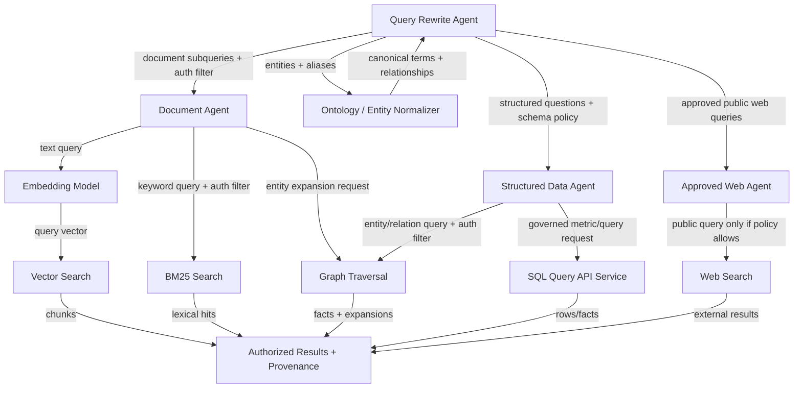
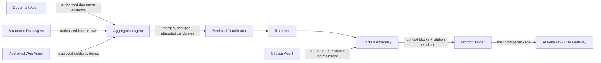
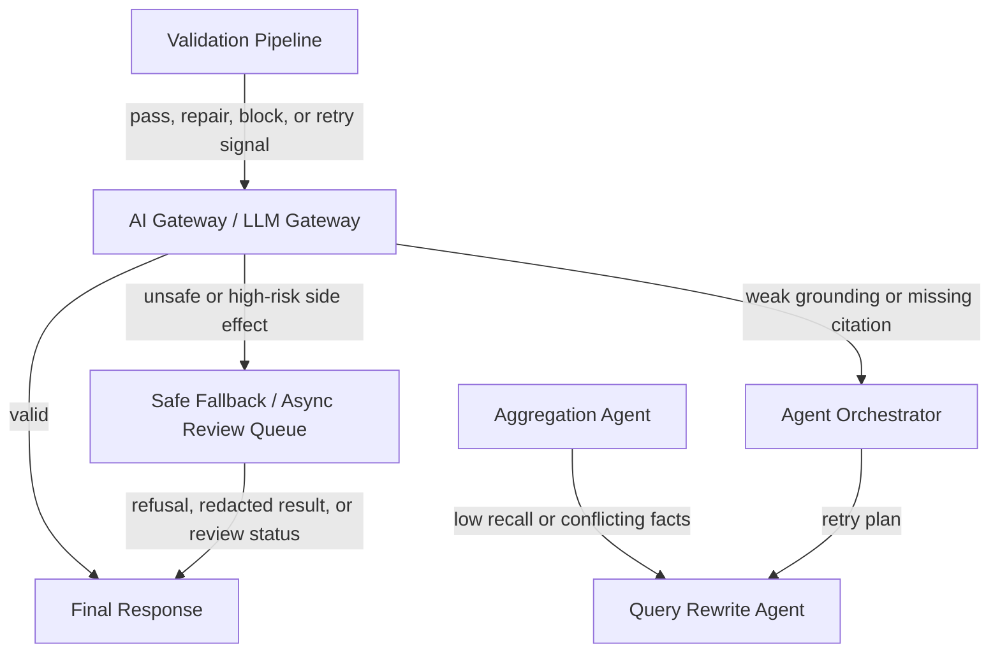

# Advanced Multi-Agent Retrieval Design

## Scope

Multi-agent retrieval is useful when a request needs decomposition across different source types, workflows, or reasoning modes. It adds routing and planning on top of the standard RAG retrieval path.

Use it for questions that combine document evidence, structured metrics, relationship facts, external public context, or multi-step synthesis. Avoid it for simple single-source Q&A because agent routing adds latency, cost, operational complexity, and more failure modes.

Inbound edge:

- AI Gateway or RAG Orchestrator provides a safe query, identity context, authorization filters, allowed agents/tools, policy constraints, and citation requirements.

Outbound edge:

- Multi-agent retrieval returns normalized, authorized candidates and provenance to the standard Retrieval Coordinator, Reranker, Context Assembly, and Prompt Builder path.

All model calls used by agents for routing, planning, rewriting, or synthesis still go through the AI Gateway.

## Agent Control Flow

```mermaid
flowchart LR
    Gateway[AI Gateway / LLM Gateway]
    Router[Router Agent]
    AgentOrchestrator[Agent Orchestrator / Retry Policy]
    Planner[Planner Agent]
    Rewrite[Query Rewrite Agent]
    Tasks[Specialized Agent Tasks]

    Gateway -->|safe query, policy, allowed agents/tools| Router
    Router -->|selected agents + rationale| AgentOrchestrator
    AgentOrchestrator -->|task + retry budget| Planner
    Planner -->|ordered retrieval plan| Rewrite
    Rewrite -->|source-specific tasks| Tasks
```



Routing, planning, and rewriting can use model calls, but those calls still go through the AI Gateway. Agents do not bypass the gateway just because they are internal.

## Specialized Agent Fanout



## Aggregation Back to Standard RAG



The multi-agent layer ends when it has produced normalized, authorized, attributed evidence. From that point forward, the system rejoins the standard RAG evidence preparation and gateway-controlled generation path.

## Retry and Fallback Loop



## Agent Responsibilities

| Agent | Owns | Input | Output |
|---|---|---|---|
| Router Agent | Selects one or more specialized retrieval workflows | Safe query, history, allowed agents, policy | Selected agents with rationale and confidence |
| Planner Agent | Defines retrieval steps, tool sequence, dependencies, stop conditions, and retry policy | Routed task, available tools, constraints | Ordered plan |
| Query Rewrite Agent | Decomposes the query, normalizes terms, expands entities, and creates source-specific subqueries | User query, plan, ontology hints | Document subqueries, structured questions, web queries |
| Document Agent | Retrieves unstructured document evidence | Document subqueries, auth filters | Authorized chunks, snippets, summaries, source metadata |
| Structured Data Agent | Retrieves governed metrics, rows, and graph facts | Structured questions, schema policy, auth filters | Rows, aggregates, graph paths, provenance |
| Web Agent | Retrieves external/public information only when allowed | Approved web query, recency/source constraints | Public results and provenance |
| Citation Agent | Normalizes source IDs, citation labels, provenance rules, and attribution requirements | Source metadata from all agents | Citation map rules and source metadata |
| Aggregation Agent | Merges agent outputs, resolves duplicates, flags conflicts, and keeps provenance | Candidates from specialized agents | Attributed candidate set for reranking |

## Planning Contract

Router input:

```json
{
  "query": "How many VDRs were created last month and what were the top security issues?",
  "history": [],
  "policy": {
    "allowed_agents": ["document", "structured_data"],
    "allow_external_web": false,
    "require_citations": true
  },
  "identity": {
    "principal_id": "user_123",
    "tenant_id": "tenant_a",
    "groups": ["deal-team-a"]
  }
}
```

Router output:

```json
{
  "routes": [
    {
      "agent": "structured_data",
      "reason": "metric question about VDR count",
      "confidence": 0.94
    },
    {
      "agent": "document",
      "reason": "security issue explanation requires source evidence",
      "confidence": 0.88
    }
  ]
}
```

Planner output:

```json
{
  "plan": [
    {
      "step": 1,
      "agent": "structured_data",
      "tool": "sql_query_api",
      "input": {
        "metric": "vdr_count",
        "filters": { "created_after": "2026-06-01" }
      }
    },
    {
      "step": 2,
      "agent": "document",
      "tool": "hybrid_search",
      "input": "top security issues VDR documents last month"
    }
  ],
  "stop_condition": "sufficient_grounded_context",
  "retry_budget": 2
}
```

## Specialized Retrieval Contracts

### Document Agent Output

```json
{
  "agent": "document",
  "candidates": [
    {
      "source_id": "d456:c123",
      "source_uri": "datasite://documents/d456",
      "title": "Security Policy",
      "page": 4,
      "text": "Datasite uses RBAC...",
      "score": 0.92,
      "authorization_checked": true
    }
  ]
}
```

### Structured Data Agent Output

```json
{
  "agent": "structured_data",
  "facts": [
    {
      "source_id": "query:q555:row:1",
      "source_uri": "datasite://query-api/vdr/q555",
      "statement": "15,234 VDRs were created after 2026-06-01.",
      "tables": ["vdr"],
      "columns": ["count"],
      "authorization_checked": true
    }
  ]
}
```

### Web Agent Output

```json
{
  "agent": "web",
  "results": [
    {
      "source_id": "web:https://example.com/article",
      "source_uri": "https://example.com/article",
      "title": "Example Public Source",
      "snippet": "Publicly available information...",
      "retrieved_at": "2026-07-01T14:10:00Z",
      "policy_allowed": true
    }
  ]
}
```

### Multi-Agent Output to Standard RAG Path

```json
{
  "query": "How many VDRs were created last month and what were the top security issues?",
  "candidates": [
    {
      "source_id": "query:q555:row:1",
      "source_uri": "datasite://query-api/vdr/q555",
      "text": "15,234 VDRs were created after 2026-06-01.",
      "source_type": "structured_fact",
      "authorization_checked": true
    },
    {
      "source_id": "d456:c123",
      "source_uri": "datasite://documents/d456",
      "text": "Datasite uses RBAC...",
      "source_type": "document_chunk",
      "authorization_checked": true
    }
  ],
  "citation_rules": {
    "required": true,
    "allowed_source_ids": ["query:q555:row:1", "d456:c123"]
  },
  "retrieval_metadata": {
    "agents_used": ["structured_data", "document"],
    "external_web_used": false
  }
}
```

## Failure and Retry Rules

- **Low recall:** Query Rewrite Agent broadens or decomposes queries within the same authorization policy.
- **Conflicting facts:** Aggregation Agent preserves both facts, source authority, and timestamps; Prompt Builder instructs the LLM to state the conflict rather than hide it.
- **Missing citations:** Citation Agent repairs source mapping before regeneration.
- **Weak grounding:** Agent Orchestrator retries retrieval before asking the LLM to answer again.
- **Unauthorized result:** Retrieval Coordinator drops it and emits a security event; unauthorized content never reaches reranking or prompting.
- **External web blocked by policy:** Web Agent is skipped and the response should state that external sources were not used if relevant.
- **High-risk side effect:** Gateway returns a safe fallback or async review status instead of letting agents act directly.

## When To Use Multi-Agent Retrieval

Use multi-agent retrieval when:

- The query spans documents, structured data, graph relationships, and optional web context.
- Different source types require different access policies or query languages.
- The system must decompose a broad task into separately verifiable evidence-gathering steps.
- The answer needs structured facts plus explanatory document evidence.

Avoid it when:

- A single vector or hybrid retrieval pass can answer the question.
- Latency and cost matter more than decomposition quality.
- The policy surface is not mature enough to safely expose multiple tools.
- The team cannot observe and debug agent plans, tool calls, and retries.
