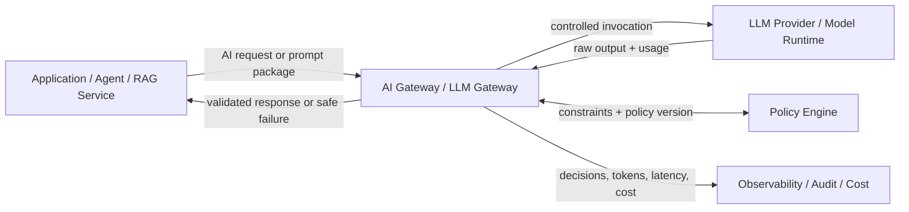
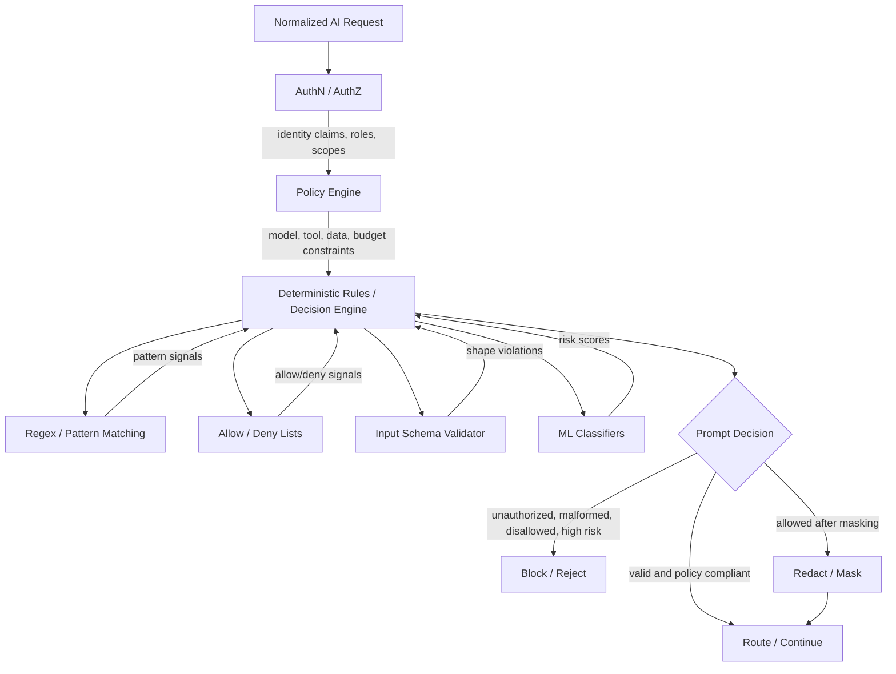
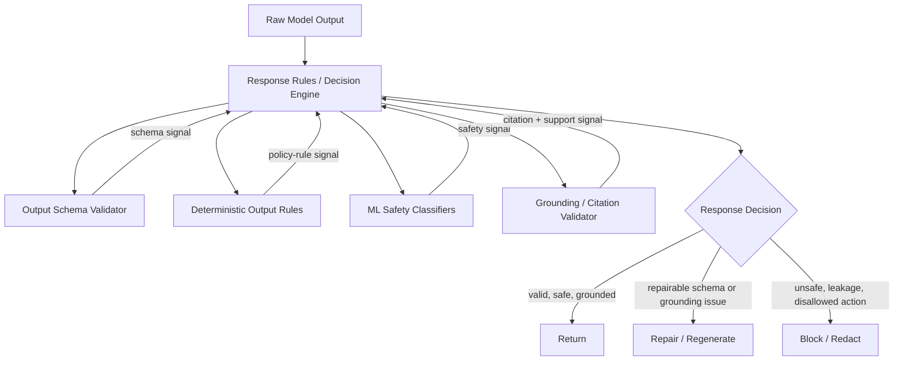
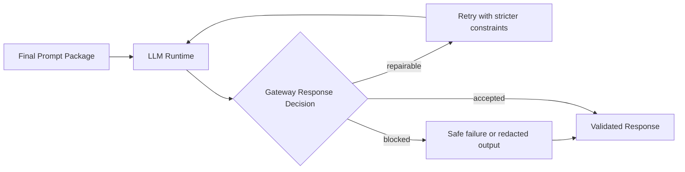
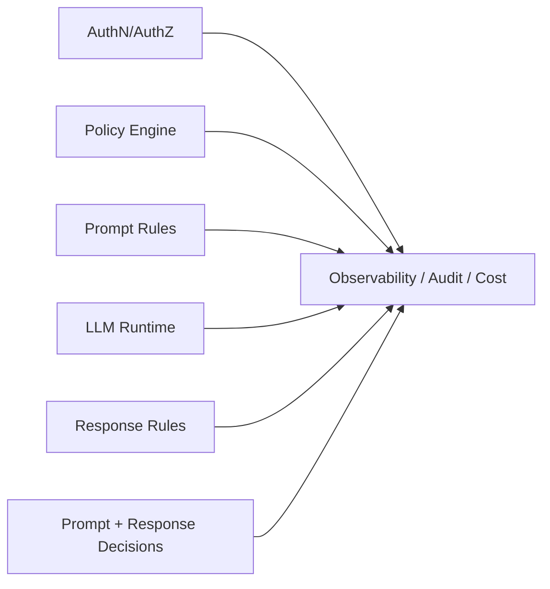

# AI Gateway Internal Design

## Scope

The AI Gateway, also called an LLM Gateway, is the control boundary around model access. It authenticates callers, loads policy constraints, applies prompt guardrails, enforces model/tool access, routes to model runtimes, validates responses, controls repair/block/return decisions, and emits audit and cost telemetry.

It does not own retrieval ranking, chunking, query planning, vector search, BM25 search, graph traversal, SQL execution, or web retrieval. Those belong to the RAG system and retrieval tools.

Inbound edge:

- Application, agent, or RAG service sends a normalized AI request or final prompt package.

Outbound edge:

- Gateway returns a prompt decision, a sanitized request, a controlled model response, or a safe failure/review status.

## Gateway Boundary Overview



The gateway is the only path to model runtime. The RAG layer can prepare a prompt package, but the gateway still owns policy, routing, validation, and final response decisions.

## Prompt Intake Decision



## Response Validation Decision



## Repair, Block, Return Loop



## Telemetry Sources



## Component Responsibilities

| Component | Responsibility | Output |
|---|---|---|
| AuthN/AuthZ | Verify token, API key, session, tenant, roles, groups, and scopes | Identity claims and auth decision |
| Policy Engine | Resolve tenant/app/user/model/tool/data/budget constraints | Applicable constraints and policy version |
| Deterministic Rules / Decision Engine | Combine policy, validators, classifiers, and static checks into decisions | Allow, redact, block, repair, or return action |
| Regex / Pattern Matching | Fast detection for known PII, secrets, jailbreak phrases, IDs, domains, and disallowed terms | Matched patterns and confidence |
| Allow / Deny Lists | Check known approved or blocked users, apps, tools, models, domains, providers, and datasets | Allow, deny, or restricted match signals |
| Input Schema Validator | Validate request type, JSON shape, required fields, tool args, and enum values | Valid input or schema violations |
| ML Classifiers | Score safety, prompt injection, sensitive content, intent, and policy-risk categories | Risk labels and scores |
| Prompt Decision | Decide whether the request can proceed before model invocation | Block, redact, route, or require review |
| Response Validation Layer | Evaluate the model output against schema, policy, safety, and grounding requirements | Validation result and signals |
| Output Schema Validator | Validate JSON, enums, required fields, and tool-call arguments | Valid output or repairable schema error |
| Deterministic Output Rules | Enforce non-negotiable limits such as no unsupported action, max values, and required disclaimers | Allowed, blocked, or repairable signal |
| ML Safety Classifiers | Detect unsafe, toxic, sensitive, disallowed, or policy-risk output | Output risk scores |
| Grounding / Citation Validator | Verify claims against retrieved chunks, citations, and source IDs | Supported, unsupported, missing citation, or low-confidence support |
| Repair / Block / Return Decision | Choose the final response action from policy and validation signals | Retry, repair, regenerate, block, redact, or return |
| Observability / Audit / Cost | Record decisions, matched policies, validation results, tokens, latency, provider status, and cost | Logs, traces, metrics, audit records |

## Request Lifecycle

1. Normalize the caller request into a common gateway envelope.
2. Authenticate the caller and resolve principal, tenant, role, scope, and group claims.
3. Load applicable policy for the tenant, app, model, action, tools, data class, and budget.
4. Run deterministic checks, schema validation, allow/deny lists, pattern matching, and ML classifiers.
5. Make the prompt decision: block, redact, route, or require review.
6. Route allowed requests to the selected model runtime with policy-bound limits.
7. Validate raw model output against schema, deterministic output rules, safety classifiers, and grounding/citation requirements.
8. Make the response decision: return, repair/regenerate, block/redact, or async review.
9. Emit telemetry for auth, policy, decision, validation, model usage, latency, cost, and final result.

## Edge Contracts

### Caller to AI Gateway

```json
{
  "request_id": "req_123",
  "tenant_id": "tenant_a",
  "app_id": "deal_assistant",
  "principal_token": "opaque_token",
  "requested_action": "answer_question",
  "requested_model": "default_llm",
  "requested_tools": ["document_search"],
  "prompt": "How does Datasite secure documents?",
  "metadata": {
    "conversation_id": "conv_456",
    "requires_citations": true,
    "data_classification": "confidential"
  }
}
```

### AuthN/AuthZ to AI Gateway

```json
{
  "authenticated": true,
  "principal_id": "user_123",
  "tenant_id": "tenant_a",
  "roles": ["deal_member"],
  "scopes": ["rag:query", "documents:read"],
  "groups": ["deal-team-a"]
}
```

### AI Gateway to Policy Engine

```json
{
  "principal_id": "user_123",
  "tenant_id": "tenant_a",
  "app_id": "deal_assistant",
  "roles": ["deal_member"],
  "scopes": ["rag:query", "documents:read"],
  "requested_action": "answer_question",
  "requested_model": "default_llm",
  "requested_tools": ["document_search"],
  "data_classification": "confidential"
}
```

### Policy Engine to AI Gateway

```json
{
  "allowed": true,
  "allowed_models": ["default_llm"],
  "allowed_tools": ["document_search", "vector_search", "bm25_search"],
  "require_citations": true,
  "allow_external_web": false,
  "allow_sensitive_data_to_external_models": false,
  "max_input_tokens": 12000,
  "max_output_tokens": 1000,
  "retention_policy": "audit_metadata_only"
}
```

### AI Gateway to LLM Runtime

```json
{
  "model": "default_llm",
  "prompt": "System: Answer using only provided context and cite sources...",
  "allowed_tools": [],
  "max_output_tokens": 1000,
  "metadata": {
    "request_id": "req_123",
    "tenant_id": "tenant_a",
    "requires_citations": true
  }
}
```

### Response Validation Result

```json
{
  "status": "pass",
  "schema_valid": true,
  "safe": true,
  "grounded": true,
  "citations_valid": true,
  "unsupported_claims": [],
  "action": "return_response"
}
```

## Repair and Human Review

Repair should be automatic only when the validation failure is bounded and recoverable, such as malformed JSON, missing citations, weak grounding, or incomplete formatting. The gateway can retry with stricter schema, citation, or safety instructions.

Human review should not sit in the synchronous happy path for normal chat or low-risk RAG answers. For high-risk side effects, regulated approvals, publication workflows, refunds, deletes, infrastructure changes, or external communications, the gateway should return a safe state such as `pending_review`, `cannot_complete_automatically`, or `needs_approval`, then place the requested side effect into an asynchronous review queue.
