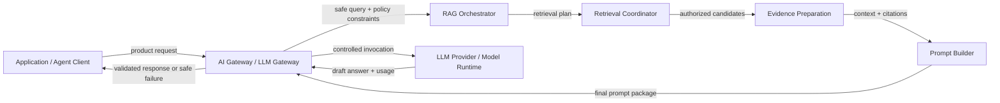
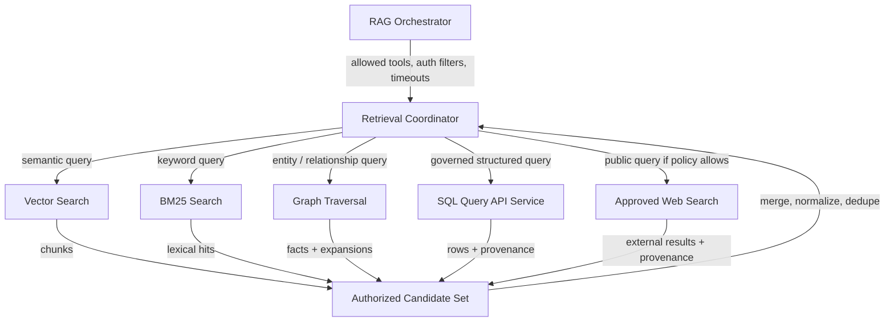
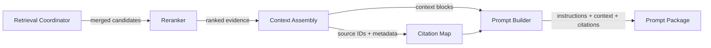
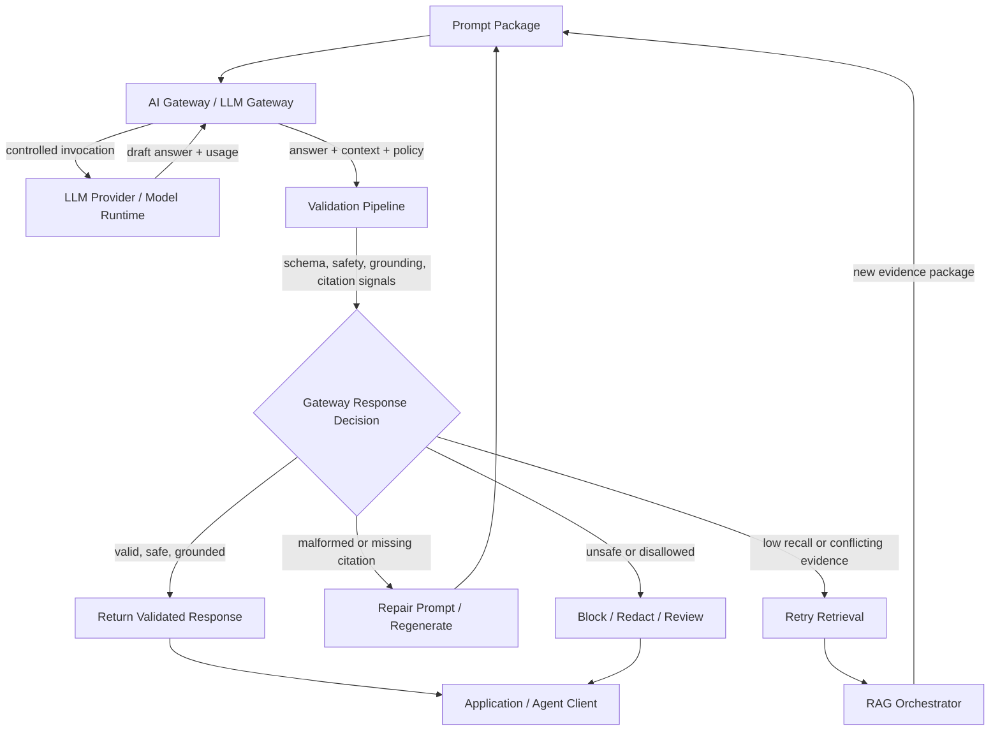

# End-to-End RAG System Design

## Scope

This document owns the retrieval read path from an approved user query to an evidence-backed prompt package and validated answer. It includes the RAG Orchestrator, retrieval tools, Retrieval Coordinator, Reranker, Context Assembly, Prompt Builder, AI Gateway, LLM, and Validation Pipeline.

It assumes ingestion has already chunked, embedded, indexed, and stored source metadata. See [RAG Ingestion System Design](../rag_ingestion_system_design.md) for the write path.

Inbound edge:

- AI Gateway provides a safe query, identity claims, authorization filters, allowed retrieval tools, policy constraints, and citation requirements.

Outbound edge:

- Prompt Builder returns a final prompt package and citation map to the AI Gateway. The gateway invokes the LLM and owns final response validation decisions.

## RAG Read Path Overview



The end-to-end RAG view treats the AI Gateway as a boundary, not as an expanded internal subsystem. The details of prompt and response decisions live in [AI Gateway Internal Design](./ai-gateway-internal-design.md).

## Retrieval Fanout



## Evidence Preparation



## Generation and Validation Loop



## Authorization Filter Placement


## Component Responsibilities

| Component | Owns | Input | Output |
|---|---|---|---|
| RAG Orchestrator | Retrieval strategy, source selection, retry/fallback policy, tool fanout | Safe query, policy constraints, allowed tools, identity context | Retrieval plan and tool calls |
| Retrieval Tools | Source-specific authorized data access | Tool query plus authorization filters | Authorized candidates with source metadata |
| Retrieval Coordinator | Fanout execution, normalization, merge, dedupe, candidate selection | Retrieval plan and tool results | Normalized candidate set |
| Reranker | Relevance ordering and final evidence selection | Candidate set and user query | Ranked evidence |
| Context Assembly | Token budgeting, source grouping, citation metadata preservation | Ranked evidence and token budget | Context blocks and source metadata |
| Prompt Builder | Prompt template, instructions, history insertion, citation map | Context blocks, query, constraints | Final prompt package |
| AI Gateway | Policy, model invocation, response decision | Prompt package and validation context | Validated response or safe failure |
| LLM | Draft generation from authorized context | Final prompt | Draft answer and usage |
| Validation Pipeline | Schema, safety, grounding, citation, and policy-compliance checks | Draft answer, context blocks, citation map, policy | Validation signals |

## Retrieval Tools

### Embedding Model

Converts text into vectors for semantic search.

- Best technology: OpenAI embeddings, Voyage AI, BGE/E5, or another model selected by platform policy.
- Input: `{ "text": "How does Datasite secure documents?" }`
- Output: `{ "embedding": [0.012, -0.044, 0.087], "dimension": 1536 }`

### Vector Search

Finds semantically similar document summaries, section summaries, and chunks. It must support metadata filtering for tenant, workspace, group, document type, source, time, and authorization.

- Best technology: Pinecone, Qdrant, Weaviate, Milvus, or pgvector.
- Input: `{ "query_vector": [0.012, -0.044], "top_k": 20, "filter": { "allowed_groups": ["deal-team-a"] } }`
- Output: `{ "chunks": [{ "chunk_id": "c123", "doc_id": "d456", "source_uri": "datasite://documents/d456", "title": "Security Policy", "page": 4, "score": 0.92, "text": "Datasite uses RBAC..." }] }`

### BM25 Search

Finds exact keyword and phrase matches with authorization filtering.

- Best technology: Elasticsearch, OpenSearch, or Apache Solr.
- Input: `{ "query": "SOC2 Type II access controls", "filter": { "allowed_groups": ["deal-team-a"] } }`
- Output: `{ "hits": [{ "chunk_id": "c789", "doc_id": "d456", "source_uri": "datasite://documents/d456", "title": "SOC2 Controls", "page": 8, "field": "body", "score": 14.7, "snippet": "SOC2 Type II controls..." }] }`

### Graph Traversal

Finds relationship-based facts and entity expansions.

- Best technology: Neo4j, Amazon Neptune, TigerGraph, or PostgreSQL recursive queries for simpler graphs.
- Use GraphDB when relationship traversal and multi-hop reasoning are primary requirements.
- Avoid GraphDB when answers come directly from documents or structured records; Vector Search and BM25 are usually sufficient.

Graph usage patterns:

- Direct retrieval: entity + relationship -> relationship facts sent to the LLM.
- Query expansion: query entity -> related entities used to build vector or BM25 queries.
- Ranking data: candidates + graph relationships -> distance, authority, and importance signals for the Reranker.

Input:

```json
{
  "start_entity": "Company A",
  "relationship": "ACQUIRED|OWNS|INVESTED_IN",
  "max_depth": 2,
  "allowed_groups": ["deal-team-a"]
}
```

Output:

```json
{
  "paths": [
    {
      "nodes": ["Company A", "Company B"],
      "node_ids": ["n101", "n202"],
      "edges": ["ACQUIRED"],
      "edge_ids": ["e303"],
      "source_uri": "datasite://graph/e303",
      "facts": ["Company A acquired Company B"]
    }
  ]
}
```

### SQL Query API Service

Retrieves structured facts through a governed abstraction between the RAG layer and the database.

- Best technology: internal Query API backed by Snowflake, BigQuery, Databricks SQL, PostgreSQL, or SQL Server.
- Prefer semantic-layer/query APIs over raw LLM-generated SQL.
- Allow dynamic SQL only behind read-only credentials, table and column allowlists, row-level security, query validation, cost limits, timeouts, and audit logging.

Calling service input:

```json
{
  "metric": "vdr_count",
  "filters": { "created_after": "2026-05-01" },
  "user_context": { "allowed_groups": ["deal-team-a"] }
}
```

Internal database call:

```json
{
  "sql": "SELECT count(*) FROM vdr WHERE created_at >= ?",
  "params": ["2026-05-01"],
  "policy_checks": ["read_only", "allowed_tables", "row_level_security", "cost_limit"]
}
```

Output:

```json
{
  "query_id": "q555",
  "source_uri": "datasite://query-api/vdr/q555",
  "tables": ["vdr"],
  "columns": ["count"],
  "rows": [{ "count": 15234 }],
  "provenance": {
    "service": "query-api",
    "database": "snowflake",
    "policy_passed": true
  }
}
```

### Web Search

Retrieves external or public information only when policy allows it.

- Best technology: Bing Search API, Google Programmable Search, Tavily, SerpAPI, or an internal approved web-search service.
- Input: `{ "query": "Datasite latest acquisition", "recency_days": 30 }`
- Output: `{ "results": [{ "title": "...", "url": "https://example.com/article", "source_uri": "https://example.com/article", "snippet": "...", "published_at": "2026-05-20", "retrieved_at": "2026-06-01T14:10:00Z" }] }`

## Core Data Contracts

### AI Gateway to RAG Orchestrator

```json
{
  "safe_query": "How does Datasite secure documents?",
  "principal_id": "user_123",
  "tenant_id": "tenant_a",
  "authorization_filter": {
    "allowed_groups": ["deal-team-a"]
  },
  "allowed_tools": ["document_search", "vector_search", "bm25_search"],
  "require_citations": true,
  "policy_constraints": {
    "allow_external_web": false,
    "max_context_tokens": 6000
  }
}
```

### RAG Orchestrator to Retrieval Coordinator

```json
{
  "query": "How does Datasite secure documents?",
  "sources": ["vector", "bm25"],
  "filters": {
    "tenant_id": "tenant_a",
    "allowed_groups": ["deal-team-a"]
  },
  "top_k_per_source": 20,
  "timeout_ms": 1500,
  "require_source_metadata": true
}
```

### Retrieval Coordinator to Reranker

```json
{
  "query": "How does Datasite secure documents?",
  "candidates": [
    {
      "chunk_id": "c123",
      "doc_id": "d456",
      "source": "vector",
      "source_uri": "datasite://documents/d456",
      "title": "Security Policy",
      "page": 4,
      "text": "Datasite uses RBAC...",
      "score": 0.92,
      "authorization_checked": true
    }
  ]
}
```

### Context Assembly to Prompt Builder

```json
{
  "context_blocks": [
    {
      "source_id": "d456:c123",
      "source_uri": "datasite://documents/d456",
      "title": "Security Policy",
      "page": 4,
      "text": "Datasite uses RBAC...",
      "authorization_checked": true
    }
  ],
  "citation_map": {
    "[1]": {
      "source_id": "d456:c123",
      "source_uri": "datasite://documents/d456"
    }
  },
  "retrieval_metadata": {
    "tools_used": ["vector_search", "bm25_search"],
    "candidate_count": 24,
    "reranked_count": 6
  }
}
```

### Prompt Builder to AI Gateway

```json
{
  "request_id": "req_123",
  "tenant_id": "tenant_a",
  "model": "default_llm",
  "prompt": "System: Answer using only provided context and cite sources...",
  "citation_map": {
    "[1]": "d456:c123"
  },
  "context_source_ids": ["d456:c123"],
  "allowed_tools": [],
  "max_output_tokens": 1000,
  "validation_requirements": {
    "require_json": false,
    "require_citations": true,
    "require_grounding": true
  }
}
```

## Authorization Filtering

Authorization filtering must execute before retrieved content becomes a candidate for reranking or prompt construction.

Flow:

1. Resolve user identity in the AI Gateway.
2. Load tenant, workspace, group, role, scope, model, tool, and data policies.
3. Build retrieval authorization filters.
4. Apply filters to Vector Search, BM25 Search, Graph Traversal, SQL Query API, and Web Search requests.
5. Remove unauthorized results before candidate aggregation.
6. Reranker only receives authorized candidates.
7. Context Assembly only receives authorized content.
8. The LLM never receives unauthorized content.

Critical invariant:

**Authorization filtering happens before generation, not after generation. Retrieval leakage is a security failure.**

The AI Gateway owns the identity and policy boundary, but each retrieval tool must still enforce the resulting authorization filter. The gateway passes `principal_id`, `tenant_id`, `groups`, scopes, allowed tools, and data policy constraints into the RAG Orchestrator. The RAG Orchestrator passes tool-specific authorization filters into Vector Search, BM25 Search, Graph Traversal, SQL Query API, and Web Search.

## Retrieval Patterns

- **Naive RAG:** Query embedding -> Vector Search -> Context Assembly -> Prompt Builder -> AI Gateway -> LLM -> validation.
- **Query Rewriting / RAG Fusion:** Rewrite one query into several subqueries -> run parallel retrieval -> merge and dedupe -> Reranker.
- **Hybrid Retrieval:** Combine vector search, BM25 search, graph facts, and structured data where each source adds a distinct signal.
- **Hierarchical Retrieval:** Search summaries first, then sections, then precise child chunks; optionally pass larger parent sections to the LLM.
- **Corrective RAG:** If evidence is weak, retry with rewritten queries, alternate tools, or broader filters within policy.
- **Contextual Compression:** Shrink retrieved chunks before prompt assembly while preserving source IDs and citation metadata.
- **HyDE:** Generate a hypothetical answer, embed it, and retrieve against that embedding. The hypothetical answer is a retrieval aid, not final evidence.

Use [Advanced Multi-Agent Retrieval Design](./advanced-multi-agent-retrieval-design.md) when routing, planning, and source-specific retrieval require multiple specialized agents.
