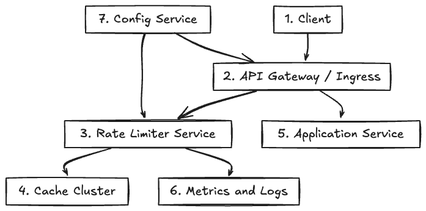

---

## See Also
- [Rate Limiting: Concepts & Trade-offs](../../components/rate-limiter.md)
- [API Gateway: Concepts & Trade-offs](../../components/api-gateway.md)
- [Idempotency: Concepts & Trade-offs](../../components/idempotency.md)
# Rate Limiter — System Design (Fresh Start)

## Introduction

A rate limiter is a critical component in modern distributed systems to control the frequency of client requests to APIs or services. It prevents abuse, ensures fair usage, protects backend resources, and improves overall system reliability and user experience.

This document presents a comprehensive design for a scalable, distributed rate limiter system suitable for high-traffic APIs.

---

## Goals and Requirements

### Functional Requirements

- Limit the number of requests per client (user, IP, API key) within a configurable time window.
- Support multiple rate limit tiers (e.g., free, premium).
- Provide immediate feedback (e.g., HTTP 429) when limits are exceeded.
- Allow burst traffic up to a configurable burst size.
- Support both global and per-endpoint rate limits.
- Enable dynamic configuration of limits without downtime.

### Non-Functional Requirements

- Low latency: rate limit checks should add minimal overhead.
- High throughput: support millions of clients and requests per second.
- Scalability: horizontally scalable across regions.
- High availability and fault tolerance.
- Consistency: avoid race conditions and ensure accurate counting.
- Observability: metrics, logs, and alerts for monitoring.

---

## High-Level Architecture

### Components

1. **API Gateway**
   - Entry point for all client requests.
   - Performs initial rate limit checks by querying the rate limiter cache.
   - Rejects requests exceeding limits with appropriate responses.
   - Supports pluggable rate limiting logic for flexibility.

2. **Rate Limiter Cache (Redis)**
   - Stores counters or token buckets for each client and endpoint.
   - Uses atomic operations and Lua scripts for concurrency safety.
   - TTL-based key expiration to clean up inactive clients.
   - Supports clustering for scalability and availability.

3. **Backend Service**
   - Business logic processing after rate limiting.
   - Can implement additional, finer-grained limits if needed.

4. **Configuration Service**
   - Stores and manages rate limit policies.
   - Allows dynamic updates pushed to API gateways.

5. **Metrics & Logging**
   - Collects data on rate limiting events, usage patterns, and errors.
   - Enables alerting and capacity planning.

---

## Rate Limiting Algorithms

### 1. Token Bucket (Recommended)

- Tokens are added to a bucket at a fixed rate.
- Each request consumes a token.
- If no tokens are available, the request is rejected.
- Allows bursts up to the bucket size.
- Implemented efficiently using atomic Redis commands or Lua scripts.

### 2. Fixed Window Counter

- Counts requests in fixed intervals (e.g., per minute).
- Simple but can cause bursts at window boundaries.

### 3. Sliding Window Log

- Stores timestamps of each request.
- Accurate but memory-intensive and slower.

### 4. Sliding Window Counter

- Maintains counters for current and previous windows.
- Balances accuracy and efficiency.

### 5. Leaky Bucket

- Requests are added to a queue that leaks at a fixed rate.
- Smooths bursts but can add latency.

---

## Data Model in Redis

- **Key format:** `rate_limit:{client_id}:{endpoint}:{window_start}`
- **Value:** current count or token bucket state (tokens, last refill timestamp)
- **TTL:** set to window size + buffer to auto-expire keys.

---

## Request Flow

1. Client sends request to API Gateway.
2. Gateway extracts client identifier and endpoint.
3. Gateway calculates current window or token refill.
4. Gateway performs atomic Redis operation to check and update counters/tokens.
5. If allowed, request proceeds to backend.
6. If limit exceeded, gateway responds with HTTP 429 and retry-after headers.
7. Metrics are logged asynchronously.

---

## Scalability & Fault Tolerance

- Redis clusters shard keys by client or endpoint.
- API Gateway instances run rate limiting logic locally with shared Redis.
- Use consistent hashing or client-side sharding to distribute load.
- Redis replication and failover ensure availability.
- Circuit breakers and fallback strategies handle Redis unavailability gracefully.

---

## Security Considerations

- Authenticate clients to prevent spoofing.
- Use TLS for all communications.
- Rate limit based on authenticated identifiers, not IP alone.
- Protect Redis with authentication and network isolation.
- Monitor for suspicious activity and potential bypass attempts.

---

## Observability

- Expose metrics such as allowed requests, blocked requests, token refill rates.
- Log rate limit breaches with context.
- Alert on unusual spikes or failures.

---

## Extensions

- User dashboards for usage and quota visualization.
- Integration with billing and quota management.
- Support for distributed tracing to correlate rate limiting with request flows.
- Adaptive rate limiting based on system load or client behavior.

---

## Summary

---

## See Also
- [Sharding: Concepts & Trade-offs](../../components/sharding.md)
- Example: [Consistent Hashing Ring](../../../coding/consistent_hashing_ring/consistent_hashing_ring.md)
