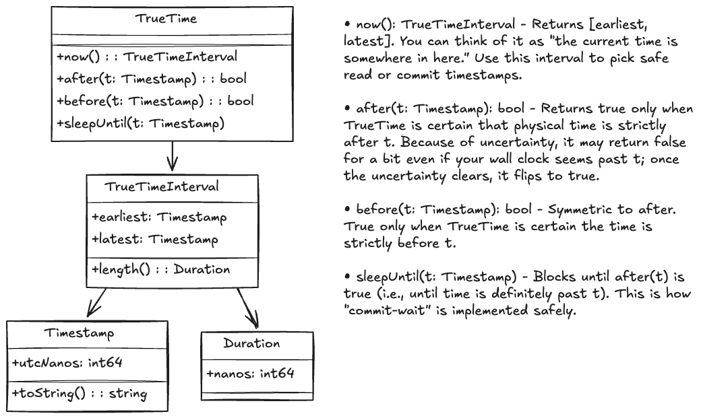
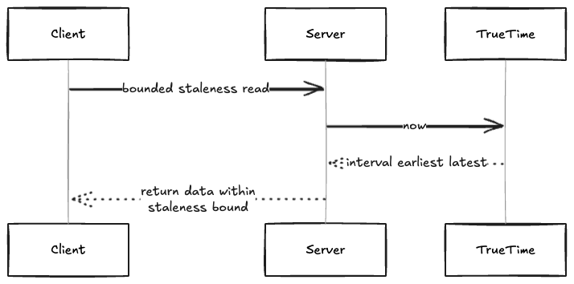
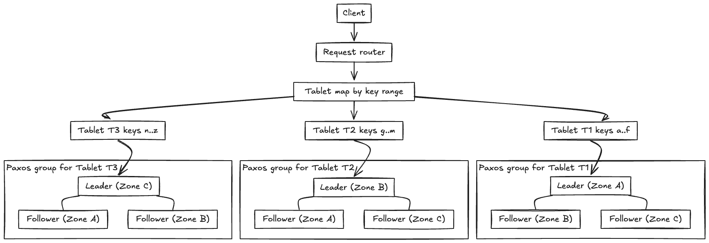
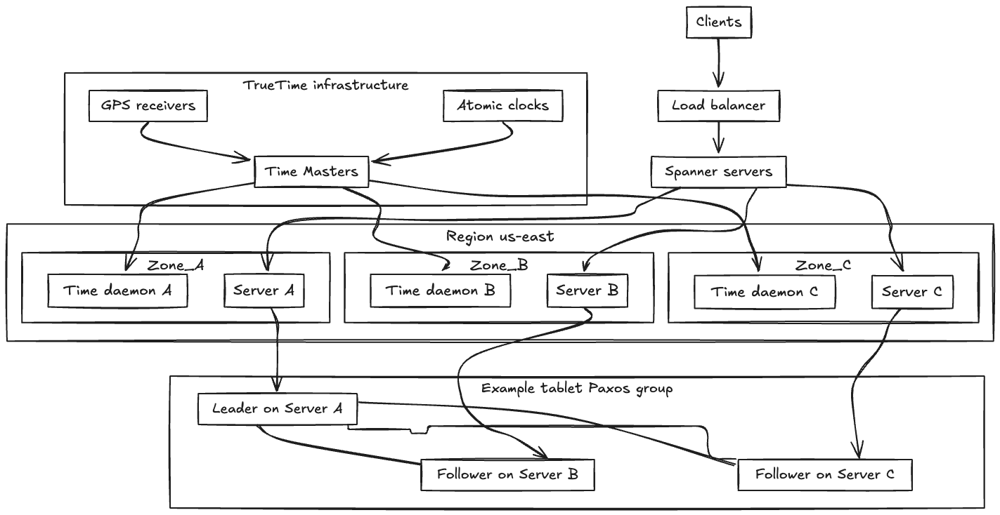

# Google Spanner System Design

## Overview

> This document outlines the architecture and data flow of Google Spanner, Google’s globally distributed, strongly consistent database. It highlights the unique features that enable external consistency at scale, including the TrueTime API, commit-wait protocol, and bounded staleness reads.

---

## Requirements

#### *Functional*
- Support globally distributed transactions with strong consistency
- Provide SQL query support across partitions and regions
- Enable both strong and bounded staleness reads
- Ensure external consistency using physical time

#### *Non-Functional*
- Horizontal scalability across datacenters and regions
- High availability and fault tolerance
- Low-latency read and write paths
- Transparent handling of replication and failover

---

## 1. TrueTime

> TrueTime is the cornerstone of Spanner’s consistency guarantees. It provides a bounded-uncertainty interval `[earliest, latest]` instead of a single timestamp, exposing clock uncertainty directly to applications and the database engine.

#### *Key Technologies*
- GPS and Atomic clocks for ground truth
- Time Master servers per datacenter
- Timeslave daemons on each machine synchronizing to Masters
- TrueTime API: `now()`, `after()`, `before()`, `sleepUntil()`

#### *Conceptual Flow*
- Each datacenter has **Time Master servers** that are connected to GPS receivers and atomic clocks.
- **Timeslave daemons** run on every machine. They poll and synchronize with the Time Masters.
- The timeslaves keep local clocks within a bounded error margin ε of “true” global time.
- Applications (Spanner nodes) call into the local **TrueTime daemon** to obtain intervals, ensuring safe choices for commit and read timestamps.

#### *Diagrams*
##### Datacenter Time Synchronization
- 
##### TrueTime Classes
- 

---

## 2. Commit Logic

> Spanner uses TrueTime to choose safe commit timestamps and enforces external consistency through **commit-wait**.

#### *Commit-Wait Protocol*
1. Transaction coordinator calls `now()` → receives interval `[earliest, latest]`.
2. Commit timestamp `ts` is chosen at or after `latest`.
3. Commit record replicated via Paxos to a quorum of replicas.
4. Coordinator blocks (commit-wait) until `after(ts)` is true.
5. Only then is the commit acknowledged to the client, guaranteeing no observer can see an effect before its cause.

#### *Locking in Spanner*
- Spanner employs **two-phase locking (2PL)** for concurrency control.
- Read locks are acquired for queries, and write locks for updates.
- Locks are held until the transaction reaches commit or abort.
- Together with TrueTime-based commit timestamps, locks ensure both **serializability** and **external consistency**.

#### *Diagrams*
##### Commit-Wait Timeline
- 
##### Commit-Wait Sequence
- 

---

## 3. Read Flow

> Spanner supports two read modes: **strong reads** and **bounded staleness reads**. Both rely on TrueTime intervals to ensure correctness.

#### *Strong Reads*
- Server obtains `[earliest, latest]` from TrueTime.
- Chooses a read timestamp at or after `latest`.
- Guarantees linearizable reads, reflecting the latest committed state.

#### *Bounded Staleness Reads*
- Server obtains `[earliest, latest]` from TrueTime.
- Chooses a read timestamp at or before `earliest`.
- Guarantees results are within a bounded staleness window (e.g., “no more than 15 seconds stale”).

#### *Use Cases*
- **Strong reads**: financial transactions, critical consistency checks.
- **Bounded staleness**: analytics, read-heavy workloads where slight staleness is acceptable.

#### *Diagrams*
##### Bounded Staleness Read
- 
##### Strong Read Flow
- 

---

## 4. Tablets, Routing, Partitioning, and Paxos Consensus Groups

> Spanner stores data in units called **tablets**, which are sharded and distributed across multiple nodes for scalability and fault tolerance. Tablets are assigned to **Paxos groups** for replication and consistency, and Spanner’s routing logic ensures queries and transactions are directed to the correct tablet and Paxos group leader.

### Tablet Management, Partitioning & Routing

- Each tablet holds a contiguous range of rows from a table, similar to a partition or shard.
- Tablets are partitioned based on primary key ranges, enabling horizontal scaling and efficient query routing.
- Routing logic directs reads and writes to the appropriate tablet and Paxos group leader, minimizing latency and optimizing resource usage.
- Tablets can be reassigned to different servers to balance CPU, memory, and disk usage across the cluster.
- Spanner automatically splits tablets when they grow too large or experience high load, and merges them when underutilized.

### Paxos Consensus Groups

- Tablets are replicated across multiple nodes using **Paxos groups**, which provide strong consistency and high availability.
- Each Paxos group consists of a set of nodes (replicas) responsible for a tablet or set of tablets.
- One node acts as the **leader**; others are **followers**.
- When a write occurs, the leader proposes the update to the group.
- The update is only committed when a majority (quorum) of replicas acknowledge and agree on the proposal.
- This process ensures that all replicas remain consistent, even if some nodes fail or messages are delayed.
- Paxos guarantees that only one value is chosen for each update, preventing split-brain and data inconsistency.
- If the leader fails, a new leader is elected from the remaining replicas, ensuring no single point of failure.

### Benefits

- **Horizontal scaling:** Distributes data and queries across many machines.
- **Online rebalancing and resharding:** Minimal impact on availability.
- **Efficient failover and recovery:** Tablets can be moved to healthy nodes.
- **Strong consistency and durability:** Paxos groups ensure all replicas agree on transaction order.
- **Optimized query performance:** Partitioning and routing logic balance load and resource utilization.

#### *Diagrams*
##### Tablet Sharding and Distribution
- 

---

## Scaling & Resiliency

- Replication across multiple datacenters using Paxos for consistency.
- Region-level time masters ensure low ε (uncertainty bounds).
- Automatic failover to healthy replicas in case of node or region failure.
- Sharded tablets allow independent scaling of storage and compute.

---

## Security Considerations

- All communication between nodes is authenticated and encrypted.
- Transactions are tied to authenticated user sessions.
- Strict time synchronization is monitored and audited.
- Attempts to tamper with TrueTime daemons or Masters are treated as security violations.

---

## Extensions

- Integrating Spanner with other Google services (BigQuery, Dataflow) for hybrid workloads.
- Enhancements to TrueTime accuracy with future clock hardware.
- APIs for developers to specify staleness bounds per query.
- Potential open-source variants (e.g., CockroachDB) inspired by Spanner’s design.

---

## Architecture Diagrams

>   
> You can edit this diagram by uploading the PNG to [Excalidraw](https://excalidraw.com).

---

## See Also
- [Sharding: Concepts & Trade-offs](../../components/sharding.md)
- Example: [Consistent Hashing Ring](../../../coding/consistent_hashing_ring/consistent_hashing_ring.md)
- [Replication: Concepts & Trade-offs](../../components/replication.md)
- [Consistency: Concepts & Trade-offs](../../components/consistency.md)
- [Caching: Concepts & Trade-offs](../../components/caching.md)
- Example: [LRU Cache Implementation](../../../coding/caching_kv_store/lru_cache.md)
- Example: [TTL Cache Implementation](../../../coding/caching_kv_store/ttl_cache.md)

- [Write-Ahead Log (WAL): Concepts & Trade-offs](../../components/wal.md)
 - [Colossus: Google’s Distributed File System](../colossus/colossus.md)
 - [Raft Consensus Algorithm](../../components/raft.md)