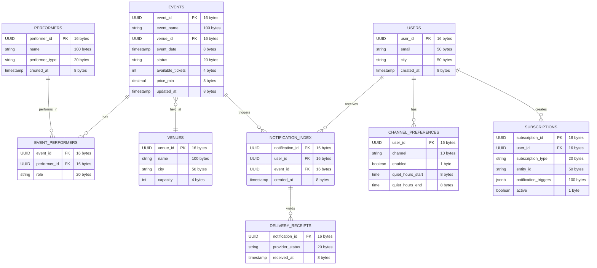

# SubHub Notification System Design

## Overview

> This document outlines the architecture and data flow of the Notification System. The system delivers personalized notifications to users through various channels (Push, In-App, Email, SMS) with support for preference management, retry handling, and delivery analytics.

---

## Key Components and Flow

1. **API Gateway**
   - Receives event update requests, provides security, rate limiting, and routing.

2. **Notification Trigger & Distribution Logic**
   - Detects event changes that require notifications (status changes, price drops, etc.)
   - Queries Cassandra Subscription Store to get subscriber IDs filtered by trigger type
   - Creates fan-out jobs and writes batches to Redis

3. **Cassandra Subscription Store**
   - Denormalized by trigger type for O(1) lookups
   - Pre-filters users by notification preferences (e.g., only users who want "on_sale" alerts)
   - Sharded for large performer followings (160 partitions for 5M+ subscribers)

4. **Redis Instance 1 (Notification Storage)**
   - Stores full notification payloads with 7-day TTL (fast writes, instant modifications)
   - Status embedded in payload (queued/sent/delivered/cancelled/modified)
   - Used by Channel Workers for notification details and status checks
   - Auto-expires old notifications (memory management)

5. **Redis Instance 2 (Batches & Locks)**
   - Stores fan-out batch metadata and distributed locks
   - Coordinates Fan-Out Workers with checkpointing for fault tolerance

6. **Fan-Out Worker Pool**
   - Horizontally scalable worker pool (10-500 workers based on load)
   - Queries batches from Redis for processing coordination
   - Writes full notification payloads to Redis (~200ms for 10M notifications)
   - Writes minimal index records to RDBMS asynchronously (~1.5s for 10M)
   - Enqueues lightweight messages to Kafka (notification_id, user_id, event_id)

7. **Kafka Topic (notifications-to-send)**
   - Single unified queue for all notifications
   - Small messages (~80 bytes) - just references, not full payloads
   - Enables easy replay and modification handling

8. **Channel Worker Pool**
   - Consumes from Kafka and handles complete delivery lifecycle
   - Fetches full notification details from Redis (fast, ~1ms)
   - Checks status for cancellations/modifications in Redis payload
   - Fetches fresh event data and user preferences at send-time
   - Determines channel (push/email/SMS) based on quiet hours and preferences
   - Renders templates with current event data
   - Sends directly to external providers (FCM, SendGrid, Twilio)
   - Updates notification status in Redis (sent_at, delivered_at)

9. **RDBMS (PostgreSQL)**
   - Authoritative source for events, subscriptions, users, venues
   - Minimal notification index (notification_id, user_id, event_id, created_at)
   - Enables fast user queries ("show my notifications")
   - Long-term audit trail (notifications persist beyond Redis 7-day TTL)

10. **Analytics & Delivery Tracking**
    - Monitors delivery success/failure rates, latency, throughput
    - Tracks user engagement (opens, clicks, conversions)

---

## Data Flow

1. **Event Update**: API Gateway receives event change (e.g., status → "on_sale")
2. **Trigger Detection**: Business logic identifies which notification trigger fired
3. **Subscription Lookup**: Query Cassandra for users subscribed to this trigger type (pre-filtered, O(1) lookup)
4. **Fan-Out Processing**: 
   - Distribution Logic creates batches and writes to Redis
   - Fan-Out Workers process batches in parallel
   - Write full notification payloads to Redis (~200ms for 10M)
   - Write minimal index records to RDBMS asynchronously (~1.5s for 10M)
   - Enqueue lightweight messages to Kafka
5. **Channel Delivery**:
   - Channel Workers consume from Kafka
   - Fetch notification details from Redis (full payload)
   - Check status for cancellations/modifications
   - Fetch fresh event data and user preferences
   - Determine channel based on quiet hours and user settings
   - Render template with current data
   - Send to external provider (FCM/SendGrid/Twilio)
   - Update status in Redis (sent_at, delivered_at)
6. **Analytics**: Track delivery receipts, opens, clicks, and engagement metrics

---

## Event Schema and Definition

### What is an Event?
An **event** is a real-world happening (concert, sports game, theater show, conference, etc.) that users can purchase tickets for and receive notifications about. This is similar to StubHub, Ticketmaster, or Eventbrite.

**Event Examples:**
- Taylor Swift concert at Madison Square Garden (Dec 15, 2025)
- Lakers vs. Warriors game at Staples Center (Jan 3, 2026)
- Hamilton on Broadway (ongoing shows)
- TechCrunch Disrupt 2026 (May 10-12, 2026)

### Event Schema

Events contain: event_id, event_name, event_type (concert/sports/theater), performer_id, venue_id, event_date, on_sale_date, status (upcoming/on_sale/sold_out/cancelled/postponed), ticket_inventory (total/available/price_range), and metadata. See RDBMS Model section for complete schema.

### Subscription Model

Users subscribe to events, performers, venues, or event types to receive notifications about updates.

**Notification Triggers (configurable per subscription):**
```json
{
  "on_sale": true,              // Notify when tickets go on sale
  "price_drop": true,           // Notify when prices decrease
  "new_tickets": true,          // Notify when new inventory added
  "event_update": true,         // Notify on date/venue changes
  "event_reminder": [1, 7, 30], // Remind N days before event
  "low_inventory": true,        // Notify when tickets running out
  "price_threshold": 150.00     // Notify when tickets below this price
}
```

**Subscription Types:**
- **Event subscription**: Watch a specific concert (e.g., "Taylor Swift at MSG")
- **Performer subscription**: Follow an artist/team for all their events (e.g., "All Taylor Swift concerts")
- **Venue subscription**: Track a specific venue (e.g., "All Madison Square Garden events")
- **Event type subscription**: Get notified for event categories (e.g., "All concerts in my city")
- **City subscription**: Watch all events in a geographic area (e.g., "All events in New York")

**NoSQL High-Volume Store (Read-Optimized for Fan-Out):**
- Replicated asynchronously from RDBMS
- Partitioned by `subscription_type:entity_id` for fast lookups
- Example: All users watching `event:evt_taylor_swift_nyc` or `performer:artist_taylor_swift`
- Structure detailed in "High-Volume Subscription Store" section

### Notification Trigger Types

| Trigger Type | Condition | Example Message |
|-------------|-----------|-----------------|
| **On-Sale** | Status → `on_sale` | "Taylor Swift tickets are now on sale!" |
| **Price Drop** | Price ↓ >10% | "Tickets dropped from $150 to $99!" |
| **New Inventory** | Available tickets ↑ | "New tickets just released for Lakers game!" |
| **Event Update** | Date/venue/performer change | "Concert rescheduled from Dec 15 to Dec 20" |
| **Reminder** | N days before event | "Your concert is tomorrow at 8 PM!" |
| **Low Inventory** | <5% tickets remaining | "Only 50 tickets left for Hamilton!" |
| **Cancellation** | Status → cancelled/postponed | "Event cancelled - refunds will be processed" |

**Flow:** Events progress from creation → on-sale → updates → reminders → completion. Each state change triggers relevant notifications to millions of subscribed users via the fan-out process.

## RDBMS Model

**Storage Unit Reference:**
- **bit (b)** – smallest unit
- **byte (B)** – 8 bits
- **kilobyte (KB)** – 1,024 bytes
- **megabyte (MB)** – 1,024 KB
- **gigabyte (GB)** – 1,024 MB
- **terabyte (TB)** – 1,024 GB
- **petabyte (PB)** – 1,024 TB



**Note on Notification Storage:**
- **NOTIFICATION_INDEX** (RDBMS): Minimal index for user queries (90 bytes per record)
  - Only stores: notification_id, user_id, event_id, created_at
  - Enables fast lookups: "Show me my notifications"
  - Long-term retention (beyond Redis TTL)
- **Full notification details** stored in Redis with 7-day TTL:
  - Key: `notification:{notification_id}`
  - Value: Complete JSON payload (trigger_type, channel, status, event details, timestamps)
  - Fast writes (~200ms for 10M), instant modifications (~0.5s for 10M)

---

## Key Metrics

- Total notifications processed (by type)
- Success/failure rates
- Retry counts, DLQ volume
- Delivery time per channel
- Failure reasons and error logs
- Processing latency at each layer
- Kafka topic queue depth (lag per consumer group)
- Acknowledgement metrics: delivery receipts received, acknowledgement latency, failed or missing receipts

---

## NoSQL Data Models

The notification system uses Redis and a wide column store (Cassandra/ScyllaDB) for different purposes:

| Store | Purpose | When Used | Data Structure | Example Key |
|-------|---------|-----------|----------------|-------------|
| **High-Volume Subscription Store** (Cassandra/ScyllaDB) | Fast fan-out queries (which users to notify) | Every notification event (100% of events) | Aggregated user lists by subscription type | `event_id: evt_taylor_nyc`<br/>`performer_id: artist_taylor_swift` |
| **Notification Storage** (Redis) | Store full notification payloads with fast access and modification | Every notification (100% of events) | Complete notification details with status embedded (queued/sent/delivered/cancelled/modified), 7-day TTL | `notification:notif_abc123` |
| **Fan-Out Batch Tracking & Locking** (Redis) | Track completed batches and coordinate workers | During fan-out processing (temporary) | Batch completion metadata and distributed locks | `fanout:evt_123:0:1000`<br/>`lock:fanout:evt_123:0:1000` |

### 1. High-Volume Subscription Store (Cassandra/ScyllaDB)

**Purpose:** Optimize fan-out queries by pre-aggregating subscriptions from RDBMS and denormalizing by trigger type for O(1) lookups.

**Data Flow:**
```
RDBMS (subscriptions table) 
  → ETL/CDC (every 5 min)
  → Cassandra/ScyllaDB (denormalized by trigger type)
  → Fan-Out Workers (O(1) partition key lookups)
```

**Schema:**


**Cassandra Tables:**


**Example Data (event_subscriptions_by_trigger):**

```json
{
  "event_id": "evt_taylor_nyc",
  "trigger_type": "on_sale",
  "user_ids": ["user_123", "user_456", "user_789", ...],  // 30K users want on_sale
  "total_count": 30000,
  "last_updated": 1731412800
}
```

*Note: `performer_subscriptions_by_trigger` and `venue_subscriptions_by_trigger` follow the same pattern with different partition keys. Performer subscriptions are sharded across 160 partitions for large followings (e.g., 5M Taylor Swift fans).*

**Key Design Benefits:**
- **O(1) Fan-out Query**: Single partition key lookup `(event_id, trigger_type)` → instant user list
- **No Filtering Needed**: Each row contains only users who want that specific trigger
- **Parallel Queries**: Can query multiple trigger types simultaneously
- **Moderate Storage**: 5-10 rows per event (one per trigger type)

**Fan-Out Query Examples:**
- "Taylor Swift on sale" → `performer_subscriptions_by_trigger[(artist_taylor_swift, *, on_sale)]` → 5M users
- "Specific event on sale" → `event_subscriptions_by_trigger[(evt_taylor_nyc, on_sale)]` → 30K users
- "MSG price drop" → `venue_subscriptions_by_trigger[(venue_msg, price_drop)]` → 5K users

Multiple subscription types can be aggregated (union) and deduplicated before fan-out.

**ETL/CDC Process:** Runs every 5 minutes. Fetches active subscriptions from RDBMS, groups users by (entity_id, subscription_type, trigger_type), and writes denormalized data to Cassandra. Performer subscriptions are sharded across 160 partitions for large followings.

**Performance:** O(1) partition key lookups (~2ms) vs O(n) RDBMS queries (~500ms). No filtering required - users pre-grouped by trigger type.

---

### 2. Notification Storage (Redis)

**Purpose:** Store full notification payloads for fast writes, instant modifications, and quick access during delivery.

**Schema:**

```json
// Redis Key-Value Store
// Key pattern: notification:{notification_id}
// TTL: 7 days (604800 seconds)

Key: "notification:notif_abc123"
Value: {
  "notification_id": "notif_abc123",
  "user_id": "user_123",
  "event_id": "evt_taylor_nyc",
  "trigger_type": "on_sale",
  "channel": "push",
  "template_id": "on_sale_v2",
  "status": "queued",  // queued | sent | delivered | cancelled | modified
  "payload": {
    "event_name": "Taylor Swift - Eras Tour",
    "event_date": "2025-12-15T19:00:00Z",
    "venue": "Madison Square Garden",
    "ticket_url": "https://stubhub.com/evt_taylor_nyc"
  },
  "created_at": 1731412800,
  "sent_at": null,
  "delivered_at": null
}
TTL: 604800 seconds (7 days)
```

**Write Performance:**
- **Fan-Out Workers**: Batch 10,000 SET operations per pipeline
- **Latency per batch**: ~20ms (in-memory write)
- **Total time (10M notifications)**: 10M / 10K = 1,000 batches / 100 workers = ~0.2 seconds ✅

**Update Performance (Event Modification):**
- **Bulk update (10M notifications)**: Pipeline GET + SET operations
- **Latency per batch**: ~50ms (10K updates pipelined)
- **Total time**: 1,000 batches / 100 workers = ~0.5 seconds ✅
- **vs RDBMS UPDATE**: 30-60 seconds (table lock, index updates)

**Cancellation:**
- **Option 1**: Mark as cancelled (preserves history) - update status field to "cancelled"
- **Option 2**: Delete entirely (saves memory) - remove Redis key

**Storage Requirements:**
- **Average notification**: ~400 bytes (JSON)
- **10M notifications**: 4 GB
- **7-day retention (70M notifications)**: ~34 GB
- **Redis cluster**: 3 nodes × 16 GB RAM = 48 GB (with replication)

**Benefits:**
- ✅ **Fast writes**: 7.5x faster than RDBMS (0.2s vs 1.5s for 10M)
- ✅ **Instant modifications**: 60-120x faster than RDBMS UPDATE (0.5s vs 30-60s)
- ✅ **No control state complexity**: Status embedded in notification payload
- ✅ **Automatic cleanup**: TTL expires old notifications
- ✅ **In-memory access**: ~1ms GET latency for Channel Workers

**Query Pattern:**
1. Channel Worker fetches notification details from Redis by notification_id
2. Check status field - if "cancelled", skip sending
3. Send notification to provider
4. Update status to "sent" with timestamp
5. Write updated notification back to Redis with 7-day TTL

---

### 3. User Notification Index (Redis - Optional)

**Purpose:** Enable fast user queries ("Show my notifications") without RDBMS lookup.

**Schema:**

```
// Redis Sorted Set
// Key pattern: user_notifications:{user_id}
// Score: timestamp (for ordering)
// Member: notification_id

Key: "user_notifications:user_123"
Members: {
  "notif_abc123": 1731412800,  // score = created_at timestamp
  "notif_def456": 1731399200,
  ...
}
TTL: 604800 seconds (7 days)
```

**Write Flow:**
- When creating notification, add notification_id to user's sorted set with timestamp as score
- Set 7-day TTL on user's notification index

**Query Flow:**
- Retrieve user's 50 most recent notification IDs from sorted set (reverse range query)
- Fetch full notification details using pipelined Redis GET operations
- Filter out any expired notifications

**Alternative:** Use minimal RDBMS index (see NOTIFICATION_INDEX table) for user queries with long-term retention.

---

## Fan-Out Worker Pool: Architecture and Scaling

### Purpose
The Fan-Out Worker Pool expands a single event notification into individual notification messages for all subscribed users. For high-volume events (millions of subscribers), this process must be horizontally scalable and fault-tolerant.

### How It Works

#### 1. **Job Coordination**
- When an event arrives (e.g., user posts content), Distribution Logic queries the Subscription Store to get subscriber count
- A **Fan-Out Coordinator** creates a fan-out job with metadata:
  - `event_id`: Unique event identifier
  - `total_subscribers`: Total users to notify
  - `batch_size`: Number of users to process per worker (e.g., 1,000)
  - `offset_ranges`: Divide total subscribers into chunks [(0-1000), (1000-2000), ...]
- Job metadata is stored in Redis or a distributed job queue (e.g., Celery, AWS SQS with message groups)

#### 2. **Worker Pool Architecture**
```
Fan-Out Coordinator
    ↓
[Job Queue] → Any available worker picks up batch:
              - Batch 1: Process users[0-1000]
              - Batch 2: Process users[1000-2000]
              - Batch 3: Process users[2000-3000]
              - Batch N: Process users[N*1000 - (N+1)*1000]

Workers are stateless and interchangeable.
Any worker can process any batch from the queue.
```

Each worker:
1. **Fetches batch**: Retrieves user IDs from Subscription Store (already filtered by trigger type in Cassandra)
2. **Creates notification payloads**: For each user, create full notification with event details, template_id, etc.
3. **Writes to Redis**: Batch SET operations (10K notifications per pipeline, ~20ms per batch)
4. **Writes to RDBMS** (async): Minimal index records (notification_id, user_id, event_id, created_at)
5. **Writes to Kafka**: Lightweight messages (notification_id, user_id, event_id)
6. **Marks progress**: Updates job progress in Redis (for resumability)

**Write Performance per Worker:**
- Redis: 100K notifications / 10K batch = 10 batches × 20ms = **200ms**
- RDBMS: Async background write (doesn't block)
- Kafka: 100K messages / 1K batch = 100 batches × 1ms = **100ms**
- **Total**: ~300ms per batch of 100K users

#### 3. **Horizontal Scaling**

**Auto-Scaling Triggers:**
- **Queue depth**: Scale up when job queue length > threshold (e.g., 1,000 pending batches)
- **Processing latency**: Scale up if avg job completion time > SLA (e.g., 5 seconds per batch)
- **Event rate**: Scale up during peak hours or viral events

**Scaling Mechanism:**
- Use Kubernetes HPA (Horizontal Pod Autoscaler) or AWS Auto Scaling Groups
- Scale from baseline (e.g., 10 workers) to max capacity (e.g., 500 workers)
- Workers are stateless—safe to add/remove at any time

**Example Capacity:**
- 1 worker processes 100K users in ~300ms (Redis + Kafka writes)
- 100 workers = 10M users in ~300ms ✅
- Redis write: ~200ms for 10M notifications (pipelined)
- Kafka write: ~100ms for 10M messages (pipelined)

#### 4. **Fault Tolerance and Idempotency**

**Challenges:**
- Worker crash mid-batch
- Duplicate job execution
- Partial failures in writing to queue

**Solutions:**
- **Visibility timeout**: Use queue visibility timeout (e.g., SQS) or task TTL—if worker doesn't complete in time, job returns to queue
- **Idempotency keys**: Each batch has unique ID (`fanout:{event_id}:{offset_start}:{offset_end}`). Before processing, check if already completed in Redis cache with value storing completion metadata (`{"status": "completed", "timestamp": 1731412800, "notifications_created": 1000}`)
- **Distributed locking with checkpointing**: Workers use Redis SET NX for atomic lock acquisition. The lock record stores both ownership and progress checkpoints (e.g., `{"worker_id": "worker-123", "last_processed_offset": 450, "started_at": 1731412800}`). Locks expire after 30 seconds; if a worker crashes, the next worker can resume from the last checkpoint offset.
- **Dead Letter Queue (DLQ)**: After 3 retries, send failed batches to DLQ for manual inspection

#### 5. **Optimization Techniques**

**Batching to Downstream Queue:**
- Instead of 1 message = 1 user, write 100 users per batch to Kafka/SQS
- Router/Channel workers unbatch before delivery
- Reduces queue write overhead by 100x

**Subscription Store Read Optimization:**
- Query all performer shards in parallel (async queries across 160 partitions) for sub-second total latency
- Direct partition key lookups `(event_id, trigger_type)` eliminate need for scanning or pagination
- Optional: Cache extremely viral events in Redis (LRU with 1-minute TTL) if same event triggers multiple times rapidly

**Priority Queues:**
- High-priority events (breaking news) use separate queue with dedicated workers
- Low-priority events (daily digest) processed during off-peak hours

#### 6. **Monitoring and Observability**

**Key Metrics:**
- `fan_out_job_duration_p99`: Time to complete full fan-out (alert if > 10 minutes)
- `fan_out_batch_throughput`: Users processed per second per worker
- `fan_out_error_rate`: Failed batches / total batches (alert if > 1%)
- `worker_pool_utilization`: Active workers / total workers
- `downstream_queue_lag`: Messages waiting in channel queues (backpressure indicator)

---

## Processing Timeline: 1 Million Notifications

The following diagram shows the complete timeline for processing 1 million notifications from event trigger to provider delivery:


**Key Timeline Metrics (1M notifications with 100 workers):**

| Phase | Duration | Details |
|-------|----------|---------|
| **Event Detection** | 0-20ms | API Gateway → Trigger Logic |
| **Subscription Lookup** | 20-30ms | Cassandra query (parallel shards) → Dedupe users |
| **Fan-Out Prep** | 30-50ms | Job creation, batch metadata to Redis |
| **Fan-Out Execution** | 50-110ms | Parallel workers create & write notifications |
| &nbsp;&nbsp;├─ Redis writes | 20ms | 100 batches × 10K notifications, pipelined |
| &nbsp;&nbsp;├─ RDBMS writes | 150ms (async) | Non-blocking background writes |
| &nbsp;&nbsp;└─ Kafka writes | 10ms | Lightweight messages, pipelined |
| **Kafka Distribution** | 110-120ms | Partition assignment |
| **Channel Processing** | 120-2,520ms | **2.4 seconds** - Fetch, validate, enrich, render |
| &nbsp;&nbsp;├─ Consume from Kafka | 10ms | Read messages from partitions |
| &nbsp;&nbsp;├─ Fetch from Redis | 20ms | Get notification payloads (in-memory) |
| &nbsp;&nbsp;├─ **User Preferences** | **~2 seconds** | **50% cache (1ms) + 50% batched DB (100ms/batch)** |
| &nbsp;&nbsp;├─ Event Data | 100ms | 99% cache hit (pre-warmed) |
| &nbsp;&nbsp;└─ Render templates | 200ms | Template engine processing |
| **Ready for Providers** | **~2.5 seconds** | **Event update → ready to send to FCM/SendGrid/Twilio** |

**Database Query Bottleneck Analysis:**

Without caching, channel workers need to query:
- **User Preferences**: 1M individual SELECTs or large batch queries
  - Optimistic: 1M / 500 workers = 2K queries per worker
  - Per query: ~10ms (indexed lookup)
  - Sequential: 2K × 10ms = **20 seconds per worker** ⚠️
  - Even with batching (100 users per query): 20 queries × 100ms = **2 seconds**

- **Event Data**: Fewer queries if many users subscribe to same event
  - Example: 1M users, 100 unique events = 100 queries
  - But still need to join/lookup for each notification

**Solution: Multi-Layer Caching Strategy**

| Cache Layer | Purpose | Hit Rate | Latency | Details |
|-------------|---------|----------|---------|---------|
| **Redis Cache** (User Preferences) | Recently active users | 50% | ~1ms | Cache users who recently received notifications |
| **Redis Cache** (Event Data) | Hot event data | 95-99% | ~1ms | Cache events currently triggering notifications |
| **Application Cache** | In-memory LRU | 30% | <1ms | Worker-local cache for repeated lookups |
| **Database** | Cold data fallback | 50% | 10ms | Cache misses hit database |

**With Caching - Revised Timeline:**

| Phase | With Cache | Details |
|-------|------------|---------|
| **Channel Processing** | 120-5,120ms | **5 seconds total** |
| &nbsp;&nbsp;├─ Fetch from Redis | 20ms | Notification payloads (in-memory) |
| &nbsp;&nbsp;├─ **User Preferences** | **~5 seconds** | 50% Redis cache (~1ms), 50% DB (~10ms) |
| &nbsp;&nbsp;├─ Event Data | **100ms** | 99% Redis cache hit (100 unique events) |
| &nbsp;&nbsp;└─ Render templates | 200ms | Template processing (parallel) |
| **Ready for Providers** | **~5.1 seconds** | **With 50% cache hit rate** |

**User Preference Query Math:**
- 1M notifications / 500 workers = 2,000 per worker
- 50% cache hit (1ms): 1,000 × 1ms = **1 second**
- 50% cache miss (10ms): 1,000 × 10ms = **10 seconds**
- **Parallel processing**: Max(1s cache, 10s DB) = **10 seconds** if sequential
- **With batching** (100 users per DB query): 10 queries × 100ms = **1 second** for DB queries
- **Total per worker**: 1s (cache) + 1s (batched DB) = **2 seconds**
- **With 500 workers in parallel**: ~**2 seconds** wall-clock time

**Optimized Timeline (with batched queries):**

| Phase | Optimized | Details |
|-------|-----------|---------|
| **Channel Processing** | 120-2,520ms | **2.4 seconds total** |
| &nbsp;&nbsp;├─ Fetch from Redis | 20ms | Notification payloads |
| &nbsp;&nbsp;├─ User Preferences | **2 seconds** | 50% cache (1ms) + 50% batched DB (100ms per batch) |
| &nbsp;&nbsp;├─ Event Data | 100ms | 99% cache hit |
| &nbsp;&nbsp;└─ Render templates | 200ms | Parallel processing |
| **Ready for Providers** | **~2.5 seconds** | **With batched DB queries** ✅

**Caching Implementation:**

**Event Data Pre-Warming (99% hit rate):**
- When event triggers notification, immediately cache event details in Redis
- Cache key: `event:{event_id}` with 1-hour TTL
- All workers can fetch from cache instead of hitting database

**Channel Worker Cache-First Strategy:**
1. Extract user IDs from notification batch
2. Try Redis cache first for all user preferences (multi-get, ~1ms per lookup)
3. Identify cache misses
4. Batch query database for misses (100 users per query, ~100ms per batch)
5. Write back to cache for future requests (1-hour TTL)

**Realistic Timeline (1M notifications):**
- **Without caching**: ~20 seconds (1M individual DB queries)
- **With 50% cache hit + batching**: ~2.5 seconds ✅

**Parallelization Details:**
- **Fan-Out Workers**: 100 workers × 10K notifications/batch = 1M in 60ms
- **Channel Workers**: 500 workers × 2K notifications each = 1M processed in parallel
- **Redis Performance**: In-memory writes complete in 20ms (pipelined batches)
- **RDBMS Performance**: Async writes don't block the critical path
- **Cache Strategy**: Event data 99% hit (pre-warmed), user preferences 50% hit (batched DB fallback)
- **Total Internal Processing**: **~2.5 seconds** from event update to provider API calls (with 50% cache hit)

**Note on Provider Delivery:**
- Provider API calls (FCM, SendGrid, Twilio) add 2-3 seconds due to:
  - External API rate limits
  - Network latency
  - Provider processing time
- Our system hands off notifications in **190ms** - provider delivery is outside our control

---

## Architecture Diagram

### End-to-End Notification Flow


---

