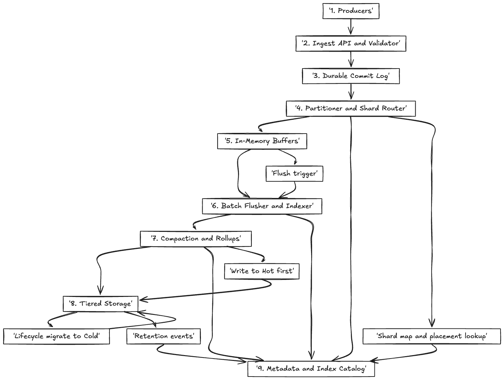
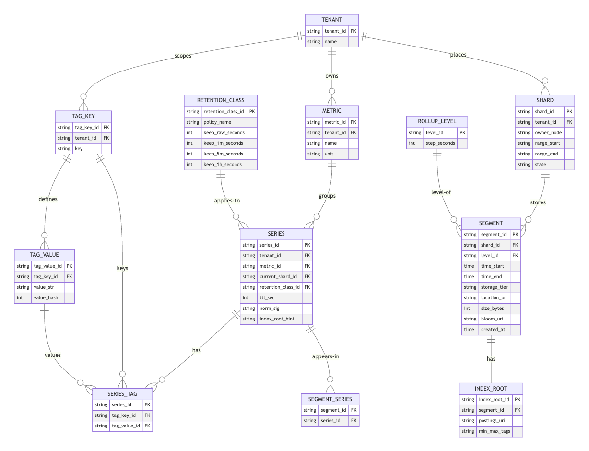

# Timeseries Database System Design

## Overview

A Timeseries Database (TSDB) is a database optimized for storing and querying time-stamped or time-series data. This data is typically generated by IoT devices, monitoring systems, financial markets, or any system that produces data points indexed by time.

## Requirements

### Functional

- Ingest high write throughput of timeseries data.
- Efficiently store and compress timeseries data.
- Support queries over time ranges, aggregation, and downsampling.
- Provide retention policies to automatically expire old data.
- Support tags and metadata for filtering and grouping.

### Non-Functional

- High availability and fault tolerance.
- Scalability to handle increasing data volume.
- Low latency for writes and queries.
- Cost-effective storage.

## Write Path Workflow

1. **Client sends data points**: Each data point consists of a timestamp, measurement name, tags, and fields.
2. **Load Balancer**: Routes writes to appropriate ingestion nodes.
3. **Ingestion Nodes**: Validate and preprocess data.
4. **Write-Ahead Log (WAL)**: Data is appended to WAL for durability.
5. **Memtable**: Data is stored in an in-memory structure for fast writes.
6. **Flush to SSTables**: When memtable is full, it is flushed to disk as an immutable SSTable.
7. **Compaction**: Background process merges SSTables to optimize storage and queries.

## Read Path Workflow

1. **Client query**: Specifies time range, measurements, tags, and aggregation functions.
2. **Query Coordinator**: Parses and plans the query.
3. **Storage Engine**: Reads data from memtable and SSTables.
4. **Merge and Aggregate**: Combines data from multiple sources, applies filters and aggregation.
5. **Return results** to client.

## Data Model

- **Measurement**: Similar to a table name.
- **Tags**: Key-value pairs indexed for fast filtering.
- **Fields**: Actual data values, not indexed.
- **Timestamp**: Time of the data point.

>   

## Component Breakdown

Below are detailed descriptions of the nine components in the architecture diagram. This version consolidates ingestion pieces and adds the router, so labels match the diagram one-for-one.

### 1. Producers
Producers are the originators of time-series data (IoT sensors, apps, agents, market feeds). They emit points that include a timestamp, measurement/metric name, tags, and fields. Producers vary in rate and reliability; they should batch sensibly, handle retries, and avoid tag explosion.

Considerations: micro-batching to reduce overhead, basic client-side validation, and optional compression/encryption. Where connectivity is intermittent, use local spooling with backoff and idempotent retries.

### 2. Ingest API and Validator (includes Load Balancer and Ingestion Nodes)
This is the high-throughput entry point that authenticates requests, enforces schema, rejects malformed data, and normalizes tags/units. It must stay stateless for elasticity and expose clear backpressure signals.

#### Supplementary Details
- **Load Balancer**: Spreads traffic across ingest nodes and sheds unhealthy targets; may keep affinity if you later add per-tenant limits.
- **Ingestion Nodes**: Perform lightweight parsing/dedup; prepare batches for durability. Keep them stateless and easy to autoscale.

### 3. Durable Commit Log (WAL)
All accepted writes are appended to an fsync-friendly commit log before ACK, ensuring crash recovery and ordered replay. Manage segment rollover and cleanup once data has safely flushed to storage.

Key points: sequential I/O for throughput, replication/EC for availability, and exposing WAL fill level as a backpressure signal.

> **Possible Integration:** Spanner (Google’s globally distributed database) could be integrated here to manage globally consistent commit log metadata or catalog state, ensuring correctness and consistency across regions.

### 4. Partitioner and Shard Router
Deterministically assigns each write to a shard using a stable key (e.g., hash of series_id plus optional time-bucket). It **reads** the shard map and placement rules from the catalog to route to current owners and supports smooth rebalancing.

Design notes: consistent hashing with indirection for live moves; fast reload on map change; bounded shard fan-out to tame hot keys.

### 5. In-Memory Buffers (Memtables)
Per-shard write-optimized structures (e.g., skip-list or LSM(Log-Structured Merge) buffers) that coalesce writes and keep them time-sorted. They flush on size/time thresholds or when WAL pressure rises.

Tuning: thresholds to balance memory and write amplification; admission control to avoid OOM; optional small read cache for the most recent minutes.

### 6. Batch Flusher and Indexer
Flush turns memtables into immutable, columnar **segments** and builds/updates lightweight tag/label indexes (postings, blooms, min/max). It records new segment and index manifests in the catalog.

Focus areas: columnar encoding per field type, clock-aligned block boundaries for scans, and atomic publish of manifests for crash safety.

### 7. Compaction and Rollups
Background workers merge small segments, reorder for locality, and apply compression (delta/RLE/Gorilla). They also compute **aggregated rollups** (e.g., 1m, 5m, 1h) for zoomed-out queries and publish updated manifests.

Scheduling: prioritize hottest shards to cut read amplification; cap concurrent I/O; integrate retention so old raw data is dropped while rollups persist.

> Note: A query engine is intentionally **omitted** from the diagram to stay write-path-centric. Reads typically consult Tiered Storage + Catalog.

### 8. Tiered Storage (Hot and Cold)
Recent data lands on **Hot** (e.g., NVMe) for low-latency reads. Lifecycle processes migrate older/colder segments to **Cold** (e.g., object store) according to policy, while maintaining a consistent namespace and manifests.

Details: immutable segments per level (raw and rollups), integrity checksums, and optional verification passes after migration.

> **Possible Integration:** Colossus (Google’s distributed file system) could serve as the cold storage backend, providing durability, scalability, and high throughput for storing large volumes of cold time-series data.

### 9. Metadata and Index Catalog
Holds the **shard map**, retention classes, per-series TTL overrides, and manifests for segments/index roots. The router consults it for placement; flusher/compactor update it as new artifacts are published. It is small but highly available.

Contents (typical): series map (series_id → metric/tags signature/current_shard), index roots and postings locations, segment manifests with time bounds, retention/TTL policies, and audit logs for ops.

### Legend / Mapping
- **2. Ingest API and Validator** includes “Load Balancer” and “Ingestion Nodes”.
- **6. Batch Flusher and Indexer** encompasses “Flush to SSTables” and index building.
- **7. Compaction and Rollups** generalizes the compaction process and adds aggregated rollup generation.
- **8. Tiered Storage** is where SSTables/segments physically live across Hot and Cold tiers.
- **9. Metadata and Index Catalog** centralizes shard maps, manifests, retention, and TTL.

>  

### ER Diagram Explanations

- **Entities**: Measurements, Tags, Fields, and Timestamps represent core components of the time-series data model.
- **Relationships**: Measurements contain multiple data points; each data point is associated with a timestamp, has multiple tags (key-value pairs), and multiple fields (values).
- **Indexes**: Tags are indexed for efficient filtering and querying.
- **Normalization**: The model balances normalization to reduce redundancy with denormalization for query performance.

## Scaling Strategies

- **Sharding**: Partition data by time range or measurement.
- **Replication**: Maintain multiple copies for fault tolerance.
- **Load Balancing**: Distribute writes and reads evenly.
- **Caching**: Cache recent or frequent query results.

> **Possible Integration:** Borg (Google’s cluster scheduler) could orchestrate the deployment and scaling of ingestion nodes, compaction workers, and query coordinators across a large fleet, ensuring efficient resource utilization and high availability.

## Retention and Downsampling

- Implement policies to delete data older than a certain threshold.
- Downsample data by aggregating older data into coarser granularity to save space.

## Summary

A TSDB must efficiently handle high write throughput, provide fast queries over time ranges, and manage storage cost through compression, retention, and downsampling. The architecture involves careful design of the write and read paths, data modeling, and scaling strategies.
