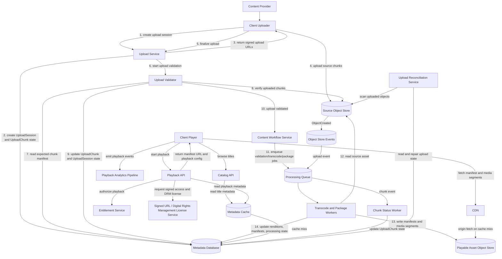

# Video Streaming System Design

## Overview

Design a subscription video streaming platform that allows users to browse a content catalog, start playback, and stream video reliably across web, mobile, and connected TV devices.

The system must support two major domains:

1. **Content ingestion and processing** from studios or internal content teams.
2. **Playback and delivery** to end users through adaptive bitrate streaming and CDN distribution.

This design focuses on reliable video-on-demand playback. Live streaming, offline playback, recommendations, payments, and social features are optional extensions and are out of scope for the core design.

---

## 1. Functional Requirements

### In Scope

- Content providers can upload large source video files.
- The system validates uploaded assets.
- The system transcodes source video into multiple resolutions, bitrates, audio tracks, and subtitle formats.
- The system packages encoded video into HLS(HTTP Live Streaming) and MPEG-DASH(Moving Picture Experts Group Dynamic Adaptive Streaming over HTTP) manifests and chunks.
- The system stores playable assets in object storage.
- The system distributes video chunks through a CDN.
- Users can browse metadata for available titles.
- Users can start playback on supported devices.
- The player can fetch manifests, request chunks, and adapt bitrate based on bandwidth and buffer health.
- The system records playback quality metrics such as startup latency, rebuffering, errors, and bitrate switches.

### Out of Scope

- Recommendation ranking.
- Payments and subscription billing.
- User-generated content.
- Social features such as comments, likes, and sharing.
- Live streaming.
- Offline downloads.
- Ad insertion.
- Multi-region active-active catalog editing.

---

## 2. Non-Functional Requirements

- Scale: Support 10 million daily active users, 1 million peak concurrent viewers, 5 terabits per second (Tbps) peak video egress before Content Delivery Network (CDN) caching, 10,000:1 catalog metadata read/write ratio, hundreds to thousands of new uploads per day, and 50-500 gigabytes (GB) source files per title.
- Availability: Target high playback availability with 99.95% or higher playback Application Programming Interface (API) availability, 99.99% or higher Content Delivery Network (CDN) and object storage delivery availability, Recovery Time Objective (RTO) under 30 minutes, and Recovery Point Objective (RPO) under 5 minutes for catalog and entitlement metadata.
- Performance: Serve catalog metadata within 100-200 ms 95th percentile (p95), playback start within 100-300 ms 95th percentile (p95), startup time under 2 seconds on healthy networks, and rebuffering under 1% of playback time.
- Consistency: Use eventual consistency for catalog metadata and playback progress, strong consistency for entitlement checks and content workflow state, and idempotent upload and processing operations.
- Security and Compliance: Require authenticated and authorized studio uploads and user playback, encryption at rest and in transit, Digital Rights Management (DRM) for premium content, signed Uniform Resource Locators (URLs) or cookies for CDN access, audit logs, and tenant isolation.
- Observability: Track API latency, error rate, throughput, saturation, CDN cache hit rate, origin fetches, playback quality metrics, transcoding queue depth, retry rate, Dead Letter Queue (DLQ) growth, and distributed traces for playback-start requests.

---

## 3. High-Level Architecture



### Major Components

- **Client Uploader**: Splits the source file into chunks within server-defined limits and uploads chunks using signed URLs.
- **Upload Service**: Creates upload sessions, validates chunks, finalizes source assets, and records upload state.
- **Upload Validator**: Verifies uploaded chunks by comparing the expected chunk manifest stored in the Metadata Database against the actual objects stored in the Source Object Store, validates checksums and byte ranges, updates UploadChunk and UploadSession state, and determines whether an upload can transition to `UPLOADED`.
- **Metadata Database**: Authoritative store for all non-video state, including content metadata, upload tracking, processing lifecycle state, rendition metadata, manifest metadata, and publishing state.
- **Metadata Cache**: Read-through cache for title metadata, duration, thumbnail URLs, available renditions, and caption metadata; not authoritative.
- **Source Object Store**: Authoritative storage for original uploaded video files.
- **Object Store Events**: Event stream emitted when upload chunks are created, enabling asynchronous upload progress tracking.
- **Content Workflow Service**: Owns the content processing lifecycle and state transitions.
- **Processing Queue**: Buffers work for transcode, package, thumbnail, subtitle, and validation workers.
- **Chunk Status Worker**: Consumes object-store events and updates UploadChunk status for upload progress tracking.
- **Upload Reconciliation Service**: Periodically scans Metadata Database state and Source Object Store objects to repair stuck uploads, missed events, and metadata drift.
- **Transcode and Package Workers**: Generate renditions, manifests, chunks, thumbnails, and subtitles.
- **Playable Asset Object Store**: Authoritative storage for generated streaming artifacts.
- **Catalog API**: Serves title metadata to clients.
- **Playback API**: Performs entitlement checks and returns playback configuration.
- **Entitlement Service**: Authoritative source for whether a user can watch a title.
- **Signed URL / Digital Rights Management (DRM) License Service**: Issues short-lived CDN access tokens, signed URLs, and Digital Rights Management (DRM) license information used to decrypt protected video content.
- **CDN**: Caches manifests and video chunks close to viewers.
- **Playback Analytics Pipeline**: Collects client-side quality and operational events.

---

## 4. Main Flows

### Write Path: Content Upload and Processing

1. Content provider creates an upload session through the Upload Service.
2. Upload Service creates an `upload_session_id` and writes upload state to the Metadata Database.
3. Client chooses a chunk size within those limits, calculates the planned chunk list, and assigns each chunk a deterministic `chunk_id` based on `upload_session_id` and chunk index, for example `{upload_session_id}/part-{zero_padded_index}`.
4. Upload Service validates the proposed chunk manifest, records each `chunk_id`, byte range, size, checksum, and status, then returns one signed URL per chunk or per object-part upload target.
5. Provider uploads chunks directly to the Source Object Store using signed URLs.
6. Provider calls finalize on the Upload Service when all chunks are uploaded.
7. Upload Service invokes the Upload Validator.
8. Upload Validator reads the expected chunk manifest from the Metadata Database.
9. Upload Validator performs HEAD requests against the Source Object Store and validates chunk existence, size, checksum, and byte ranges.
10. Upload Validator updates UploadChunk and UploadSession state.
11. Upload Validator marks the upload as `UPLOADED` only when all expected chunks pass validation.
12. Content Workflow Service transitions the asset into validation and processing states.
13. Workers transcode and package the source video.
14. Workers write generated manifests and media segments to the Playable Asset Object Store.
15. Workers update rendition and processing metadata.
16. Workflow marks the title as playable only after required outputs pass validation.

### Chunk Identity and Upload Status

- Each upload has one server-generated `upload_session_id`.
- Each chunk has a deterministic `chunk_id`, usually derived from `upload_session_id` plus the zero-based chunk index, for example `{upload_session_id}/part-000001`.
- The client proposes the chunk manifest, including `chunk_id`, byte range, size, and checksum; the Upload Service validates it against server limits before issuing signed URLs.
- The Metadata Database tracks each UploadChunk as `PENDING`, `UPLOADING`, `UPLOADED`, `VERIFIED`, `FAILED`, or `EXPIRED`.
- The Upload Validator compares the expected chunk manifest stored in the Metadata Database with the actual uploaded objects in the Source Object Store before an UploadSession can transition to `UPLOADED`.
- Finalization succeeds only when every expected `chunk_id` is uploaded, byte ranges are contiguous, sizes match, and checksums pass validation.

### Object Store Event Flow

1. Chunk is uploaded to the Source Object Store.
2. The Source Object Store emits an ObjectCreated event.
3. The event is written to the Processing Queue.
4. A Chunk Status Worker validates object metadata and updates UploadChunk state.
5. Upload progress is updated asynchronously for user experience.
6. The Upload Validator remains the final authority during upload finalization.
7. An Upload Reconciliation Service periodically scans for stuck uploads, missed events, and metadata drift.

### Read Path: Playback Start

1. Client requests playback for a title.
2. Playback API authenticates the user.
3. Playback API asks Entitlement Service whether the user can watch the title.
4. Playback API reads title, asset, rendition, and manifest metadata.
5. Playback API requests signed CDN URLs and Digital Rights Management (DRM) license information.
6. Playback API returns playback configuration to the client.
7. Client fetches the manifest from CDN.
8. Client downloads chunks from CDN and adapts bitrate locally.

### Async Path: Playback Analytics

1. Client emits playback events such as startup time, rebuffering, bitrate switch, error, and session end.
2. Events are sent to an analytics ingestion endpoint.
3. Events are written to a durable stream.
4. Stream processors aggregate quality-of-experience metrics.
5. Dashboards and alerts detect customer-impacting playback issues.

---

## 5. Data Model

### Core Entities

- **User**: End viewer identity.
- **Entitlement**: User or account permission to view a title.
- **Title**: Customer-facing content identity including title name, description, content rating, provider, publish visibility, and release metadata.
- **SourceAsset**: Original uploaded file metadata including asset identifier, file size, checksum, upload status, and source object-store location.
- **UploadSession**: Upload workflow state including session identifier, uploader, expiration time, upload constraints, and current lifecycle state.
- **UploadChunk**: Per-chunk tracking including `chunk_id`, chunk index, byte range, size, checksum, object key, and upload status.
- **Rendition**: Encoded output metadata including resolution, bitrate, codec, audio profile, packaging profile, and processing status.
- **Manifest**: Playback manifest metadata including HLS or MPEG-DASH manifest location, referenced renditions, version, and publish eligibility.
- **ProcessingState**: Content processing lifecycle state including validation, transcoding, packaging, retry counts, and failure reasons.
- **PublishState**: Publishing lifecycle state including visibility, release windows, regional availability, takedown status, and publish timestamps.
- **MediaSegment**: Small playable video or audio segment generated during packaging and delivered through the CDN.
- **SubtitleTrack**: Captions or subtitles for a title.
- **PlaybackSession**: User playback attempt for a specific title and device.
- **PlaybackEvent**: Client-side quality and lifecycle event.

### Ownership

- Upload Service owns upload sessions.
- Source Object Store owns source video bytes.
- Content Workflow Service owns processing state.
- Playable Asset Object Store owns generated chunks and manifests.
- Metadata Database owns Title, SourceAsset, UploadSession, UploadChunk, Rendition, Manifest, ProcessingState, and PublishState metadata.
- Entitlement Service owns access decisions.
- CDN owns cached copies but is not authoritative.
- Client playback progress is advisory and can be replayed or overwritten.

---

## 6. Ownership and Authority

- Source Object Store is authoritative for original uploaded video files.
- Playable Asset Object Store is authoritative for generated streaming files.
- Metadata Database is authoritative for Title, SourceAsset, UploadSession, UploadChunk, Rendition, Manifest, ProcessingState, and PublishState metadata.
- Content Workflow Service is authoritative for processing lifecycle state.
- Entitlement Service is authoritative for whether playback is allowed.
- CDN is cache only.
- Client-reported analytics are advisory and may be duplicated, delayed, or missing.
- Playback progress is user-experience state, not financial or compliance-critical state.
- Derived indexes, search documents, and analytics aggregates can be rebuilt from authoritative metadata and event logs.

---

## 7. State Model / Lifecycle

### Upload Lifecycle

```text
INITIATED → UPLOADING → UPLOADED → VALIDATING → VALIDATED → PROCESSING → PLAYABLE → PUBLISHED
```

### Failure States

```text
UPLOAD_FAILED
VALIDATION_FAILED
PROCESSING_FAILED
PUBLISH_FAILED
```

### State Transition Rules

- `INITIATED → UPLOADING`: Upload Service creates an upload session.
- `UPLOADING → UPLOADED`: Upload Validator verifies all expected chunks exist, checksums match, byte ranges are contiguous, and upload completeness requirements are satisfied.
- `UPLOADED → VALIDATING`: Workflow Service starts validation.
- `VALIDATING → VALIDATED`: Validator verifies checksum, format, duration, audio, subtitles, and policy requirements.
- `VALIDATED → PROCESSING`: Workflow Service enqueues transcode and package jobs.
- `PROCESSING → PLAYABLE`: Workers complete required renditions and manifests.
- `PLAYABLE → PUBLISHED`: Content operator or automated publishing rule makes the title visible.

Only the Content Workflow Service should perform processing state transitions. Workers report results, but they do not independently decide whether a title is published.

---

## 8. Failure Modes

### Worker Crash During Transcoding

- Detection: Job heartbeat expires or queue visibility timeout expires.
- Recovery: Job is retried using the same `asset_id`, `profile_id`, and idempotency key.
- Authority: Workflow Service owns job state; object storage owns any partial outputs.
- Repair: Partial outputs are overwritten or garbage-collected before retry completion.

### Lost Processing Event

- Detection: Workflow state remains stuck past expected SLA.
- Recovery: Reconciliation scans Metadata DB and object storage to detect completed outputs.
- Authority: Metadata Database and object storage are authoritative, not the event bus.
- Repair: Workflow state is advanced or job is re-enqueued.

### CDN Cache Miss Storm

- Detection: Origin request rate, CDN hit rate, and origin latency alerts.
- Recovery: Shield caches, request coalescing, origin rate limits, and pre-warming for popular titles.
- Authority: Object storage remains authoritative for chunks and manifests.
- Repair: Rehydrate CDN cache and throttle non-critical traffic if needed.

### Entitlement Service Outage

- Detection: Playback start errors and dependency health checks.
- Recovery: Fail closed for premium content unless there is a short-lived, previously issued playback token.
- Authority: Entitlement Service is authoritative.
- Repair: Replay failed playback attempts is not required, but monitor customer impact.

### Duplicate Upload Finalization

- Detection: Same `upload_session_id` finalized more than once.
- Recovery: Finalization is idempotent and returns current state.
- Authority: Upload Service owns upload orchestration, Upload Validator owns upload verification, and Metadata Database owns authoritative UploadSession and UploadChunk state.
- Repair: No repair required if state transition is conditional and idempotent.

### Regional Outage

- Detection: Regional health checks, error budget burn, synthetic playback probes.
- Recovery: Route playback APIs to healthy region and rely on multi-region CDN/object replication.
- Authority: Metadata Database replication strategy determines latest available catalog state.
- Repair: Reconcile metadata and object replication after region recovery.

---

## 9. Tradeoffs and Alternatives

### Metadata Caching

- Cacheable: title metadata, duration, thumbnail URLs, available renditions, and caption metadata.
- Not Cacheable: entitlements, Digital Rights Management (DRM) licenses, signed playback URLs, and user-specific policies.
- Cache Key: `title_id`.
- Time To Live (TTL): 5-15 minutes with jitter.
- Invalidation: metadata updates, publish state changes, and content takedowns.
- Hot-Key Protection: request coalescing, stale-while-revalidate, local in-memory cache, replicated cache keys, and cache stampede protection.

### Cost vs Reliability

- Multi-CDN improves availability but increases operational complexity and vendor cost.
- Pre-warming CDN caches improves launch reliability for popular titles but increases egress and cache-fill cost.

### Consistency vs Availability

- Entitlement checks favor correctness over availability.
- Catalog browsing favors availability and can tolerate stale metadata.
- Playback progress favors availability and can tolerate lost or delayed writes.

### Latency vs Correctness

- Playback start should perform synchronous entitlement checks.
- Playback analytics should be asynchronous to avoid affecting viewing experience.

### Build vs Buy

- Commodity encoding and packaging can use managed services such as AWS Elemental, Bitmovin, Mux, or MediaPackage.
- Differentiated areas are playback quality, cost optimization, observability, catalog operations, and CDN strategy.

### SQL vs NoSQL

- Relational storage is a good fit for content metadata, workflow state, and entitlement relationships.
- Object storage is the right fit for large immutable video assets.
- Search indexes and caches are derived, not authoritative.

---

## 10. Observability

### Technical Metrics

- API p50, p95, and p99 latency.
- API error rate by endpoint, region, device type, and title.
- CDN cache hit rate.
- CDN origin fetch rate.
- Object storage latency and errors.
- Digital Rights Management (DRM) license success and failure rate.

### Business Metrics

- Playback start success rate.
- Time to first frame.
- Rebuffer ratio.
- Playback completion rate.
- Title publish success rate.
- New content processing SLA compliance.

### Operational Metrics

- Transcode queue depth.
- Job retry rate.
- DLQ growth.
- Worker saturation.
- Workflow states stuck beyond SLA.
- CDN regional error rate.
- Origin egress spikes.
- Cache hit rate.
- Cache stampede rate.
- Reconciliation backlog.

---

## 11. Cost

### Major Cost Drivers

- Video CDN egress.
- Storage for source files and generated renditions.
- Transcoding compute.
- Multi-region replication.
- Analytics event volume.

### First Optimizations

- Tune encoding ladders by device and network profile.
- Use CDN cache shielding and request coalescing.
- Apply lifecycle retention policies for intermediate processing files.
- Use adaptive codec strategy, such as AV1 for high-volume supported devices.
- Downsample analytics events where exact per-event retention is not required.

---
