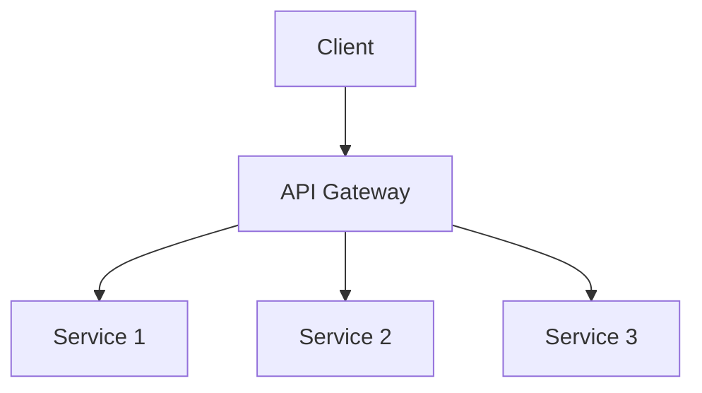

# API Gateway

An API Gateway is a centralized entry point for microservices, providing cross-cutting concerns and API management.

## Features
- Authentication/authorization
- Rate limiting
- Request/response transformation
- API versioning
- Analytics
- Routing

## Benefits
- Simplified client integration
- Centralized security
- Operational control

## Trade-offs
- Additional latency hop
- Potential single point of failure
- Increased complexity

## Trade-offs and Comparisons
- API Gateway provides API lifecycle management, request transformation, rate limiting, and microservices orchestration.
- Load balancers focus on traffic distribution and health checks.
- Trade-off: API management features vs. simple traffic distribution.

**Hybrid Approach:** Use API Gateway for external APIs, load balancer for internal traffic.

**Questions to Ask:**
- Do you need API versioning and transformation?
- Are you building a microservices architecture?
- What are your security and analytics needs?

## Architecture Diagram

## Examples
- Amazon API Gateway
- Kong
- Zuul
- Istio Gateway
