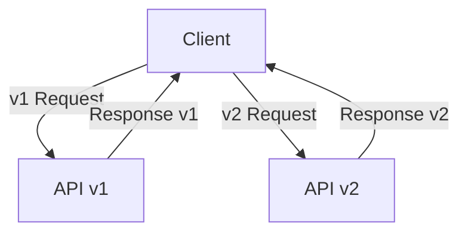

# API Versioning

API versioning is the practice of managing changes to an API without breaking existing clients. It allows teams to introduce new features or changes while maintaining backward compatibility.

## Key Concepts
- URL versioning (e.g., `/api/v1/resource`)
- Header versioning (e.g., `Accept: application/vnd.api+json;version=1`)
- Query parameter versioning (e.g., `/api/resource?version=1`)
- Content negotiation
- Deprecation and sunset policies

## Trade-offs
- **Pros:**
  - Enables safe evolution of APIs
  - Maintains backward compatibility
  - Allows parallel support for multiple versions
- **Cons:**
  - Increases maintenance overhead
  - Can lead to proliferation of versions
  - May confuse clients if not documented clearly

## Interview Q&A
- **Q:** Why is API versioning important?
  - **A:** It allows changes and improvements without breaking existing clients.
- **Q:** What are common strategies for API versioning?
  - **A:** URL versioning, header versioning, query parameter versioning, and content negotiation.
- **Q:** How do you deprecate an API version?
  - **A:** Announce deprecation, provide a migration path, and eventually sunset the old version.

## Mermaid Diagram

## See Also
- [rest-api.md](./rest-api.md)
- [grpc-api.md](./grpc-api.md)
- [graphql-api.md](./graphql-api.md)
