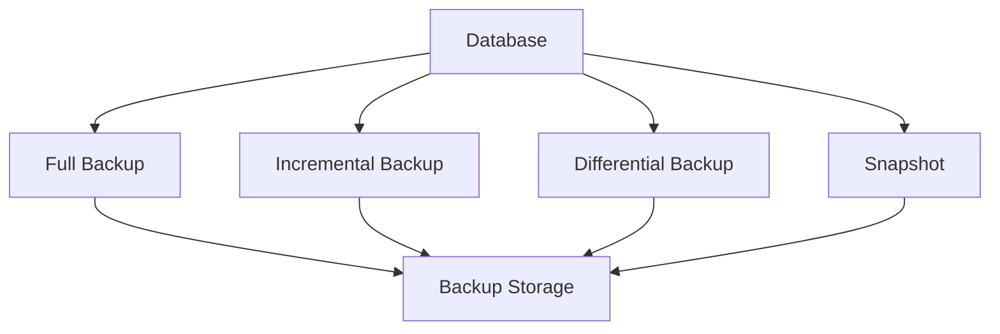

# Backup

Backup is the process of creating copies of data to protect against loss, corruption, or disasters. It is a critical part of data management and business continuity.

## Types
- **Full Backup:** Complete copy of all data
- **Incremental Backup:** Only data changed since the last backup
- **Differential Backup:** Data changed since the last full backup
- **Snapshot:** Point-in-time image of data (often used in cloud and VM environments)

## Trade-offs
- Full backups are simple but slow and storage-intensive
- Incremental/differential backups save space but complicate restores
- Snapshots are fast but may not capture all application state

## Interview Q&A
- How do you design a backup strategy for a large-scale system?
- How do you ensure backup consistency?
- What are the trade-offs between backup frequency and recovery time?

## Architecture Diagram

## See Also
- [consistency.md](./consistency.md)
- [replication.md](./replication.md)
- [sharding.md](./sharding.md)
- [merkle-tree.md](./merkle-tree.md)
- [rsync-delta-sync.md](./rsync-delta-sync.md)
