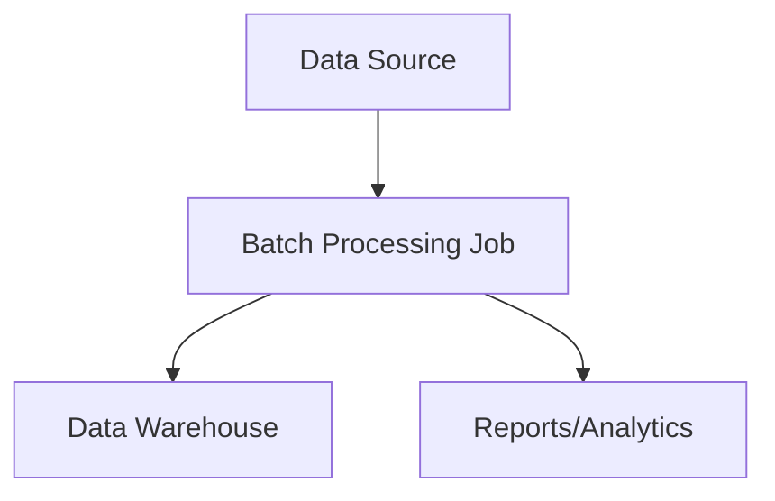

# Batch Processing

Batch processing handles large volumes of data in scheduled chunks or batches, optimizing for throughput and cost efficiency.

## Characteristics
- High throughput
- Cost-effective resource usage
- Simpler error handling and recovery
- Higher latency, delayed insights

## Technologies
- Apache Spark
- Hadoop MapReduce
- AWS Batch
- Google Dataflow

## Use Cases
- ETL pipelines
- Data warehousing
- Financial reporting
- Log analysis

## Trade-offs
- High throughput and resource efficiency vs. higher latency and less responsiveness

## Interview Q&A
- When is batch processing preferable to stream processing?
- How do you handle errors and retries in batch jobs?
- What are the challenges of scaling batch pipelines?

## Architecture Diagram

