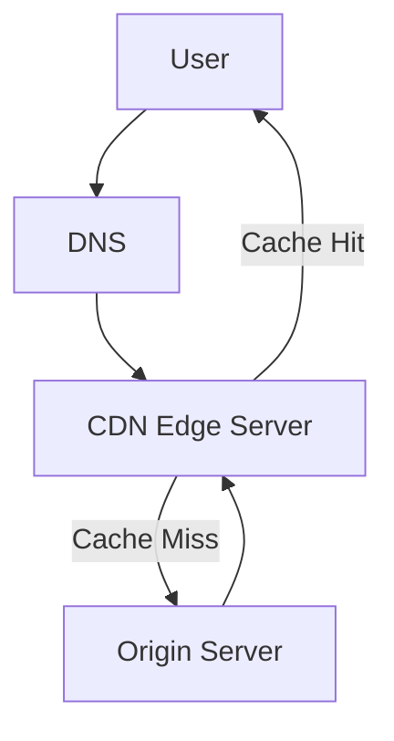

# Content Delivery Networks (CDNs)

CDNs use geographically distributed edge servers to cache content closer to users.

## How it Works
- User request → DNS resolves to nearest edge → Cache hit/miss → Serve content

## Benefits
- Reduced latency
- Bandwidth savings
- Origin protection

## Trade-offs and Considerations
- CDNs reduce latency and bandwidth but add cost and complexity.
- Cache invalidation and consistency are operational challenges.

## Architecture Diagram

