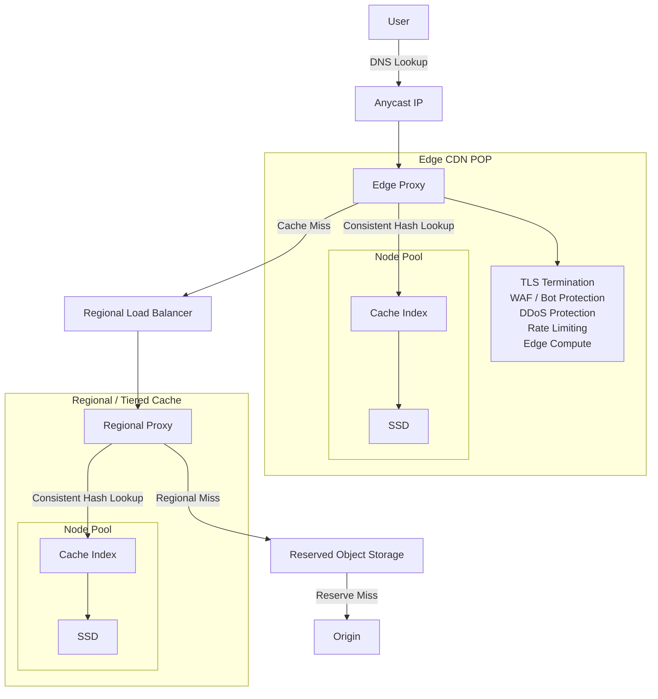

# Content Delivery Networks (CDNs)

CDNs provide a globally distributed edge layer that routes traffic to the nearest Point of Presence (POP) using DNS and Anycast. In addition to caching, modern CDNs commonly provide TLS termination, DDoS protection, WAF capabilities, edge compute, and traffic analytics.

## How it Works
- User request → DNS resolves to nearest edge → Cache hit/miss → Serve content

## Benefits
- Reduced latency
- Bandwidth savings
- Origin protection
- Global traffic routing via Anycast
- TLS termination
- DDoS mitigation
- Edge request processing
- Improved availability through tiered caching

## Common Edge Functions

| Capability | Purpose |
|-------------|---------|
| Anycast Routing | Direct traffic to the nearest POP |
| Cache | Reduce latency and origin load |
| TLS Termination | Offload encryption from origins |
| DDoS Protection | Absorb volumetric attacks |
| WAF / Bot Protection | Filter malicious requests |
| Rate Limiting | Protect downstream services |
| Edge Compute | Header rewrites, redirects, auth |
| Compression | Reduce bandwidth consumption |
| Signed URLs | Protect private content |
| Analytics | Traffic and cache observability |
| Origin Failover | Regional disaster recovery |

## Trade-offs and Considerations
- CDNs reduce latency and bandwidth but add cost and complexity.
- Cache invalidation and consistency are operational challenges.

## Relationship with Load Balancers

The CDN and load balancer serve different purposes.

### CDN Responsibilities
- DNS + Anycast global routing
- Edge caching
- TLS termination
- DDoS protection
- WAF and bot mitigation
- Edge functions and request processing

### Backend Load Balancer Responsibilities
- Backend instance selection
- Health checks
- Connection balancing
- Regional failover
- Session affinity (optional)

Traffic is routed globally by the CDN and then forwarded to regional load balancers, which distribute requests to backend services.

## Architecture Diagram

```mermaid
graph TD
    User[User] -->|DNS Lookup| Anycast[Anycast IP]

    Anycast --> EdgeProxy

    subgraph Edge[Edge CDN POP]
        EdgeProxy[Edge Proxy]

        EdgeServices[TLS Termination<br/>WAF / Bot Protection<br/>DDoS Protection<br/>Rate Limiting<br/>Edge Compute]

        subgraph EdgePool[Node Pool]
            EdgeIndex[Cache Index]
            EdgeSSD[SSD]
        end

        EdgeProxy --> EdgeServices
        EdgeProxy -->|Consistent Hash Lookup| EdgeIndex
        EdgeIndex --> EdgeSSD
    end

    EdgeProxy -->|Cache Miss| RegionalLB[Regional Load Balancer]

    RegionalLB --> RegionalProxy

    subgraph Regional[Regional / Tiered Cache]
        RegionalProxy[Regional Proxy]

        subgraph RegionalPool[Node Pool]
            RegionalIndex[Cache Index]
            RegionalSSD[SSD]
        end

        RegionalProxy -->|Consistent Hash Lookup| RegionalIndex
        RegionalIndex --> RegionalSSD
    end

    RegionalProxy -->|Regional Miss| Reserve[Reserved Object Storage]
    Reserve -->|Reserve Miss| Origin[Origin]
```
