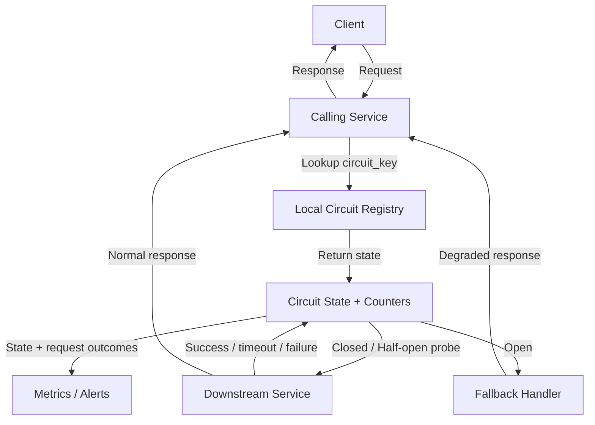
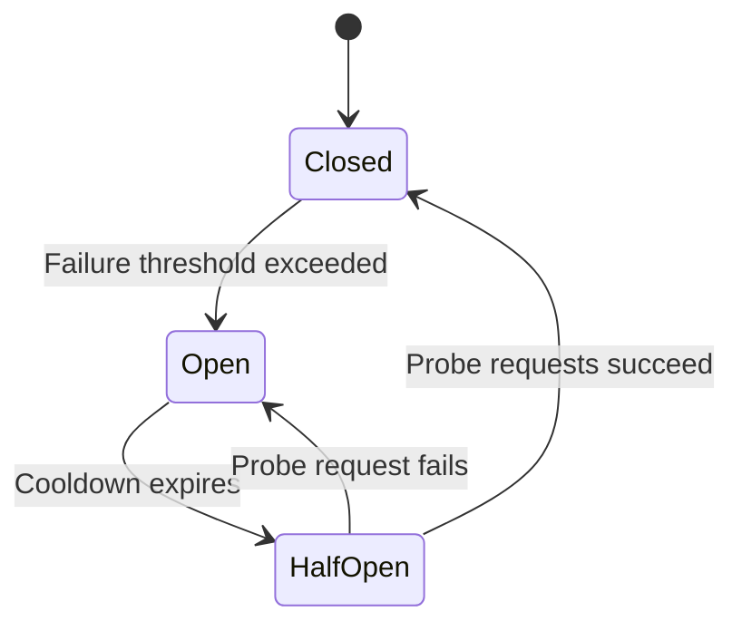

# Circuit Breaker

A circuit breaker is a caller-side reliability pattern that stops a service from repeatedly calling an unhealthy downstream dependency.

The implementation matters more than the concept: a circuit breaker is usually a small state machine stored in memory by the caller, keyed by dependency/operation.

## Core Idea

```text
Caller checks local circuit state before making a downstream call.

CLOSED    -> allow normal traffic
OPEN      -> fail fast or return fallback
HALF_OPEN -> allow a few probe requests to test recovery
```

## Basic Architecture



## Who Owns `circuit.state()`?

The circuit breaker implementation owns `circuit.state()`.

For most service-to-service calls, this state lives in local memory inside the calling process.

```text
Checkout instance A
  circuit[payment-service:authorize] = CLOSED

Checkout instance B
  circuit[payment-service:authorize] = OPEN
```

Each caller instance can have a different view because each instance observes its own failures.

That is usually acceptable. The goal is fast local protection, not global consensus.

## Circuit Key

Circuit state is stored by key.

```text
circuit_key = payment-service:authorize-payment:us-east-1
```

Common key choices:

- Per downstream service
- Per endpoint or operation
- Per region
- Per tenant, if tenant isolation matters

The more specific the key, the more targeted the protection. The more broad the key, the simpler the system.

## Local State Tracked

A circuit usually tracks a rolling window of recent outcomes.

```text
state = CLOSED
last_state_change_time = 10:00:00
success_count = 12
failure_count = 8
timeout_count = 3
slow_call_count = 4
window_size = 20 requests
```

The state is derived from local observations.

## State Transitions



### Closed

Normal state.

- Requests are allowed.
- Successes, failures, timeouts, and slow calls are recorded.
- If the rolling failure rate exceeds the threshold, move to `OPEN`.

### Open

Failure containment state.

- Requests are not sent downstream.
- Caller fails fast or uses fallback.
- After cooldown expires, move to `HALF_OPEN`.

### Half-Open

Recovery test state.

- Only a few probe requests are allowed.
- If probes succeed, move to `CLOSED`.
- If a probe fails, move back to `OPEN`.

## Common Config

```yaml
circuit_key: payment-service:authorize-payment:us-east-1
failure_rate_threshold: 50%
minimum_request_volume: 20
timeout_ms: 500
slow_call_threshold_ms: 1000
open_cooldown_seconds: 30
half_open_max_probes: 5
fallback_strategy: cached_or_safe_error
```

## Request Flow

1. Caller builds a `circuit_key` for the dependency call.
2. Caller looks up the circuit in a local registry.
3. If state is `OPEN`, return fallback or fail fast.
4. If state is `CLOSED`, call downstream normally.
5. If state is `HALF_OPEN`, allow only limited probe traffic.
6. Record success, failure, timeout, or slow call.
7. Recalculate whether the circuit should transition.
8. Emit metrics and alerts for state changes.

## Pseudocode

```python
def call_with_circuit_breaker(request):
    circuit_key = "payment-service:authorize-payment:us-east-1"
    circuit = circuit_registry.get(circuit_key)  # local memory lookup

    if circuit.state == "OPEN":
        if circuit.cooldown_expired():
            circuit.transition_to_half_open()
        else:
            return fallback_response()

    if circuit.state == "HALF_OPEN" and not circuit.allow_probe():
        return fallback_response()

    try:
        response = downstream.call(request, timeout_ms=500)
        circuit.record_success()

        if circuit.state == "HALF_OPEN" and circuit.probes_succeeded():
            circuit.transition_to_closed()

        return response

    except (TimeoutError, DownstreamError):
        circuit.record_failure()

        if circuit.state == "HALF_OPEN" or circuit.failure_threshold_exceeded():
            circuit.transition_to_open()

        return fallback_response()
```

## Authority Model

- Downstream service owns business data.
- Circuit breaker owns the caller's decision to send traffic.
- Metrics are derived from observed calls.
- Fallback is degraded behavior, not authoritative truth.

## Retry Interaction

Retries and circuit breakers should work together.

Retries help with temporary failures, but they can amplify outages. Circuit breakers stop retries from repeatedly hammering an unhealthy dependency.

Retry only when the operation is idempotent.

Safe:

- Read by ID
- Fetch profile
- Submit with idempotency key

Unsafe:

- Charge payment without idempotency key
- Create order without deduplication
- Send email without duplicate protection

## Fallback Choices

Fallback depends on business criticality.

- Optional dependency: return cached/default/partial data.
- Critical dependency: fail safely with a clear error.
- Async workflow: queue work for later if retry-safe.

Example: recommendations can degrade to popular products. Payments should fail safely instead of pretending success.

## Failure Modes

### Downstream Down

Detect with timeouts, connection failures, or 5xxs. Open the circuit, fail fast, then probe after cooldown.

### Downstream Slow

Treat slow calls as failures if they exceed the slow-call threshold. This protects thread pools and connection pools.

### Retry Storm

Detect retry spikes and downstream QPS amplification. Use bounded retries with backoff, jitter, timeouts, and circuit breaking.

### Circuit Opens Too Fast

Increase minimum request volume, adjust timeout, or raise the failure threshold.

## Observability

Track:

- Circuit state by key
- State transition count
- Dependency error rate
- Timeout rate
- Slow-call rate
- Fallback rate
- Half-open probe success rate
- Retry rate
- Downstream latency

Alert on:

- Circuit stuck open
- Rapid open/close flapping
- High fallback rate
- Retry storm
- Probe failures during recovery

## Interview Summary

A circuit breaker is a caller-owned, usually in-memory state machine. It protects the caller from unhealthy dependencies by failing fast, using fallback behavior, and probing recovery after cooldown. The key design choices are the circuit key, thresholds, timeout, fallback behavior, retry safety, and observability.