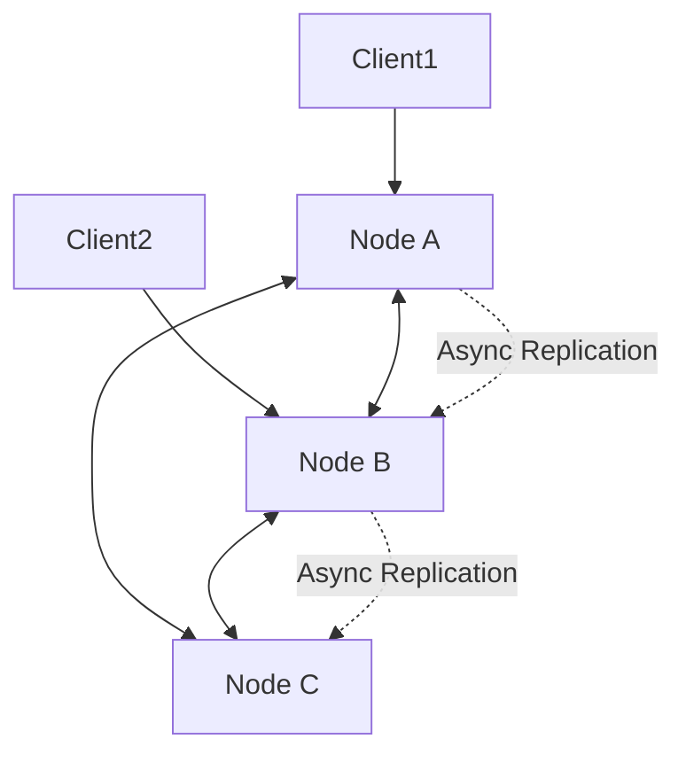

# Consistency

Consistency defines how up-to-date and synchronized data is across distributed systems. It is a core concern in distributed databases and storage systems.

## Models
- **Strong Consistency:** All clients see the same data at the same time after a write
- **Eventual Consistency:** Updates propagate asynchronously; clients may see stale data temporarily
- **Causal Consistency:** Operations that are causally related are seen in the same order by all nodes
- **Read-After-Write Consistency:** Guarantees a client sees its own writes

## Trade-offs
- Strong consistency simplifies reasoning but can reduce availability and increase latency
- Eventual consistency improves availability and performance but risks stale reads
- CAP theorem: Consistency, Availability, Partition tolerance—pick two

## Interview Q&A
- When would you choose eventual over strong consistency?
- How do you design for consistency in a globally distributed system?
- What is the CAP theorem and how does it apply?

## Architecture Diagram

## See Also
- [replication.md](./replication.md)
- [sharding.md](./sharding.md)
- [backup.md](./backup.md)
- [raft.md](./raft.md)
