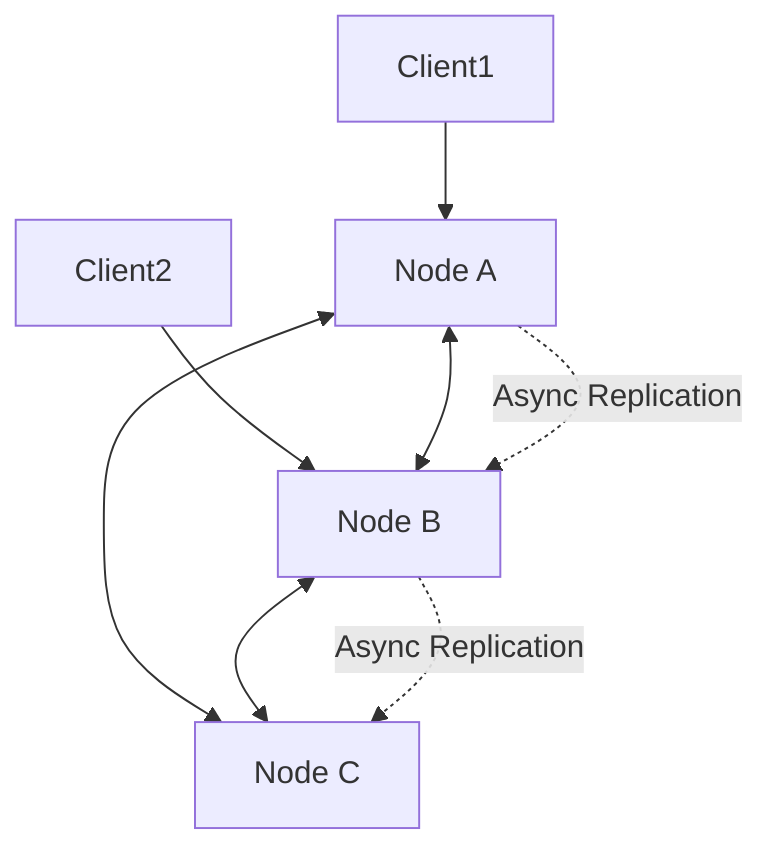

# Consistency

Consistency defines how up-to-date and synchronized data is across distributed systems. It is a core concern in distributed databases and storage systems.

## Models
- **Strong Consistency:** All clients see the same data at the same time after a write
- **Eventual Consistency:** Updates propagate asynchronously; clients may see stale data temporarily
- **Causal Consistency:** Operations that are causally related are seen in the same order by all nodes
- **Read-After-Write Consistency:** Guarantees a client sees its own writes

## Trade-offs
- Strong consistency simplifies reasoning but can reduce availability and increase latency
- Eventual consistency improves availability and performance but risks stale reads
- CAP theorem: Consistency, Availability, Partition tolerance—pick two

---

## CAP Theorem

**Theorem:** In a distributed system, you can only guarantee **two out of three** properties simultaneously:

### The Three Properties

1. **Consistency (C):** Every read receives the most recent write or an error (all nodes see the same data at the same time)
2. **Availability (A):** Every request receives a response (success or failure), without guarantee it contains the most recent write
3. **Partition Tolerance (P):** The system continues to operate despite network partitions (messages dropped or delayed between nodes)

### Why You Must Choose

**Network partitions are inevitable in distributed systems**, so **Partition Tolerance (P) is mandatory**. This forces a choice between:

- **CP (Consistency + Partition Tolerance):** System becomes unavailable during partition to maintain consistency
- **AP (Availability + Partition Tolerance):** System remains available during partition but may return stale data

**CA (Consistency + Availability) is impossible in distributed systems** because network partitions will occur.

### Examples

| System | Choice | Behavior During Partition |
|--------|--------|---------------------------|
| **PostgreSQL (single-leader replication)** | CP | Writes blocked if leader unreachable (maintains consistency) |
| **MongoDB (with majority write concern)** | CP | Writes blocked if majority of replicas unavailable |
| **Cassandra (with eventual consistency)** | AP | Accepts writes to available nodes (returns stale reads) |
| **DynamoDB** | AP | Continues serving requests from available replicas |
| **etcd/ZooKeeper** | CP | Requires quorum; unavailable if majority nodes down |
| **DNS** | AP | Returns cached/stale records if authoritative server unreachable |

### Trade-offs

**CP Systems (Choose Consistency):**
- ✅ Strong consistency guarantees
- ✅ No stale reads
- ❌ Reduced availability during partitions
- ❌ Higher latency (coordination overhead)
- **Use when:** Data correctness is critical (financial transactions, inventory, leader election)

**AP Systems (Choose Availability):**
- ✅ Always available (even during partitions)
- ✅ Low latency
- ❌ Stale reads possible
- ❌ Conflict resolution needed
- **Use when:** Availability is critical (social media feeds, shopping carts, metrics collection)

---

## PACELC Theorem

**Extension of CAP:** Addresses system behavior **even when there's no partition**.

**Formula:** 
- **If Partition (P):** Choose between Availability (A) and Consistency (C)
- **Else (E):** Choose between Latency (L) and Consistency (C)

### The PACELC Trade-off

**During normal operation (no partition), distributed systems face:**
- **Consistency (C):** Synchronous replication (wait for all replicas to acknowledge)
- **Latency (L):** Asynchronous replication (return immediately, replicate in background)

### PACELC Classification

| System | Partition Behavior | Normal Behavior | Classification |
|--------|-------------------|-----------------|----------------|
| **DynamoDB** | AP (available, eventual consistency) | EL (low latency, async replication) | **PA/EL** |
| **Cassandra** | AP (available, eventual consistency) | EL (low latency, async replication) | **PA/EL** |
| **MongoDB** | CP (unavailable if no quorum) | EC (strong consistency, sync replication) | **PC/EC** |
| **PostgreSQL** | CP (blocks writes if leader down) | EC (strong consistency, sync to replicas) | **PC/EC** |
| **Cosmos DB** | Tunable (per-request consistency level) | Tunable | **PA/EL or PC/EC** |
| **Spanner** | CP (unavailable without quorum) | EC (strong consistency via 2PC + TrueTime) | **PC/EC** |

### Examples

**PA/EL (Prioritize Availability and Low Latency):**
```
Normal operation: Write returns immediately (async replication to replicas)
Partition: Accept writes on available nodes (may cause divergence)
Example: Shopping cart, social media likes
```

**PC/EC (Prioritize Consistency Always):**
```
Normal operation: Write waits for quorum acknowledgment (higher latency)
Partition: Reject writes if quorum unreachable (unavailable)
Example: Bank account balance, inventory count
```

**PA/EC (Available During Partition, Consistent Otherwise):**
```
Normal operation: Strong consistency (sync replication)
Partition: Degrade to eventual consistency (accept writes)
Example: Rare—most systems don't switch consistency models dynamically
```

### Trade-offs

| Classification | Pros | Cons | Use Case |
|---------------|------|------|----------|
| **PA/EL** | Low latency, always available | Stale reads, conflict resolution | Social feeds, caching, metrics |
| **PC/EC** | Strong consistency, no conflicts | Higher latency, reduced availability | Financial transactions, leader election |
| **PA/EC** | Flexible (best of both) | Complex (mode switching) | Global apps with regional consistency |

---

## CAP vs PACELC Summary

| Theorem | Focus | Key Insight |
|---------|-------|-------------|
| **CAP** | Behavior **during network partition** | Must choose between Consistency and Availability when partition occurs |
| **PACELC** | Behavior **always** (partition + normal) | Even without partition, must choose between Latency and Consistency |

**PACELC is more complete** because it covers:
1. **Partition scenario** (same as CAP: choose A or C)
2. **Normal scenario** (choose L or C)

---

## Practical Design Questions

### When to Choose CP (PC/EC)?
- Financial transactions (no stale balances)
- Inventory management (prevent overselling)
- Leader election (only one leader)
- Distributed locks (mutual exclusion)
- Critical config updates (all nodes must agree)

### When to Choose AP (PA/EL)?
- Social media feeds (stale likes acceptable)
- Shopping carts (eventual consistency fine)
- Metrics/logging (some data loss acceptable)
- CDN caching (stale content tolerable)
- DNS (cached records acceptable)

### Hybrid Approaches
- **Multi-region with local consistency:** Strong consistency within region, eventual across regions
- **Tunable consistency:** Per-request consistency level (Cassandra, DynamoDB)
- **Conflict-free replicated data types (CRDTs):** Mathematically resolve conflicts (shopping cart merge)

---

## Interview Q&A
- When would you choose eventual over strong consistency?
- How do you design for consistency in a globally distributed system?
- What is the CAP theorem and how does it apply?
- **What is PACELC and how does it extend CAP?**
- **How does your system behave during a network partition vs normal operation?**
- **Why can't you have CA in a distributed system?**

## Architecture Diagram


## See Also
- [replication.md](./replication.md)
- [sharding.md](./sharding.md)
- [backup.md](./backup.md)
- [merkle-tree.md](./merkle-tree.md)
- [raft.md](./raft.md)
