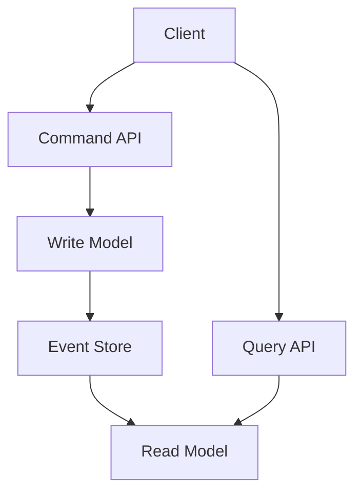

# CQRS (Command Query Responsibility Segregation)

CQRS is an architectural pattern that separates the operations that modify data (commands) from those that read data (queries).

## Key Concepts
- **Command:** Operation that changes state (create, update, delete)
- **Query:** Operation that reads data (no side effects)
- Separate models for reads and writes
- Often paired with event sourcing

## Benefits
- Scalability: Read and write workloads can be scaled independently
- Flexibility: Different data models for reads and writes
- Security: Can enforce different permissions for commands and queries

## Trade-offs
- Increased complexity
- Eventual consistency between write and read models
- More moving parts to manage

## Use Cases
- Complex business logic
- High-scale systems with different read/write patterns
- Event-driven and microservices architectures

## Interview Q&A
- When would you use CQRS?
- How do you keep read and write models in sync?
- What are the challenges of eventual consistency?

## Architecture Diagram

