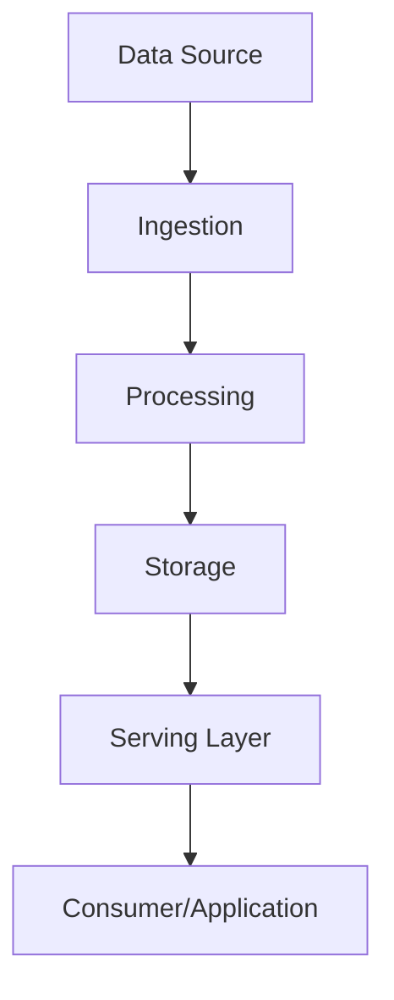

# Data Pipelines

Data pipelines are end-to-end systems that move, transform, and load data between sources and destinations, often combining batch and stream processing.

## Stages
- **Ingestion:** Collect data from various sources
- **Processing:** Clean, transform, and enrich data (batch or stream)
- **Storage:** Persist processed data in databases, warehouses, or lakes
- **Serving:** Make data available for analytics, ML, or applications

## Trade-offs
- Complexity vs. flexibility
- Latency vs. throughput
- Data quality and consistency challenges

## Interview Q&A
- How do you design a reliable data pipeline?
- How do you monitor and recover from failures?
- What are the trade-offs between batch and stream pipelines?

## Architecture Diagram

## See Also
- [MapReduce](./mapreduce.md)
- [Batch Processing](./batch-processing.md)
- [Stream Processing](./stream-processing.md)
