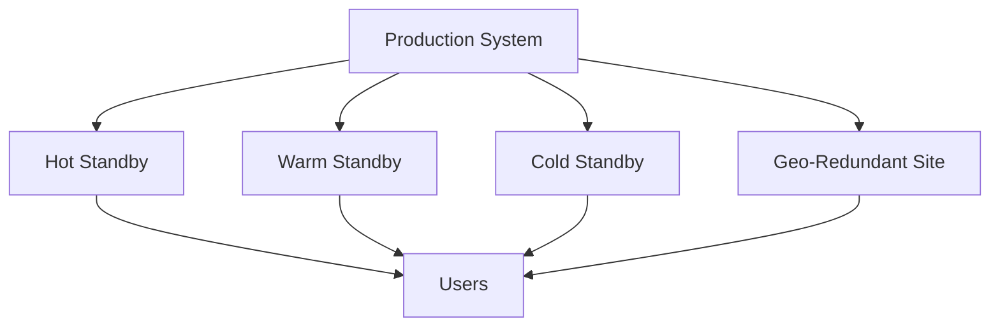

# Disaster Recovery

Disaster recovery (DR) is the set of policies and procedures to restore systems and data after catastrophic failures, outages, or data loss events.

## Strategies
- **Cold Standby:** Backup systems powered off, slowest recovery
- **Warm Standby:** Systems running, data replicated, faster recovery
- **Hot Standby:** Fully redundant, real-time replication, near-instant failover
- **Geo-Redundancy:** Replicate data and services across regions

## Trade-offs
- Hot standby offers fastest recovery but highest cost
- Cold standby is cheapest but slowest
- Geo-redundancy improves resilience but adds complexity and latency

## Interview Q&A

## Architecture Diagram

## See Also
- [backup.md](./backup.md)
- [rsync-delta-sync.md](./rsync-delta-sync.md)

