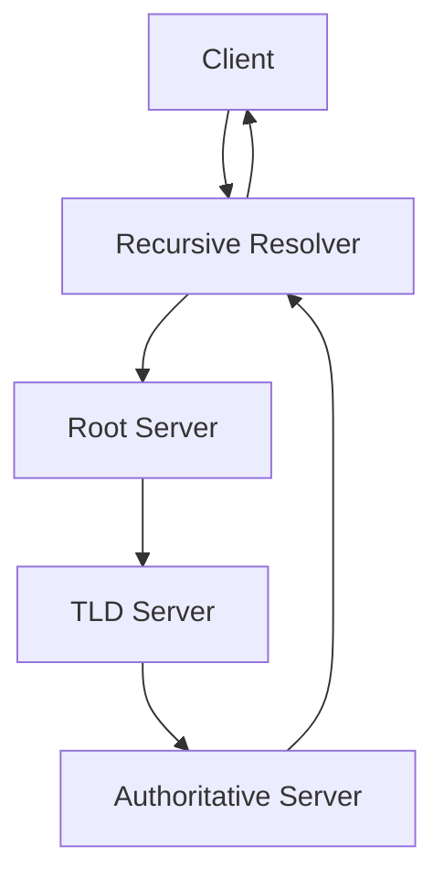

# DNS (Domain Name System)

DNS translates human-readable domain names into IP addresses. It is a hierarchical, distributed system.

## Components
- Recursive DNS Resolvers
- Root Servers
- TLD (Top-Level Domain) Servers
- Authoritative DNS Servers

## DNS Flow
Client → Recursive Resolver → Root → TLD → Authoritative → Response

## Anycast Routing
- Multiple servers share the same IP address
- BGP routes users to the nearest/best server
- Benefits: Reduced latency, improved availability, DDoS mitigation

## Trade-offs and Considerations
- Anycast routing improves availability and DDoS resilience but can complicate debugging and monitoring.
- DNS caching reduces latency but can cause propagation delays for updates.

## Architecture Diagram

