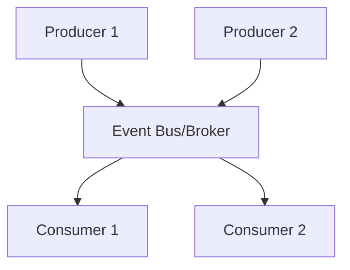

# Event-Driven Architecture

Event-driven architecture (EDA) is a design pattern where system components communicate by producing and consuming events.

## Key Concepts
- **Event:** A record of something that happened (e.g., user signup, order placed)
- **Producer:** Component that emits events
- **Consumer:** Component that reacts to events
- **Event Bus/Broker:** Middleware that routes events (e.g., Kafka, RabbitMQ)

## Benefits
- Loose coupling between components
- Scalability and flexibility
- Enables real-time processing and analytics

## Trade-offs
- Increased complexity in debugging and tracing
- Eventual consistency (not always immediate)
- Requires robust event schema/versioning

## Use Cases
- Real-time analytics
- Microservices communication
- IoT and sensor data processing

## Interview Q&A
- How do you ensure reliable event delivery?
- How do you handle event ordering and idempotency?
- What are the challenges of debugging event-driven systems?

## Architecture Diagram

