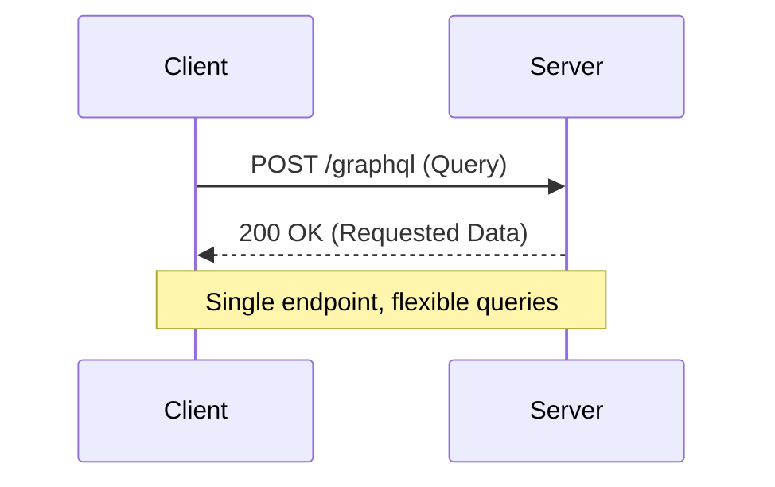

# GraphQL API Design

GraphQL is a query language and runtime for APIs that enables clients to request exactly the data they need, reducing over-fetching and under-fetching compared to REST.

## Key Concepts
- Single endpoint for all operations
- Client specifies data requirements in queries
- Strongly-typed schema with introspection
- Supports queries, mutations, and subscriptions (real-time)
- Hierarchical, nested data fetching

## Trade-offs
- **Pros:**
  - Reduces over-fetching and under-fetching
  - Flexible and efficient for complex data requirements
  - Strongly-typed and self-documenting
- **Cons:**
  - More complex server implementation
  - Caching and rate limiting are harder than REST
  - Potential for expensive queries (N+1 problem)

## Interview Q&A
- **Q:** What are the main benefits of GraphQL over REST?
  - **A:** Flexible queries, single endpoint, and reduced data transfer.
- **Q:** When would you not use GraphQL?
  - **A:** For simple CRUD APIs, or when caching and rate limiting are critical.
- **Q:** How does GraphQL handle versioning?
  - **A:** By evolving the schema (deprecating fields, adding new types) rather than versioning endpoints.

## Mermaid Diagram

## See Also
- [rest-api.md](./rest-api.md)
- [grpc-api.md](./grpc-api.md)
- [api-versioning.md](./api-versioning.md)
