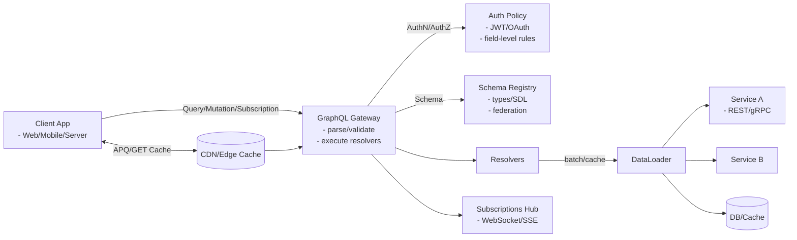
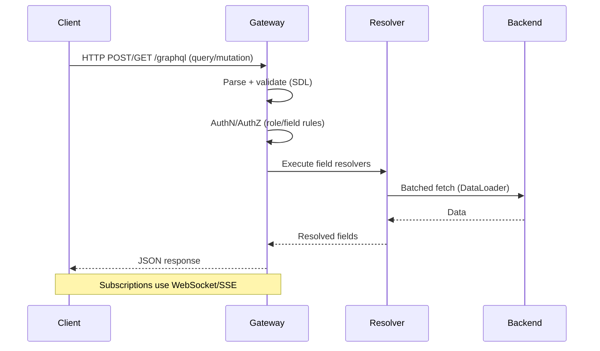

# GraphQL API Design

GraphQL is a query language and runtime for APIs that enables clients to request exactly the data they need, reducing over-fetching and under-fetching compared to REST.

## Key Concepts
- Single endpoint for all operations
- Client specifies data requirements in queries
- Strongly-typed schema with introspection
- Supports queries, mutations, and subscriptions (real-time)
- Hierarchical, nested data fetching

## Architecture Overview
At a high level, a production GraphQL stack looks like this:
- Client (web/mobile/server) sends a query/mutation/subscription to a single endpoint.
- GraphQL Gateway parses/validates against the schema, applies authZ/authN, and executes resolvers.
- Resolvers call data sources (REST/gRPC services, DBs) directly or through DataLoader-style batching/caching.
- Optional: Federation or schema stitching composes multiple subgraphs into one supergraph.
- Subscriptions use WebSocket/SSE to push events.

### Architecture (Mermaid)


### Request Flow (runtime)


## Notes on the diagrams
- The flowchart shows structural components (gateway, resolvers, DataLoader, backends, CDN, subscriptions) and how requests traverse them.
- The sequence diagram shows runtime steps for a single request and highlights where validation, auth, batching, and execution occur.

## Trade-offs
- Pros (and why they matter):
  - Precise data shaping: Clients request exactly the fields they need, shrinking payload sizes and avoiding bespoke REST endpoints.
  - Single endpoint, evolvable schema: Adding fields/types avoids endpoint versioning; deprecations guide clients without breaking them.
  - Strongly-typed + introspection: Contracts are explicit, enabling rich tooling (codegen, linting, IDE hints, mock servers) and safer refactors.
  - Aggregation gateway: One query can compose data from many backends, cutting chatty client-server roundtrips.

- Cons (and why they’re hard):
  - Server complexity: You must design schema boundaries, enforce field-level authZ, manage batching/caching, and handle depth/complexity limits.
  - Caching is non-trivial: POST bodies and variable selection sets defeat naive URL-based/CDN caching. Workarounds include persisted queries and GET for queries, plus normalized caches.
  - Rate limiting by intent: Single endpoint hides semantics; you need operation- and cost-based limiting rather than path-based limits.
  - N+1 pitfall: Naive per-entity resolvers cause many backend calls. Requires DataLoader-style batching or backend-side joins.
  - Over-flexibility risk: Unbounded queries (deep nesting, large slices) can be abused; you need depth/complexity analyzers, timeouts, and cost caps.

### Mitigations and best practices
- Use DataLoader (or equivalent) to batch by key per request; cache within request scope.
- Introduce query depth/complexity limits and max result sizes; reject or throttle expensive operations.
- Adopt persisted queries (APQ) and allow GET for queries to unlock CDN/edge caching; key cache by operation hash + variables.
- Enforce field-level authZ in resolvers or via schema directives; avoid leaking unauthorized fields in error messages.
- For scale, use Federation (Apollo/graph-gateway) to compose services into a shared supergraph with contract ownership.
- Instrument resolvers with tracing/metrics and log operation names + hashes for observability and cost analysis.

## Resolvers: Role and Computation
Resolvers are the execution units that fill in fields in the GraphQL response. Each field in the schema can have a resolver; if omitted, a default resolver returns the property of the parent object with the same name.

What resolvers do:
- Authorization checks: Enforce field- and object-level rules (often via directives or guard helpers).
- Shaping/derivation: Compute derived fields (e.g., fullName from first/last, totals from line items).
- Fetching: Retrieve data from services/DBs; batch by key and cache per-request to avoid N+1.
- Orchestration: For mutations, validate input, call side-effecting services, coordinate writes with idempotency.
- Pagination: Implement connections (Relay spec), cursors, and total counts; translate to backend queries (LIMIT/OFFSET or keyset pagination).
- Error mapping: Convert backend failures to GraphQL errors with extensions (codes, retryability) without leaking sensitive info.
- Subscriptions: Transform backend events into GraphQL payloads; filter by arguments; enforce auth on subscribe and on publish.

Inputs/outputs contract:
- Input: parent object (for nested fields), field arguments, context (user/session, loaders, tracing), and info (AST, path).
- Output: The resolved value (scalar/object/list) or a Promise thereof; may return null if unauthorized or not found, depending on schema nullability.

Common computations by category:
- Scalars: Formatting, localization, unit conversion, redaction.
- Objects: Stitching multiple sources (user profile from Users service + preferences from Settings).
- Lists: Filtering/sorting, slice windowing, cursor generation; stable ordering guarantees.
- Aggregates: Counts/sums/averages; often pushed down to backends when possible.

Performance patterns:
- Batch and cache with DataLoader per request; avoid cross-request caches unless keys are immutable and safe to share.
- Prefer backend-side joins/aggregates; only fan out when necessary and limit concurrency.
- Apply selection set awareness to fetch only requested subfields when backends support projections.
- Guard complexity: cap depth, slices, and estimated cost; prefer keyset over offset pagination for large lists.

## GraphQL vs REST: Payload Comparison

GraphQL differs from REST in how data is requested, structured, and delivered. While REST organizes data around multiple resource endpoints (each returning a fixed structure), GraphQL uses a single endpoint where the client specifies exactly which fields and relationships it needs. This makes GraphQL both more flexible and more efficient, reducing unnecessary network requests and payload size.

---

### 🧩 REST Example

**Requests**
```
GET /users/123
GET /users/123/friends
```

**Combined Response (after multiple round trips)**
```json
{
  "user": {
    "id": "123",
    "name": "Alice",
    "email": "alice@example.com",
    "age": 28
  },
  "friends": [
    { "id": "456", "name": "Bob" },
    { "id": "789", "name": "Carol" }
  ]
}
```

**Characteristics**
- Each endpoint returns a fixed schema (cannot request partial data)
- Requires multiple HTTP calls for related data (friends, posts, etc.)
- Tends to **over-fetch** (extra fields returned) or **under-fetch** (requires another call)

---

### ⚙️ GraphQL Example

**Single Query**
```graphql
query {
  user(id: "123") {
    id
    name
    friends {
      id
      name
    }
  }
}
```

**Single Response**
```json
{
  "data": {
    "user": {
      "id": "123",
      "name": "Alice",
      "friends": [
        { "id": "456", "name": "Bob" },
        { "id": "789", "name": "Carol" }
      ]
    }
  }
}
```

**Characteristics**
- One endpoint, one request
- Client specifies fields and relationships (flexible shape)
- Server returns **exactly** what was asked for — no more, no less
- Naturally supports nested relationships (e.g., posts, comments, tags)

---

### 📊 Comparison Summary

| Aspect          | REST                                          | GraphQL                                           |
|-----------------|-----------------------------------------------|---------------------------------------------------|
| **Endpoints**   | Multiple endpoints (e.g., `/users`, `/friends`) | Single `/graphql` endpoint                        |
| **Request Count** | Several per related dataset                  | One query includes all relationships               |
| **Payload Shape** | Fixed per endpoint                          | Defined dynamically by client query                |
| **Over-fetching** | Common (returns unused fields)              | Avoided (only requested fields)                    |
| **Under-fetching** | Common (needs multiple calls)              | Avoided (nesting supported)                        |
| **Caching**     | Simple (URL-based)                            | Complex (uses persisted queries / normalized caches)|
| **Versioning**  | URL-based versions (`/v1/`, `/v2/`)           | Schema evolution (deprecate / add fields)          |
| **Query Expressiveness** | Limited by endpoints and joins       | Highly flexible and nested queries                 |

---

### ✅ Takeaway

- **REST** is *resource-centric* — you fetch each type of resource from its own endpoint, often needing multiple requests and getting more data than you need.  
- **GraphQL** is *relationship-centric* — you declare the exact shape of the data and nested relationships you want, and the server delivers it all in one round trip.  

This flexibility makes GraphQL especially powerful for modern apps that combine multiple data sources, need dynamic UIs, or operate over mobile networks where minimizing round trips is critical.


## Interview Q&A
- **Q:** What are the main benefits of GraphQL over REST?
  - **A:** Flexible queries, single endpoint, and reduced data transfer.
- **Q:** When would you not use GraphQL?
  - **A:** For simple CRUD APIs, or when caching and rate limiting are critical.
- **Q:** How does GraphQL handle versioning?
  - **A:** By evolving the schema (deprecating fields, adding new types) rather than versioning endpoints.


## See Also
- [rest-api.md](./rest-api.md)
- [grpc-api.md](./grpc-api.md)
- [api-versioning.md](./api-versioning.md)
