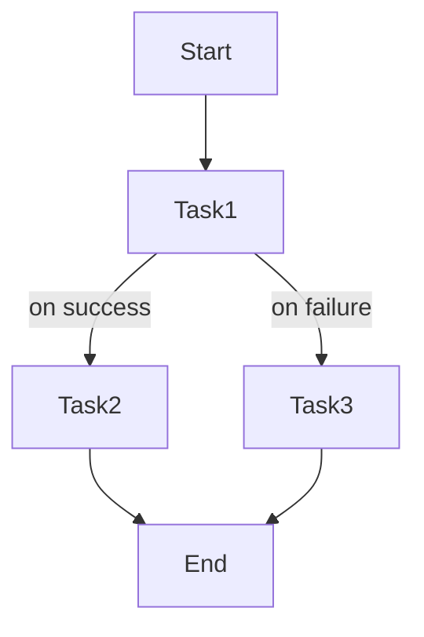
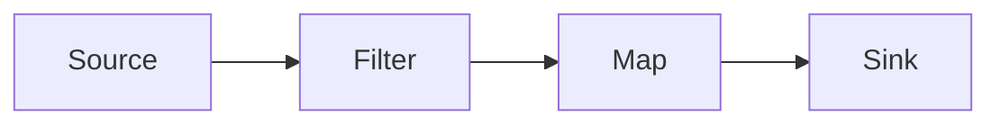
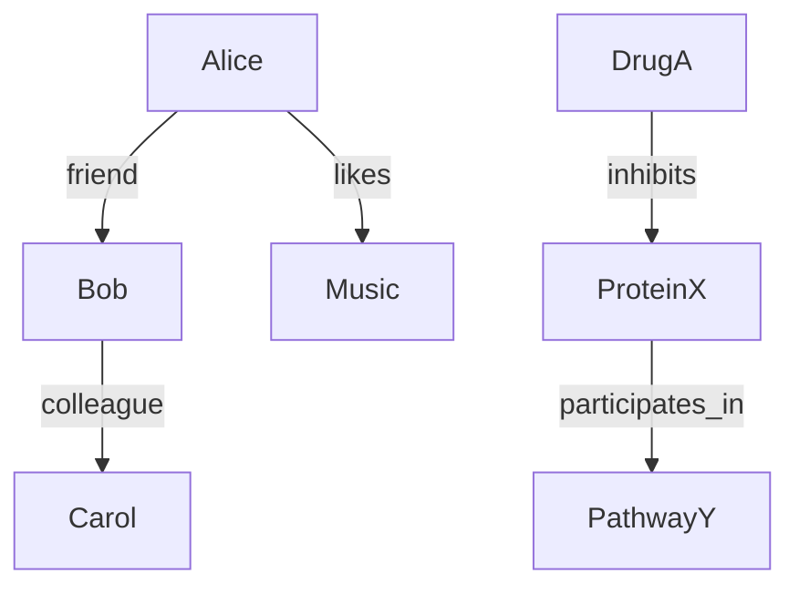

# Understanding Graphs in System Design

## Summary
Graphs are a fundamental abstraction in system design, representing entities (nodes) and their relationships (edges). They provide a versatile framework to model data, execution flows, and control dependencies across diverse systems. Understanding the different interpretations and uses of graphs helps clarify complex architectures and workflows in modern software systems.

## Key Concepts
- **Node** = an entity, operation, or task  
- **Edge** = a relationship or data/control dependency between nodes  
- Graphs vary by purpose and interpretation:  
  - **Data Model** (e.g., Social & Knowledge Graphs) represent relationships between entities and facts  
  - **Execution Model** (e.g., Dataflow & Node Graphs) represent data transformations and logic wiring  
  - **Control Flow** (e.g., DAGs & Workflow Orchestrators) represent task ordering and dependencies  

---

## 1. Control Flow Graphs (DAGs & Workflow Orchestrators)

**Nodes:** Tasks or jobs  
**Edges:** Execution order or control dependencies, including conditional branches  

**Purpose:** These graphs model workflows where tasks must execute in a specific order, often with branching based on success or failure conditions. They are widely used in job schedulers, orchestration systems, and workflow engines like Apache Airflow and Meta’s Conductor.

**Mermaid Diagram:**


**Mental Model:** Imagine a project manager coordinating tasks with conditional paths depending on outcomes, or a recipe where each step depends on the completion of previous steps without any cycles.

**Real Data Example:**
- Build “yesterday’s” revenue report: read raw S3 access logs → parse to events (Parquet) → join with product/pricing → aggregate revenue by region → publish to dashboard table.
- E-commerce order workflow: reserve inventory → charge payment; on failure branch, release inventory + email customer; on success branch, create shipment → generate label → send confirmation, with retries/backoff on flaky gateways.

**Code Snippet (Airflow DAG, Python):**
```python
from airflow import DAG
from airflow.operators.dummy import DummyOperator
from datetime import datetime

# Minimal DAG with two dependent tasks
with DAG("simple_dag", start_date=datetime(2025,1,1), schedule_interval="@daily") as dag:
    t1 = DummyOperator(task_id="start")
    t2 = DummyOperator(task_id="end")
    t1 >> t2
```

---

## 2. Dataflow & Node Graphs (Execution Models)

**Nodes:** Operators, functions, or components  
**Edges:** Data streams, transformations, or logic wiring  

**Purpose:** These graphs describe how data moves and transforms through a system, combining both dataflow pipelines and visual programming models. They enable scalable stream processing, real-time analytics, and user-defined execution logic.

**Mermaid Diagram:**


**Mental Model:** Picture a factory conveyor belt where raw materials flow through machines that transform them step-by-step, or an electrical circuit where components are connected by wires to create a functional system.

**Real Data Example:**
- Real-time ad analytics: Kafka topic clicks → filter bot traffic (IP reputation) → map to (campaign_id, 1) → 1-minute tumbling window sum → sink to BigQuery for BI and Redis for live dashboards; allow 5-minute late events.
- Visual ETL: read orders.csv → parse → join customers from Postgres → compute lifetime_value → branch to write S3 Parquet and Snowflake table; authored in a low-code node editor (no custom code).

**Code Snippet (Tiny Node Graph Engine, Python):**
```python
# Minimal node dependency example
class Node:
    def __init__(self, name, func, deps=[]):
        self.name, self.func, self.deps = name, func, deps

def run_node(node, values):
    inputs = [values[d.name] for d in node.deps] if node.deps else []
    values[node.name] = node.func(*inputs)

n1 = Node("start", lambda: 1)
n2 = Node("double", lambda x: x*2, deps=[n1])

values = {}
for node in [n1, n2]:
    run_node(node, values)

print(values["double"])  # Outputs 2
```

---

## 3. Social & Knowledge Graphs (Data Model)

**Nodes:** Entities such as people, places, things, concepts  
**Edges:** Relationships or semantic associations between entities  

**Purpose:** These graphs model complex relationships and interactions in social networks and knowledge bases, supporting rich queries, recommendations, and semantic reasoning.

**Differentiation:**  
- **Social Graphs** focus on relationships between users and content, such as friendships, likes, or colleagues.  
- **Knowledge Graphs** capture semantic facts and concepts, such as “drug inhibits protein” or “protein participates in pathway,” enabling deeper domain understanding.

**Mermaid Diagram:**


**Mental Model:** Imagine a map of social connections linking people and content alongside a network of facts linking drugs, proteins, and biological pathways.

**Real Data Example:**
- Social: “People You May Know” for user 123 via 2nd-degree connections with shared employers/schools.  
- Knowledge: Biomedical KG query “drugs that inhibit kinase X in pathway Y” across nodes (drugs, proteins, pathways) and edges (inhibits, participates_in).

**Code Snippet (Neo4j Cypher):**
```cypher
// Friends-of-friends query
MATCH (me:User {id:'123'})-[:FRIEND]->()-[:FRIEND]->(fof)
WHERE NOT (me)-[:FRIEND]->(fof) AND me <> fof
RETURN fof.id AS friend_of_friend
LIMIT 5;

// Knowledge fact query
MATCH (d:Drug)-[:INHIBITS]->(p:Protein)-[:PARTICIPATES_IN]->(path:Pathway {name:'Y'})
RETURN d.name, p.name, path.name
LIMIT 5;
```

---

## Comparison Table

| Graph Type                       | Nodes Represent       | Edges Represent       | Purpose                   | Example               |
|---------------------------------|-----------------------|-----------------------|---------------------------|-----------------------|
| Control Flow Graphs (DAGs/Conductor) | Tasks                 | Execution & control dependencies | Workflow orchestration    | Apache Airflow, Meta Conductor |
| Execution Graphs (Dataflow/Node Graphs) | Operators, functions  | Data streams & logic wiring | Data transformation & execution | Apache Flink, Unreal Engine Blueprints |
| Data Model Graphs (Social/Knowledge) | Entities, concepts    | Relationships & semantic facts | Data modeling & semantic queries | Facebook TAO, Biomedical KG  |

---

## Takeaway Summary
Graphs are a universal abstraction used across system design, but their meaning shifts depending on context. They primarily model three categories: **control flow** (task ordering and orchestration), **execution flow** (data transformations and logic wiring), and **data relationships** (entities and semantic connections). Recognizing these distinctions enables engineers to design, analyze, and optimize complex systems effectively by choosing the right graph paradigm for their needs.
