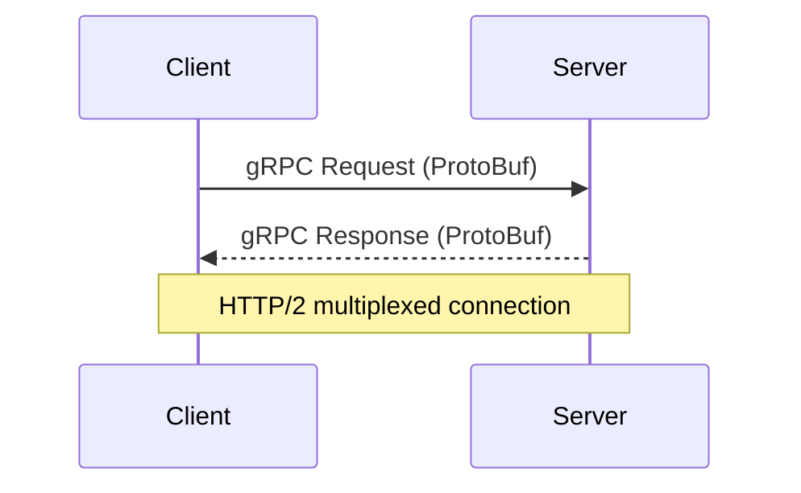

# gRPC API Design

gRPC is a high-performance, open-source RPC framework that uses HTTP/2 and Protocol Buffers for efficient, strongly-typed, contract-based communication between services.

## Key Concepts
- Contract-first API design using Protocol Buffers (`.proto` files)
- HTTP/2 for multiplexed, low-latency connections
- Supports streaming (client, server, bidirectional)
- Strongly-typed messages and service definitions
- Language-agnostic (many supported languages)

## Trade-offs
- **Pros:**
  - High performance and low latency
  - Strong typing and code generation
  - Supports streaming and bi-directional communication
  - Good for internal microservices
- **Cons:**
  - Not human-readable (binary format)
  - Harder to debug without tooling
  - Less suitable for public APIs (browser support limited)

## Interview Q&A
- **Q:** What are the main benefits of gRPC over REST?
  - **A:** Performance, streaming, strong typing, and contract-based development.
- **Q:** When would you not use gRPC?
  - **A:** For public APIs, browser-based clients, or when human-readable payloads are required.
- **Q:** How does gRPC handle versioning?
  - **A:** Through Protocol Buffers' backward/forward compatibility features (field numbering, optional fields).

## Mermaid Diagram

## See Also
- [rest-api.md](./rest-api.md)
- [graphql-api.md](./graphql-api.md)
- [api-versioning.md](./api-versioning.md)
