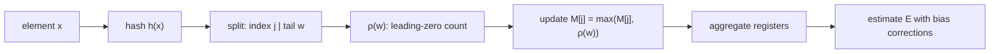

# HyperLogLog (Approximate Distinct Counting)

HyperLogLog (HLL) is a probabilistic data structure for estimating the number of distinct elements (cardinality) in a multiset using very little memory. It trades exactness for space and speed, delivering a tunable, bounded error with mergeability.

## When to use it
- Unique visitors, unique users per feature, distinct IPs, unique search queries
- Large-scale telemetry/event pipelines where exact counts are too costly
- Per-key cardinality in stream processors (e.g., uniques per campaign/post)
- Distributed systems needing mergeable counters across shards/partitions

## How it works (core algorithm)
- Choose a precision parameter p (typical 4–18). The number of registers m = 2^p.
- For each element x, compute a 64-bit hash h(x).
  - Index j = the first p bits of h(x) selects register M[j].
  - Let w = remaining bits of h(x). Define ρ(w) = position of the first 1-bit in w (counting from 1).
  - Update M[j] = max(M[j], ρ(w)).
- After processing all elements, estimate:
  - E = α_m · m^2 / (Σ_j 2^{-M[j]}), where α_m is a bias-correction constant.
- Corrections (standard HLL):
  - Small-range: if E ≤ 2.5·m and V = number of zero registers > 0, use Linear Counting: E' = m · ln(m / V).
  - Large-range: apply large-cardinality correction to limit estimator bias near hash-space saturation.

Error properties: standard error ≈ 1.04 / √m. Memory typically a few bits per register (5–6 bits common). For example, m = 16,384 with 6-bit registers is ~12 KB and ≈1.6% std error.

## Operations and properties
- Merge/union: register-wise maximum: M_union[j] = max(M_A[j], M_B[j]).
- Streaming-friendly: single pass, O(1) update per item.
- Order-independent: depends only on hashed elements.
- Per-key HLLs: maintain one HLL per dimension (e.g., per post, per tenant) and merge upstream.

## Practical notes
- Hashing: use high-quality 64-bit or 128-bit hashes; ensure stable hashing across services/languages.
- Sparse vs. dense: use a sparse representation for very small cardinalities, switch to dense at a threshold.
- Windows: for time-bounded uniques, maintain windowed HLLs (tumbling/sliding) and merge for aggregates.
- Memory: choose p by target error ε ≈ 1.04/√m; m = (1.04/ε)^2; ensure register bit-width fits max observed ρ.
- Limitations: cannot directly compute intersections; can approximate via inclusion–exclusion using multiple HLLs (adds variance).

## Mermaid sketch

## Interview Q&A
- Q: What is the error bound of HLL and how do you tune it?
  - A: Std error ≈ 1.04/√m; choose m = 2^p. Larger m lowers error but increases memory.
- Q: How do you merge results from multiple shards?
  - A: Take the register-wise maximum across HLLs (same p and register size).
- Q: When would you prefer HLL over exact counting?
  - A: When distinct counting is large-scale, approximate results are acceptable, and memory/latency budgets are tight.
- Q: How does HLL compare to Bloom filters or Count-Min Sketch?
  - A: Bloom filters test set membership with false positives, CMS estimates frequency with overestimation; HLL estimates cardinality (uniques) with bounded relative error.
- Q: How are small cardinalities handled?
  - A: Use Linear Counting with the count of zero registers; many implementations use sparse encodings for this regime.

## See Also
- [data-pipelines.md](./data-pipelines.md)
- [batch-processing.md](./batch-processing.md)
- [stream-processing.md](./stream-processing.md)
- [caching.md](./caching.md)
