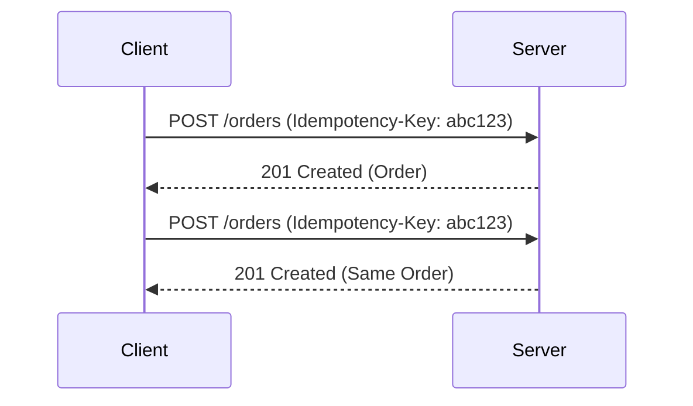

# Idempotency in API Design

Idempotency ensures that making the same API request multiple times has the same effect as making it once. This is critical for reliability, especially in distributed systems and payment APIs.

## Key Concepts
- Safe retry of requests without side effects
- Common for PUT, DELETE, and some POST operations
- Use of idempotency keys (unique request identifiers)
- Required for payment, order, and resource-creation APIs

## Trade-offs
- **Pros:**
  - Prevents duplicate operations (e.g., double charges)
  - Improves reliability and user experience
  - Simplifies client retry logic
- **Cons:**
  - Requires server-side tracking of idempotency keys
  - Slightly increases implementation complexity
  - May require storage for idempotency records

## Interview Q&A
- **Q:** What is idempotency and why is it important?
  - **A:** Idempotency means repeated requests have the same effect as one. It's important for safe retries and reliability.
- **Q:** How do you implement idempotency in APIs?
  - **A:** Use idempotency keys provided by the client and store the result of the first request for subsequent identical requests.
- **Q:** Which HTTP methods are idempotent by default?
  - **A:** GET, PUT, DELETE, and HEAD are idempotent. POST is not, but can be made idempotent with keys.

## Mermaid Diagram

## See Also
- [rest-api.md](./rest-api.md)
- [api-versioning.md](./api-versioning.md)
