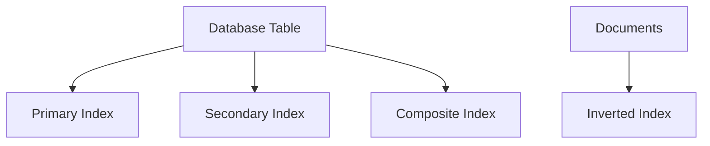

# Indexes

Indexes speed up data retrieval at the cost of slower writes and extra storage. They are critical for query performance in both SQL and NoSQL databases.

## Types
- **Primary (clustered):** Defines the physical order of data
- **Secondary (non-clustered):** Additional indexes for fast lookups
- **Composite:** Indexes on multiple columns (leftmost prefix rule)
- **Inverted Index:** Maps terms to documents (used in search engines)

## Trade-offs
- Faster selective reads vs. slower writes and extra storage
- Maintenance overhead for updates and deletes

## Guidelines
- Index WHERE/JOIN/ORDER patterns
- Avoid low-cardinality single-column indexes
- Audit and remove unused indexes

## Interview Q&A
- When would you use a composite index?
- What are the downsides of too many indexes?
- How do inverted indexes power search engines?

## Vector/Embedding Indexes

Modern systems often use vector (embedding) indexes for similarity search, semantic search, and AI-powered retrieval. These indexes store high-dimensional vectors (token embeddings) and use algorithms like HNSW or FAISS for fast nearest neighbor search.

- Useful for semantic search, recommendations, and generative AI retrieval
- Complements traditional and inverted indexes
- See [token-vectors.md](./token-vectors.md) for details on how embedding indexes work

## Architecture Diagram

